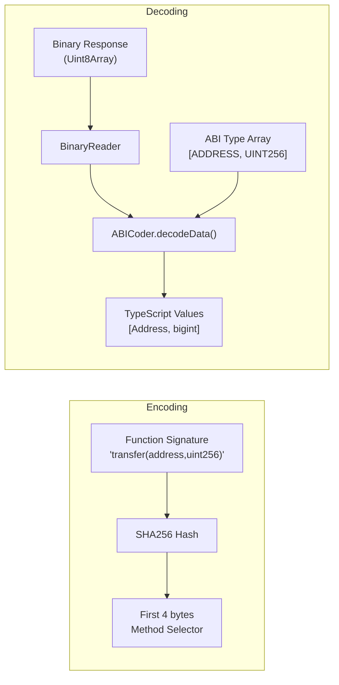

# ABICoder

ABI encoding and decoding for OPNet smart contracts. Provides method selector generation, calldata encoding, and response decoding using a binary serialization format.

> **Key difference from Ethereum:** OPNet uses **SHA256** for method selectors (first 4 bytes), **not** Keccak256. This is a fundamental distinction -- Ethereum-style ABI tools will produce incorrect selectors for OPNet contracts.

**Source:** [`src/abi/ABICoder.ts`](../../src/abi/ABICoder.ts)

---

## Table of Contents

- [Overview](#overview)
- [ABIDataTypes Enum](#abidatatypes-enum)
- [Type Mapping Table](#type-mapping-table)
- [API Reference](#api-reference)
  - [encodeSelector](#encodeselectorselectoridentifier-string-string)
  - [numericSelectorToHex](#numericselectortohexselector-number-string)
  - [decodeData](#decodedatadata-uint8array-types-abitype-unknown)
  - [decodeSingleValue](#decodesinglevaluereader-binaryreader-type-abitype-unknown)
- [ABI Type System](#abi-type-system)
  - [Simple Types](#simple-types)
  - [Tuple Types](#tuple-types)
  - [Struct Types](#struct-types)
- [Examples](#examples)
  - [Encoding a Method Selector](#encoding-a-method-selector)
  - [Decoding Contract Response Data](#decoding-contract-response-data)
  - [Decoding Tuples and Structs](#decoding-tuples-and-structs)
  - [Building Calldata for Contract Calls](#building-calldata-for-contract-calls)
- [Navigation](#navigation)

---

## Overview

The `ABICoder` class is the bridge between TypeScript values and the binary format used by OPNet smart contracts. It handles two core tasks:

1. **Selector generation** -- Computing 4-byte method selectors from function signature strings using SHA256.
2. **Data decoding** -- Reading binary response data from contracts and converting it into typed TypeScript values.



---

## ABIDataTypes Enum

The `ABIDataTypes` enum defines all supported primitive and composite types for ABI encoding/decoding.

```typescript
import { ABIDataTypes } from '@btc-vision/transaction';
```

### Unsigned Integers

| Enum Value | Description |
|-----------|-------------|
| `ABIDataTypes.UINT8` | 8-bit unsigned integer (0--255) |
| `ABIDataTypes.UINT16` | 16-bit unsigned integer |
| `ABIDataTypes.UINT32` | 32-bit unsigned integer |
| `ABIDataTypes.UINT64` | 64-bit unsigned integer |
| `ABIDataTypes.UINT128` | 128-bit unsigned integer |
| `ABIDataTypes.UINT256` | 256-bit unsigned integer |

### Signed Integers

| Enum Value | Description |
|-----------|-------------|
| `ABIDataTypes.INT8` | 8-bit signed integer (-128 to 127) |
| `ABIDataTypes.INT16` | 16-bit signed integer |
| `ABIDataTypes.INT32` | 32-bit signed integer |
| `ABIDataTypes.INT64` | 64-bit signed integer |
| `ABIDataTypes.INT128` | 128-bit signed integer |

### Basic Types

| Enum Value | Description |
|-----------|-------------|
| `ABIDataTypes.BOOL` | Boolean (true/false) |
| `ABIDataTypes.ADDRESS` | OPNet address (compact) |
| `ABIDataTypes.EXTENDED_ADDRESS` | Extended OPNet address (full public key) |
| `ABIDataTypes.STRING` | Length-prefixed UTF-8 string |
| `ABIDataTypes.BYTES` | Length-prefixed arbitrary bytes |
| `ABIDataTypes.BYTES4` | Fixed 4-byte value |
| `ABIDataTypes.BYTES32` | Fixed 32-byte value |

### Tuple / Map Types

| Enum Value | Description |
|-----------|-------------|
| `ABIDataTypes.ADDRESS_UINT256_TUPLE` | Map of Address to uint256 |
| `ABIDataTypes.EXTENDED_ADDRESS_UINT256_TUPLE` | Map of ExtendedAddress to uint256 |

### Signature Types

| Enum Value | Description |
|-----------|-------------|
| `ABIDataTypes.SCHNORR_SIGNATURE` | Schnorr signature (64 bytes) |

### Array Types

| Enum Value | Description |
|-----------|-------------|
| `ABIDataTypes.ARRAY_OF_ADDRESSES` | Array of Address values |
| `ABIDataTypes.ARRAY_OF_EXTENDED_ADDRESSES` | Array of ExtendedAddress values |
| `ABIDataTypes.ARRAY_OF_UINT256` | Array of uint256 values |
| `ABIDataTypes.ARRAY_OF_UINT128` | Array of uint128 values |
| `ABIDataTypes.ARRAY_OF_UINT64` | Array of uint64 values |
| `ABIDataTypes.ARRAY_OF_UINT32` | Array of uint32 values |
| `ABIDataTypes.ARRAY_OF_UINT16` | Array of uint16 values |
| `ABIDataTypes.ARRAY_OF_UINT8` | Array of uint8 values |
| `ABIDataTypes.ARRAY_OF_STRING` | Array of strings |
| `ABIDataTypes.ARRAY_OF_BYTES` | Array of byte arrays |
| `ABIDataTypes.ARRAY_OF_BUFFERS` | Array of raw buffers |

---

## Type Mapping Table

Each `ABIDataTypes` value maps to a specific TypeScript type at runtime:

| ABIDataTypes | TypeScript Type | Size / Notes |
|-------------|----------------|-------------|
| `UINT8` | `number` | 1 byte |
| `UINT16` | `number` | 2 bytes |
| `UINT32` | `number` | 4 bytes |
| `UINT64` | `bigint` | 8 bytes |
| `UINT128` | `bigint` | 16 bytes |
| `UINT256` | `bigint` | 32 bytes |
| `INT8` | `number` | 1 byte, signed |
| `INT16` | `number` | 2 bytes, signed |
| `INT32` | `number` | 4 bytes, signed |
| `INT64` | `bigint` | 8 bytes, signed |
| `INT128` | `bigint` | 16 bytes, signed |
| `BOOL` | `boolean` | 1 byte |
| `ADDRESS` | `Address` | Compact address |
| `EXTENDED_ADDRESS` | `Address` | Full public key address |
| `STRING` | `string` | u16 length prefix + UTF-8 |
| `BYTES` | `Uint8Array` | u16 length prefix + data |
| `BYTES4` | `Uint8Array` | Fixed 4 bytes |
| `BYTES32` | `Uint8Array` | Fixed 32 bytes |
| `SCHNORR_SIGNATURE` | `SchnorrSignature` | 64-byte Schnorr signature |
| `ADDRESS_UINT256_TUPLE` | `AddressMap<bigint>` | Address-keyed map |
| `EXTENDED_ADDRESS_UINT256_TUPLE` | `ExtendedAddressMap<bigint>` | Extended address-keyed map |
| `ARRAY_OF_ADDRESSES` | `Address[]` | u16 count prefix |
| `ARRAY_OF_EXTENDED_ADDRESSES` | `Address[]` | u16 count prefix |
| `ARRAY_OF_UINT256` | `bigint[]` | u16 count prefix |
| `ARRAY_OF_UINT128` | `bigint[]` | u16 count prefix |
| `ARRAY_OF_UINT64` | `bigint[]` | u16 count prefix |
| `ARRAY_OF_UINT32` | `number[]` | u16 count prefix |
| `ARRAY_OF_UINT16` | `number[]` | u16 count prefix |
| `ARRAY_OF_UINT8` | `number[]` | u16 count prefix |
| `ARRAY_OF_STRING` | `string[]` | u16 count prefix |
| `ARRAY_OF_BYTES` | `Uint8Array[]` | u16 count prefix |
| `ARRAY_OF_BUFFERS` | `Uint8Array[]` | u16 count prefix |

---

## API Reference

### `encodeSelector(selectorIdentifier: string): string`

Computes the method selector for a function signature using SHA256. Returns the first 4 bytes of the SHA256 hash as a hex string.

**Parameters:**

| Parameter | Type | Description |
|-----------|------|-------------|
| `selectorIdentifier` | `string` | Function signature string (e.g., `'transfer(address,uint256)'`) |

**Returns:** `string` -- 8-character hex string representing the 4-byte selector.

```typescript
const coder = new ABICoder();

// SHA256-based selector (NOT Keccak256)
const selector = coder.encodeSelector('transfer(address,uint256)');
console.log(selector); // e.g., "a9059cbb" (will differ from Ethereum's selector)

const balanceOf = coder.encodeSelector('balanceOf(address)');
console.log(balanceOf); // 4-byte hex selector
```

---

### `numericSelectorToHex(selector: number): string`

Converts a numeric selector to its hex string representation.

**Parameters:**

| Parameter | Type | Description |
|-----------|------|-------------|
| `selector` | `number` | Numeric selector value |

**Returns:** `string` -- Hex representation of the selector.

```typescript
const coder = new ABICoder();
const hex = coder.numericSelectorToHex(0xa9059cbb);
console.log(hex); // "a9059cbb"
```

---

### `decodeData(data: Uint8Array, types: AbiType[]): unknown[]`

Decodes binary response data from a contract call according to the specified ABI types. Reads values sequentially from the data using a `BinaryReader`.

**Parameters:**

| Parameter | Type | Description |
|-----------|------|-------------|
| `data` | `Uint8Array` | Raw binary response data from a contract |
| `types` | `AbiType[]` | Ordered array of expected ABI types |

**Returns:** `unknown[]` -- Array of decoded values, one per type entry.

```typescript
const coder = new ABICoder();

// Decode a response containing an address and a uint256 balance
const result = coder.decodeData(responseBytes, [
    ABIDataTypes.ADDRESS,
    ABIDataTypes.UINT256,
]);

const address = result[0] as Address;
const balance = result[1] as bigint;
```

---

### `decodeSingleValue(reader: BinaryReader, type: AbiType): unknown`

Decodes a single value from a `BinaryReader` based on the ABI type. Supports all `ABIDataTypes` enum values, tuple arrays, and struct objects.

**Parameters:**

| Parameter | Type | Description |
|-----------|------|-------------|
| `reader` | `BinaryReader` | Active binary reader positioned at the value |
| `type` | `AbiType` | The ABI type to decode |

**Returns:** `unknown` -- The decoded value.

The type parameter accepts three forms:

- **Simple type:** An `ABIDataTypes` enum value (e.g., `ABIDataTypes.UINT256`)
- **Tuple:** An array of `AbiType` values (e.g., `[ABIDataTypes.ADDRESS, ABIDataTypes.UINT256]`)
- **Struct:** An object mapping field names to `AbiType` values (e.g., `{ owner: ABIDataTypes.ADDRESS, balance: ABIDataTypes.UINT256 }`)

---

## ABI Type System

The `AbiType` type is a recursive union that supports three forms:

```typescript
type AbiType = ABIDataTypes | AbiType[] | { [field: string]: AbiType };
```

### Simple Types

Use `ABIDataTypes` enum values directly for primitive types:

```typescript
const types: AbiType[] = [ABIDataTypes.ADDRESS, ABIDataTypes.UINT256, ABIDataTypes.BOOL];
```

### Tuple Types

An array of `AbiType` values represents a tuple. How it decodes depends on the element count:

- **Single-element tuple** `[ABIDataTypes.UINT256]` -- Decodes as a flat array of `bigint` values (u16 count prefix, then values).
- **Multi-element tuple** `[ABIDataTypes.ADDRESS, ABIDataTypes.UINT256]` -- Decodes as an array of tuple entries, where each entry is an array of decoded values (u16 count prefix, then entries).

```typescript
// Single-element tuple: returns bigint[]
const balances = coder.decodeData(data, [[ABIDataTypes.UINT256]]);

// Multi-element tuple: returns [Address, bigint][]
const pairs = coder.decodeData(data, [
    [ABIDataTypes.ADDRESS, ABIDataTypes.UINT256],
]);
```

### Struct Types

An object mapping field names to `AbiType` values represents a struct. Structs are decoded inline (no count prefix) into a `Record<string, unknown>`:

```typescript
// Struct type: returns { owner: Address, balance: bigint, active: boolean }
const result = coder.decodeData(data, [
    {
        owner: ABIDataTypes.ADDRESS,
        balance: ABIDataTypes.UINT256,
        active: ABIDataTypes.BOOL,
    },
]);

const info = result[0] as { owner: Address; balance: bigint; active: boolean };
```

---

## Examples

### Encoding a Method Selector

```typescript
import { ABICoder } from '@btc-vision/transaction';

const coder = new ABICoder();

// Generate selectors for common ERC-20-like methods
const transferSelector = coder.encodeSelector('transfer(address,uint256)');
const approveSelector = coder.encodeSelector('approve(address,uint256)');
const balanceOfSelector = coder.encodeSelector('balanceOf(address)');

console.log('transfer:', transferSelector);
console.log('approve:', approveSelector);
console.log('balanceOf:', balanceOfSelector);
```

### Decoding Contract Response Data

```typescript
import { ABICoder, ABIDataTypes } from '@btc-vision/transaction';
import type { Address } from '@btc-vision/transaction';

const coder = new ABICoder();

// Decode a simple uint256 balance response
const balanceResult = coder.decodeData(responseBytes, [ABIDataTypes.UINT256]);
const balance = balanceResult[0] as bigint;
console.log('Balance:', balance);

// Decode a multi-value response (e.g., token info)
const tokenInfo = coder.decodeData(responseBytes, [
    ABIDataTypes.STRING,    // name
    ABIDataTypes.STRING,    // symbol
    ABIDataTypes.UINT8,     // decimals
    ABIDataTypes.UINT256,   // totalSupply
]);

const name = tokenInfo[0] as string;
const symbol = tokenInfo[1] as string;
const decimals = tokenInfo[2] as number;
const totalSupply = tokenInfo[3] as bigint;

console.log(`${name} (${symbol}): ${totalSupply} (${decimals} decimals)`);
```

### Decoding Tuples and Structs

```typescript
import { ABICoder, ABIDataTypes } from '@btc-vision/transaction';

const coder = new ABICoder();

// Decode an array of addresses (single-element tuple)
const holders = coder.decodeData(data, [[ABIDataTypes.ADDRESS]]);
const addressList = holders[0] as Address[];

// Decode an array of (address, balance) pairs (multi-element tuple)
const balances = coder.decodeData(data, [
    [ABIDataTypes.ADDRESS, ABIDataTypes.UINT256],
]);
const pairs = balances[0] as [Address, bigint][];

for (const [addr, bal] of pairs) {
    console.log(`${addr}: ${bal}`);
}

// Decode a struct
const config = coder.decodeData(data, [
    {
        admin: ABIDataTypes.ADDRESS,
        maxSupply: ABIDataTypes.UINT256,
        paused: ABIDataTypes.BOOL,
    },
]);
const configObj = config[0] as { admin: Address; maxSupply: bigint; paused: boolean };
```

### Building Calldata for Contract Calls

When calling a contract, you encode the method selector and write the parameters using `BinaryWriter`:

```typescript
import { ABICoder, BinaryWriter, ABIDataTypes } from '@btc-vision/transaction';

const coder = new ABICoder();

// 1. Get the method selector
const selector = coder.encodeSelector('transfer(address,uint256)');

// 2. Build the calldata with BinaryWriter
const writer = new BinaryWriter();

// Write the 4-byte selector
const selectorBytes = new Uint8Array(
    selector.match(/.{2}/g)!.map((b) => parseInt(b, 16)),
);
writer.writeBytes(selectorBytes);

// Write the parameters
writer.writeAddress(recipientAddress);  // ADDRESS parameter
writer.writeU256(amount);               // UINT256 parameter

const calldata = writer.getBuffer();

// 3. Use calldata in an interaction transaction
const interactionParams = {
    to: contractAddress,
    calldata,
    // ... other params
};
```

---

## Navigation

- **Previous:** [BinaryReader](../binary/binary-reader.md)
- **Next:** [Address Types](../addresses/address-types.md)
- **Up:** [README](../README.md) -- Table of Contents
