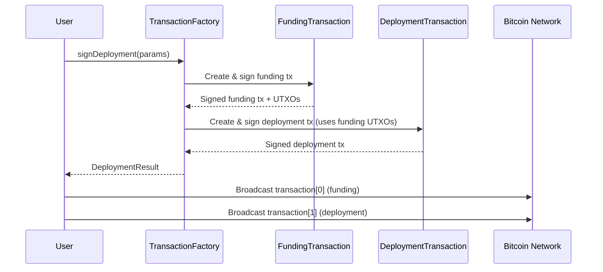
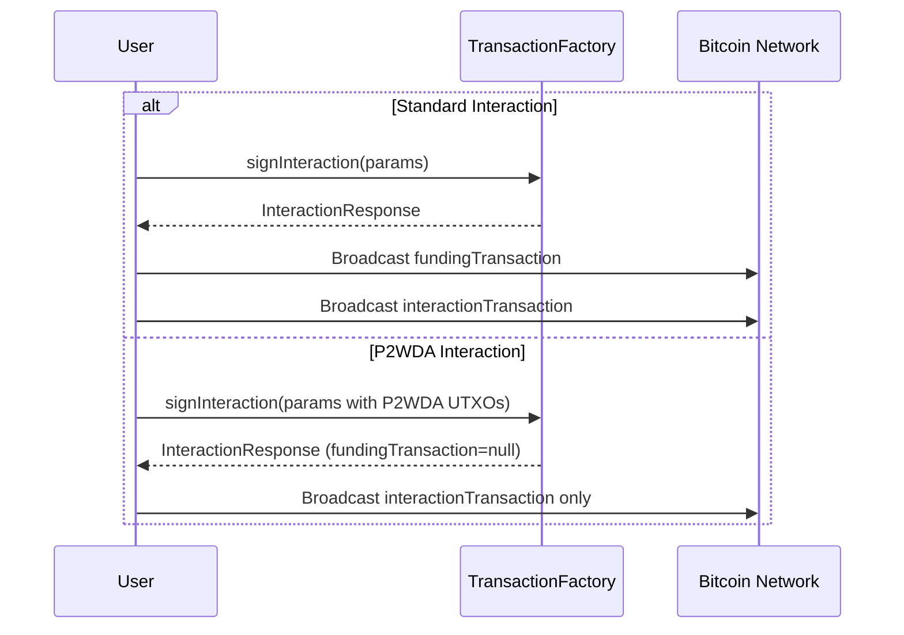

# Response Types

Complete reference for all response and result types returned by `TransactionFactory` methods and transaction builders.

---

## Navigation

- [Back to API Reference](../README.md#api-reference-1)
- [Transaction Types](./transaction-types.md)
- [Interfaces](./interfaces.md)

---

## Table of Contents

- [BitcoinTransferResponse](#bitcointransferresponse)
- [FundingTransactionResponse](#fundingtransactionresponse)
- [DeploymentResult](#deploymentresult)
- [InteractionResponse](#interactionresponse)
- [ConsolidatedInteractionResponse](#consolidatedinteractionresponse)
- [CancelledTransaction](#cancelledtransaction)
- [IConsolidatedInteractionResult](#iconsolidatedinteractionresult)
- [ISetupTransactionResult](#isetuptransactionresult)
- [IRevealTransactionResult](#irevealtransactionresult)

---

## BitcoinTransferResponse

Returned by `TransactionFactory.createBTCTransfer()`. Contains a signed BTC transfer transaction in hex format.

**Source:** `src/transaction/TransactionFactory.ts`

```typescript
interface BitcoinTransferResponse {
    readonly tx: string;
    readonly estimatedFees: bigint;
    readonly nextUTXOs: UTXO[];
    readonly inputUtxos: UTXO[];
    readonly original: FundingTransaction;
}
```

| Property | Type | Description |
|----------|------|-------------|
| `tx` | `string` | Signed transaction hex, ready to broadcast |
| `estimatedFees` | `bigint` | Total fees paid in satoshis |
| `nextUTXOs` | `UTXO[]` | New UTXOs belonging to the sender after the transaction (change outputs) |
| `inputUtxos` | `UTXO[]` | The UTXOs consumed as inputs |
| `original` | `FundingTransaction` | The underlying `FundingTransaction` builder instance |

### Usage

```typescript
import { TransactionFactory, networks } from '@btc-vision/transaction';

const factory = new TransactionFactory();
const result: BitcoinTransferResponse = await factory.createBTCTransfer({
    from: 'bc1p...sender',
    to: 'bc1p...recipient',
    utxos: myUtxos,
    signer: keypair,
    network: networks.bitcoin,
    feeRate: 10,
    amount: 50_000n,
    priorityFee: 0n,
    gasSatFee: 0n,
    mldsaSigner: null,
});

console.log('Transaction hex:', result.tx);
console.log('Fees paid:', result.estimatedFees, 'sats');
console.log('Remaining UTXOs:', result.nextUTXOs.length);
```

---

## FundingTransactionResponse

Internal response from `TransactionFactory.createFundTransaction()`. Used internally to create the funding leg of two-transaction flows.

**Source:** `src/transaction/TransactionFactory.ts`

```typescript
interface FundingTransactionResponse {
    readonly tx: Transaction;
    readonly original: FundingTransaction;
    readonly estimatedFees: bigint;
    readonly nextUTXOs: UTXO[];
    readonly inputUtxos: UTXO[];
}
```

| Property | Type | Description |
|----------|------|-------------|
| `tx` | `Transaction` | The raw `Transaction` object (not hex -- use `.toHex()` to serialize) |
| `original` | `FundingTransaction` | The `FundingTransaction` builder instance |
| `estimatedFees` | `bigint` | Total fees paid in satoshis |
| `nextUTXOs` | `UTXO[]` | New UTXOs created at the destination address |
| `inputUtxos` | `UTXO[]` | The UTXOs consumed as inputs |

> **Note:** This is typically not used directly. `BitcoinTransferResponse` wraps this with the transaction already serialized to hex.

---

## DeploymentResult

Returned by `TransactionFactory.signDeployment()`. Contains the two-transaction deployment flow (funding + deployment) along with the generated contract address.

**Source:** `src/transaction/interfaces/ITransactionResponses.ts`

```typescript
interface DeploymentResult {
    readonly transaction: [string, string];
    readonly contractAddress: string;
    readonly contractPubKey: string;
    readonly challenge: RawChallenge;
    readonly utxos: UTXO[];
    readonly inputUtxos: UTXO[];
}
```

| Property | Type | Description |
|----------|------|-------------|
| `transaction` | `[string, string]` | Tuple of `[fundingTxHex, deploymentTxHex]` -- broadcast both in order |
| `contractAddress` | `string` | The derived Taproot contract address (P2TR) |
| `contractPubKey` | `string` | The contract's public key (hex) |
| `challenge` | `RawChallenge` | The epoch challenge solution used (JSON-serializable) |
| `utxos` | `UTXO[]` | Remaining UTXOs after the deployment (change from funding) |
| `inputUtxos` | `UTXO[]` | The original UTXOs consumed as inputs |

### Usage

```typescript
const result: DeploymentResult = await factory.signDeployment({
    from: 'bc1p...deployer',
    utxos: myUtxos,
    signer: keypair,
    network: networks.bitcoin,
    feeRate: 15,
    priorityFee: 1000n,
    gasSatFee: 330n,
    bytecode: compiledBytecode,
    calldata: constructorCalldata,
    challenge: challengeSolution,
    mldsaSigner: null,
});

// Broadcast funding transaction first
await broadcast(result.transaction[0]);
// Then broadcast the deployment transaction
await broadcast(result.transaction[1]);

console.log('Contract deployed at:', result.contractAddress);
console.log('Contract public key:', result.contractPubKey);
```

### Transaction Flow



---

## InteractionResponse

Returned by `TransactionFactory.signInteraction()`. Contains the two-transaction interaction flow (funding + interaction) for calling a contract function.

**Source:** `src/transaction/interfaces/ITransactionResponses.ts`

```typescript
interface InteractionResponse {
    readonly fundingTransaction: string | null;
    readonly interactionTransaction: string;
    readonly estimatedFees: bigint;
    readonly nextUTXOs: UTXO[];
    readonly fundingUTXOs: UTXO[];
    readonly fundingInputUtxos: UTXO[];
    readonly challenge: RawChallenge;
    readonly interactionAddress: string | null;
    readonly compiledTargetScript: string | null;
}
```

| Property | Type | Description |
|----------|------|-------------|
| `fundingTransaction` | `string \| null` | Funding transaction hex. `null` for P2WDA interactions (single-tx) |
| `interactionTransaction` | `string` | Interaction transaction hex |
| `estimatedFees` | `bigint` | Fees paid by the interaction transaction in satoshis |
| `nextUTXOs` | `UTXO[]` | Remaining UTXOs after the interaction (change from funding) |
| `fundingUTXOs` | `UTXO[]` | UTXOs created by the funding transaction (consumed by interaction) |
| `fundingInputUtxos` | `UTXO[]` | Original UTXOs consumed as inputs to the funding transaction |
| `challenge` | `RawChallenge` | The epoch challenge solution used (JSON-serializable) |
| `interactionAddress` | `string \| null` | The Tapscript address used for the interaction. `null` for P2WDA |
| `compiledTargetScript` | `string \| null` | The compiled target script (hex). `null` for P2WDA |

### Usage

```typescript
const result: InteractionResponse = await factory.signInteraction({
    from: 'bc1p...sender',
    to: 'bc1p...contract',
    utxos: myUtxos,
    signer: keypair,
    network: networks.bitcoin,
    feeRate: 10,
    priorityFee: 500n,
    gasSatFee: 330n,
    calldata: encodedCalldata,
    challenge: challengeSolution,
    mldsaSigner: null,
});

// Standard interaction: broadcast both transactions
if (result.fundingTransaction) {
    await broadcast(result.fundingTransaction);
}
await broadcast(result.interactionTransaction);

console.log('Fees:', result.estimatedFees, 'sats');
console.log('Challenge:', result.challenge.epochNumber);
```

### Standard vs P2WDA Interactions

| Scenario | `fundingTransaction` | `interactionAddress` | `compiledTargetScript` |
|----------|---------------------|---------------------|----------------------|
| Standard (P2TR) | Hex string | Tapscript address | Hex-encoded script |
| P2WDA | `null` | `null` | `null` |

P2WDA interactions embed operation data directly in the witness field of a single transaction, eliminating the need for a separate funding transaction.

### Transaction Flow



---

## ConsolidatedInteractionResponse

Returned by `TransactionFactory.signConsolidatedInteraction()`. Contains both setup and reveal transactions for the CHCT (Consolidated Hash Commitment Transaction) system.

**Source:** `src/transaction/TransactionFactory.ts`

```typescript
interface ConsolidatedInteractionResponse {
    readonly setupTransaction: string;
    readonly revealTransaction: string;
    readonly setupTxId: string;
    readonly revealTxId: string;
    readonly totalFees: bigint;
    readonly chunkCount: number;
    readonly dataSize: number;
    readonly challenge: RawChallenge;
    readonly inputUtxos: UTXO[];
    readonly compiledTargetScript: string;
}
```

| Property | Type | Description |
|----------|------|-------------|
| `setupTransaction` | `string` | Setup transaction hex -- creates P2WSH commitment outputs |
| `revealTransaction` | `string` | Reveal transaction hex -- spends commitments, reveals data |
| `setupTxId` | `string` | Transaction ID of the setup transaction |
| `revealTxId` | `string` | Transaction ID of the reveal transaction |
| `totalFees` | `bigint` | Combined fees for both transactions in satoshis |
| `chunkCount` | `number` | Total number of 80-byte data chunks |
| `dataSize` | `number` | Total compiled data size in bytes |
| `challenge` | `RawChallenge` | The epoch challenge solution used (JSON-serializable) |
| `inputUtxos` | `UTXO[]` | Original UTXOs consumed as inputs |
| `compiledTargetScript` | `string` | The compiled target script (hex, same as standard interaction) |

### Usage

```typescript
const result: ConsolidatedInteractionResponse = await factory.signConsolidatedInteraction({
    from: 'bc1p...sender',
    to: 'bc1p...contract',
    utxos: myUtxos,
    signer: keypair,
    network: networks.bitcoin,
    feeRate: 10,
    priorityFee: 500n,
    gasSatFee: 330n,
    calldata: encodedCalldata,
    challenge: challengeSolution,
    mldsaSigner: null,
});

// Broadcast setup first, then reveal
await broadcast(result.setupTransaction);
await broadcast(result.revealTransaction);

console.log('Total fees:', result.totalFees, 'sats');
console.log('Data chunks:', result.chunkCount);
console.log('Data size:', result.dataSize, 'bytes');
```

### Comparison with InteractionResponse

| Property | InteractionResponse | ConsolidatedInteractionResponse |
|----------|--------------------|---------------------------------|
| First transaction | `fundingTransaction` | `setupTransaction` |
| Second transaction | `interactionTransaction` | `revealTransaction` |
| Transaction IDs | Not exposed | `setupTxId`, `revealTxId` |
| Data metrics | -- | `chunkCount`, `dataSize` |
| Fee accounting | `estimatedFees` (interaction only) | `totalFees` (both combined) |
| UTXO tracking | `nextUTXOs`, `fundingUTXOs`, `fundingInputUtxos` | `inputUtxos` |

---

## CancelledTransaction

Returned by `TransactionFactory.createCancellableTransaction()`. Contains a signed cancel transaction that recovers a stuck interaction.

**Source:** `src/transaction/interfaces/ITransactionResponses.ts`

```typescript
interface CancelledTransaction {
    readonly transaction: string;
    readonly nextUTXOs: UTXO[];
    readonly inputUtxos: UTXO[];
}
```

| Property | Type | Description |
|----------|------|-------------|
| `transaction` | `string` | Signed cancel transaction hex, ready to broadcast |
| `nextUTXOs` | `UTXO[]` | New UTXOs available after the cancel (recovered funds) |
| `inputUtxos` | `UTXO[]` | The UTXOs consumed as inputs |

### Usage

```typescript
const result: CancelledTransaction = await factory.createCancellableTransaction({
    from: 'bc1p...sender',
    to: 'bc1p...scriptAddress',
    utxos: stuckUtxos,
    signer: keypair,
    network: networks.bitcoin,
    feeRate: 20,
    priorityFee: 0n,
    gasSatFee: 0n,
    compiledTargetScript: originalTargetScript,
    mldsaSigner: null,
});

await broadcast(result.transaction);
console.log('Recovered UTXOs:', result.nextUTXOs);
```

---

## IConsolidatedInteractionResult

Low-level result from `ConsolidatedInteractionTransaction.build()`. This is the builder-level result before it is wrapped by `TransactionFactory` into `ConsolidatedInteractionResponse`.

**Source:** `src/transaction/interfaces/IConsolidatedTransactionParameters.ts`

```typescript
interface IConsolidatedInteractionResult {
    readonly setup: ISetupTransactionResult;
    readonly reveal: IRevealTransactionResult;
    readonly totalFees: bigint;
}
```

| Property | Type | Description |
|----------|------|-------------|
| `setup` | `ISetupTransactionResult` | Setup transaction details |
| `reveal` | `IRevealTransactionResult` | Reveal transaction details |
| `totalFees` | `bigint` | Combined fees for both transactions in satoshis |

---

## ISetupTransactionResult

Details of the setup (commitment) transaction in a consolidated interaction.

**Source:** `src/transaction/interfaces/IConsolidatedTransactionParameters.ts`

```typescript
interface ISetupTransactionResult {
    readonly txHex: string;
    readonly txId: string;
    readonly outputs: IHashCommittedP2WSH[];
    readonly feesPaid: bigint;
    readonly chunkCount: number;
    readonly totalDataSize: number;
}
```

| Property | Type | Description |
|----------|------|-------------|
| `txHex` | `string` | Signed setup transaction hex |
| `txId` | `string` | Setup transaction ID |
| `outputs` | `IHashCommittedP2WSH[]` | All P2WSH commitment outputs created |
| `feesPaid` | `bigint` | Fees paid by the setup transaction |
| `chunkCount` | `number` | Total number of data chunks |
| `totalDataSize` | `number` | Total compiled data size in bytes |

---

## IRevealTransactionResult

Details of the reveal transaction in a consolidated interaction.

**Source:** `src/transaction/interfaces/IConsolidatedTransactionParameters.ts`

```typescript
interface IRevealTransactionResult {
    readonly txHex: string;
    readonly txId: string;
    readonly dataSize: number;
    readonly feesPaid: bigint;
    readonly inputCount: number;
}
```

| Property | Type | Description |
|----------|------|-------------|
| `txHex` | `string` | Signed reveal transaction hex |
| `txId` | `string` | Reveal transaction ID |
| `dataSize` | `number` | Total data revealed in bytes |
| `feesPaid` | `bigint` | Fees paid by the reveal transaction |
| `inputCount` | `number` | Number of P2WSH commitment inputs spent |

---

## Summary Table

| Response Type | Factory Method | Transaction Count | Primary Use Case |
|---------------|---------------|-------------------|------------------|
| `BitcoinTransferResponse` | `createBTCTransfer()` | 1 | BTC transfers |
| `DeploymentResult` | `signDeployment()` | 2 (funding + deployment) | Contract deployment |
| `InteractionResponse` | `signInteraction()` | 1--2 (P2WDA or funding + interaction) | Contract function calls |
| `ConsolidatedInteractionResponse` | `signConsolidatedInteraction()` | 2 (setup + reveal) | Censorship-resistant interactions |
| `CancelledTransaction` | `createCancellableTransaction()` | 1 | Recover stuck transactions |

---

## See Also

- [Transaction Types](./transaction-types.md) -- Enum values used in responses
- [Interfaces](./interfaces.md) -- Parameter interfaces for creating these responses
- [TransactionFactory](../transaction-building/transaction-factory.md) -- Factory methods that produce these responses
- [Consolidated Transactions](../transaction-building/consolidated-transactions.md) -- Detailed guide on setup/reveal flow
