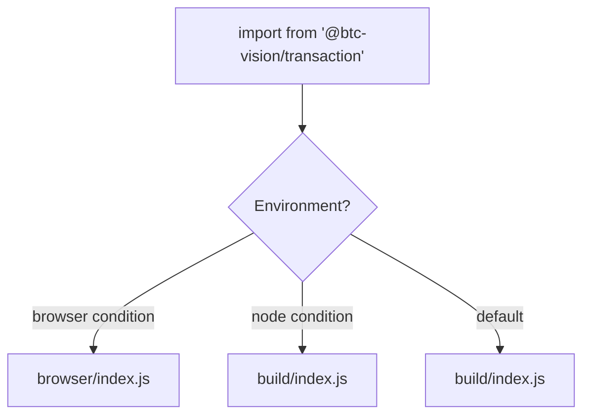

# Installation & Setup

Install and configure the OPNet Transaction Library for Node.js or browser environments.

## Table of Contents
- [Package Installation](#package-installation)
- [Peer Dependencies](#peer-dependencies)
- [TypeScript Configuration](#typescript-configuration)
- [Node.js Setup](#nodejs-setup)
- [Browser Setup](#browser-setup)
- [Package Exports](#package-exports)
- [Verifying Your Installation](#verifying-your-installation)

## Package Installation

Install the core library and its Bitcoin dependency:

```bash
npm install @btc-vision/transaction @btc-vision/bitcoin
```

## Peer Dependencies

The following peer dependencies are required and installed automatically with the core packages:

| Package | Purpose |
|---------|---------|
| `@btc-vision/bip32` | BIP32 HD key derivation with ML-DSA quantum support (BIP360) |
| `@btc-vision/ecpair` | Secp256k1 EC key pair signing (Schnorr and ECDSA) |
| `@noble/curves` | Elliptic curve primitives (secp256k1) |
| `@noble/hashes` | Cryptographic hash functions (SHA-256, RIPEMD-160) |
| `bip39` | BIP39 mnemonic phrase generation and validation |
| `pako` | Zlib compression for bytecode and calldata |

If your package manager does not install peer dependencies automatically, install them manually:

```bash
npm install @btc-vision/bip32 @btc-vision/ecpair
```

## TypeScript Configuration

The library requires ESNext target and strict mode. Create or update your `tsconfig.json`:

```jsonc
{
    "compilerOptions": {
        // Module system
        "module": "ESNext",
        "target": "ESNext",
        "moduleResolution": "bundler",
        "moduleDetection": "force",
        "verbatimModuleSyntax": true,
        "esModuleInterop": true,
        "isolatedModules": true,

        // Strict mode (required)
        "strict": true,
        "noImplicitAny": true,
        "strictNullChecks": true,
        "strictFunctionTypes": true,
        "noImplicitReturns": true,
        "noFallthroughCasesInSwitch": true,
        "noUncheckedIndexedAccess": true,

        // Output
        "declaration": true,
        "declarationMap": true,
        "sourceMap": true,
        "skipLibCheck": true,

        // Lib targets
        "lib": ["ESNext", "DOM", "DOM.Iterable"]
    },
    "include": ["src/**/*.ts"]
}
```

Key requirements:
- **`target: "ESNext"`** -- The library uses top-level `await`, `using` declarations (`Symbol.dispose`), and other modern syntax.
- **`strict: true`** -- All public APIs are strictly typed. Disabling strict mode will cause type mismatches.
- **`moduleResolution: "bundler"`** -- Required for browser builds. Use `"NodeNext"` for pure Node.js projects.
- **`verbatimModuleSyntax: true`** -- The library uses explicit `type` imports throughout.

## Node.js Setup

### Requirements

- **Node.js >= 24.0.0** (required by the `engines` field in `package.json`)
- **ESM only** -- The library is published as ES modules (`"type": "module"`)

### Minimal Node.js Project

```jsonc
// package.json
{
    "type": "module",
    "engines": {
        "node": ">=24.0.0"
    },
    "dependencies": {
        "@btc-vision/transaction": "^1.8.0",
        "@btc-vision/bitcoin": "^7.0.0"
    }
}
```

```typescript
// src/index.ts
import { Mnemonic, TransactionFactory } from '@btc-vision/transaction';
import { networks } from '@btc-vision/bitcoin';

const mnemonic = Mnemonic.generate();
console.log('Wallet created:', mnemonic.phrase);
```

Run with:

```bash
npx tsx src/index.ts
```

## Browser Setup

The library ships pre-built browser bundles at `@btc-vision/transaction/browser`. These bundles include all necessary polyfills for Node.js APIs (`Buffer`, `crypto`, `stream`, `zlib`).

### Vite Configuration

```typescript
// vite.config.ts
import { defineConfig } from 'vite';
import { nodePolyfills } from 'vite-plugin-node-polyfills';
import { resolve } from 'path';

export default defineConfig({
    build: {
        target: 'esnext',
    },
    resolve: {
        alias: {
            // Point to the browser builds of BTC Vision packages
            crypto: resolve(__dirname, 'node_modules/@btc-vision/transaction/browser/polyfills.js'),
            '@btc-vision/bitcoin': resolve(
                __dirname,
                'node_modules/@btc-vision/bitcoin/browser/index.js',
            ),
            '@btc-vision/bip32': resolve(
                __dirname,
                'node_modules/@btc-vision/bip32/src/cjs/index.cjs',
            ),
        },
    },
    define: {
        'process.env.NODE_ENV': JSON.stringify('production'),
        global: 'globalThis',
    },
    plugins: [
        nodePolyfills({
            globals: {
                Buffer: true,
                global: true,
                process: true,
            },
            exclude: [
                'crypto', 'fs', 'path', 'os', 'http', 'https',
                'net', 'tls', 'dns', 'child_process', 'zlib', 'vm',
            ],
        }),
    ],
});
```

### Importing in Browser Code

```typescript
// Use the explicit browser entry point
import { TransactionFactory, Mnemonic } from '@btc-vision/transaction/browser';
```

Or rely on the conditional `exports` map -- bundlers that support the `"browser"` condition will automatically resolve to the browser build:

```typescript
// Bundler auto-resolves to browser/index.js when targeting browsers
import { TransactionFactory, Mnemonic } from '@btc-vision/transaction';
```

### Required Dev Dependencies for Browser Builds

```bash
npm install -D vite vite-plugin-node-polyfills buffer stream-browserify browserify-zlib process
```

## Package Exports

The library uses Node.js conditional exports to serve the correct build for each environment:

| Export Path | Description |
|-------------|-------------|
| `@btc-vision/transaction` | Main entry -- auto-selects Node.js or browser build |
| `@btc-vision/transaction/browser` | Explicit browser entry point |
| `@btc-vision/transaction/browser/noble-curves` | Browser build of `@noble/curves` |
| `@btc-vision/transaction/browser/noble-hashes` | Browser build of `@noble/hashes` |
| `@btc-vision/transaction/browser/btc-vision-bitcoin` | Browser build of `@btc-vision/bitcoin` |
| `@btc-vision/transaction/browser/btc-vision-bip32` | Browser build of `@btc-vision/bip32` |
| `@btc-vision/transaction/browser/btc-vision-post-quantum` | Browser build of post-quantum crypto |
| `@btc-vision/transaction/browser/bip39` | Browser build of BIP39 mnemonic library |
| `@btc-vision/transaction/browser/polyfills` | Node.js polyfills (Buffer, process, crypto) |
| `@btc-vision/transaction/browser/vendors` | Bundled third-party vendor code |
| `@btc-vision/transaction/browser/bitcoin-utils` | Browser build of Bitcoin utilities |
| `@btc-vision/transaction/browser/scure-base` | Browser build of `@scure/base` |
| `@btc-vision/transaction/browser/pako` | Browser build of pako (zlib compression) |

### Conditional Export Resolution



## Verifying Your Installation

Run this quick check to confirm everything is wired correctly:

```typescript
import { Mnemonic, Wallet, TransactionFactory, version } from '@btc-vision/transaction';
import { networks } from '@btc-vision/bitcoin';

console.log('Library version:', version);

// Generate a mnemonic and derive a wallet
const mnemonic = Mnemonic.generate();
const wallet = mnemonic.derive(0);

console.log('P2TR address:', wallet.p2tr);
console.log('P2WPKH address:', wallet.p2wpkh);
console.log('Quantum public key length:', wallet.quantumPublicKey.length, 'bytes');

// Confirm TransactionFactory is available
const factory = new TransactionFactory();
console.log('TransactionFactory ready');
```

Expected output (addresses will vary):

```
Library version: 1.8.0
P2TR address: bc1p...
P2WPKH address: bc1q...
Quantum public key length: 1312 bytes
TransactionFactory ready
```

---

**Next:** [Architecture Overview](./overview.md) | [Quick Start Guide](./quick-start.md)
