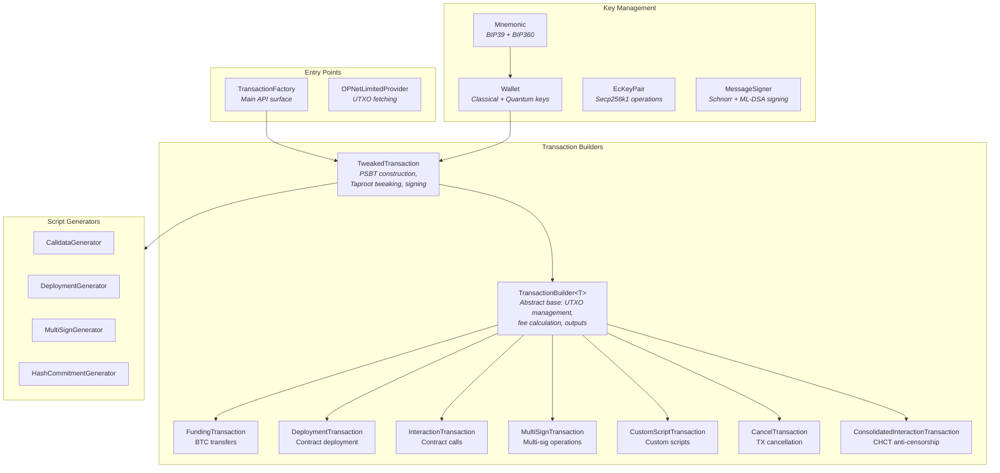
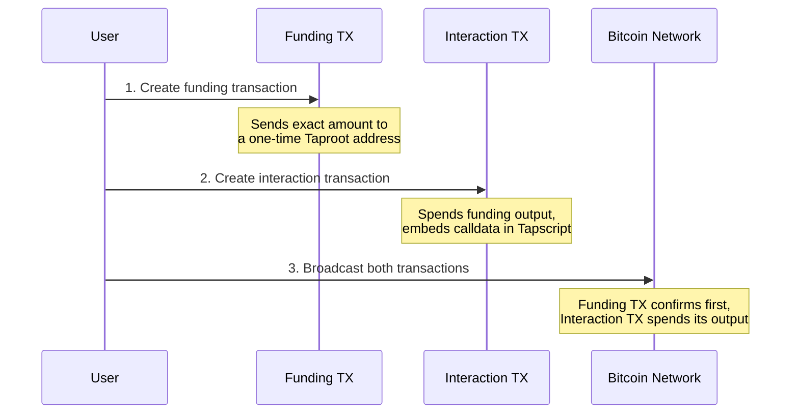
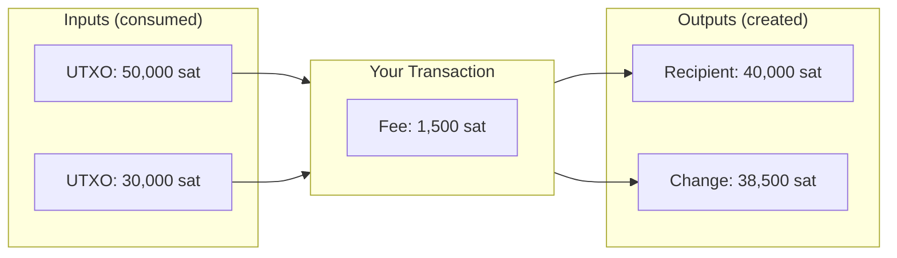
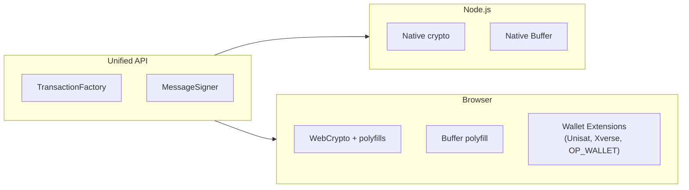
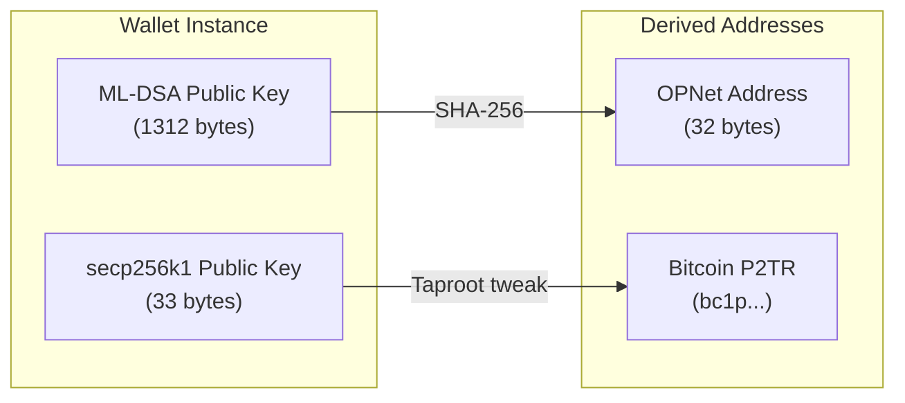

# Architecture Overview

The OPNet Transaction Library provides a layered system for building, signing, and broadcasting Bitcoin transactions with quantum-resistant cryptography support. It serves as the client-side SDK for the OPNet protocol -- a smart contract layer on Bitcoin.

## Table of Contents
- [Library Purpose](#library-purpose)
- [Architecture](#architecture)
- [Key Concepts](#key-concepts)
  - [Two-Transaction Model](#two-transaction-model)
  - [UTXO-Based Model](#utxo-based-model)
  - [Quantum-Resistant Addresses](#quantum-resistant-addresses)
  - [Dual Environment Support](#dual-environment-support)
  - [Offline Transaction Signing](#offline-transaction-signing)
- [Transaction Types](#transaction-types)
- [Network Support](#network-support)
- [Address Systems](#address-systems)
- [Class Hierarchy](#class-hierarchy)

## Library Purpose

The library enables developers to:

- **Build Bitcoin transactions** -- Create funding, deployment, interaction, multi-signature, and custom script transactions
- **Sign with quantum resistance** -- Every transaction includes ML-DSA (FIPS 204) post-quantum signatures alongside classical Schnorr signatures
- **Deploy and interact with smart contracts** -- Encode calldata, deploy WASM bytecode, and call contract functions on the OPNet network
- **Work in any environment** -- Identical API for Node.js backends and browser frontends, with built-in support for wallet extensions (Unisat, Xverse, OP_WALLET)

## Architecture



## Key Concepts

### Two-Transaction Model

OPNet smart contract operations (deployments and interactions) require **two Bitcoin transactions** that are broadcast together:



**Why two transactions?** The interaction transaction embeds contract calldata in a Taproot script path. The funding transaction creates a UTXO with the exact amount needed (fees + priority fee + gas), locked to the script address. The `TransactionFactory` handles this automatically -- you provide parameters and receive both signed transactions ready to broadcast.

Simple BTC transfers (funding-only) use a single transaction.

### UTXO-Based Model

Bitcoin uses Unspent Transaction Outputs (UTXOs), not account balances. Every transaction consumes existing UTXOs as inputs and creates new UTXOs as outputs.



The library manages UTXO selection, change calculation, and fee estimation. Each method on `TransactionFactory` returns the new UTXOs (`nextUTXOs`) that your application should track for subsequent transactions.

### Quantum-Resistant Addresses

OPNet implements **BIP360** for quantum-resistant key management using ML-DSA (FIPS 204, formerly CRYSTALS-Dilithium). Every wallet holds two key pairs:

| Key Type | Algorithm | Purpose |
|----------|-----------|---------|
| Classical | secp256k1 (Schnorr) | Bitcoin transaction signing, P2TR addresses |
| Quantum | ML-DSA-44/65/87 | OPNet identity, quantum-resistant signatures |

The quantum public key is hashed (SHA-256) to produce a 32-byte **OPNet address** that serves as the user's identity across the protocol. Classical keys handle the Bitcoin layer; quantum keys handle the OPNet protocol layer.

### Dual Environment Support

The library works identically in Node.js and browsers:



In the browser, `MessageSigner` auto-detects OP_WALLET extensions. Methods like `signMessageAuto()` and `signMLDSAMessageAuto()` automatically delegate to the browser wallet if available, or fall back to a provided key pair.

### Offline Transaction Signing

Transactions can be built in an online environment (with UTXO data but no private keys), exported as a serialized state, transported to an air-gapped machine for signing, and then returned for broadcast. This is handled by `OfflineTransactionManager`:

1. **Online:** Build transaction, export state (base64)
2. **Offline:** Import state, attach signer, sign, export signed TX hex
3. **Online:** Broadcast the signed transaction

## Transaction Types

The `TransactionType` enum defines all supported operations:

| Type | Value | Description | TX Count |
|------|-------|-------------|----------|
| `GENERIC` | 0 | Generic transaction (base type) | -- |
| `FUNDING` | 1 | Simple BTC transfer between addresses | 1 |
| `DEPLOYMENT` | 2 | Deploy a smart contract (WASM bytecode) | 2 |
| `INTERACTION` | 3 | Call a function on a deployed contract | 2 |
| `MULTI_SIG` | 4 | Multi-signature transaction (M-of-N) | 2 |
| `CUSTOM_CODE` | 5 | Execute a custom Bitcoin script | 2 |
| `CANCEL` | 6 | Cancel/recover a stuck transaction | 1 |
| `CONSOLIDATED_SETUP` | 7 | CHCT setup phase (anti-censorship) | 1 (pair) |
| `CONSOLIDATED_REVEAL` | 8 | CHCT reveal phase (anti-censorship) | 1 (pair) |

```typescript
import { TransactionType } from '@btc-vision/transaction';

// TransactionType.INTERACTION === 3
```

## Network Support

The library supports multiple Bitcoin networks, configured via the `networks` object from `@btc-vision/bitcoin` and the `ChainId` enum:

### Bitcoin Networks

| Network | Bech32 Prefix | Usage |
|---------|--------------|-------|
| `networks.bitcoin` | `bc1` | Bitcoin mainnet |
| `networks.testnet` | `tb1` | Bitcoin testnet |
| `networks.regtest` | `bcrt1` | Local development / regression testing |

### Chain IDs

```typescript
import { ChainId } from '@btc-vision/transaction';

enum ChainId {
    Bitcoin = 0,   // Bitcoin mainnet, testnet, regtest
    Fractal = 1,   // Fractal Bitcoin
}
```

The `chainId` parameter is optional on transaction parameters. When omitted, it defaults to `ChainId.Bitcoin`.

### Selecting a Network

```typescript
import { networks } from '@btc-vision/bitcoin';

// Mainnet
const mainnetWallet = mnemonic.derive(0);
// mainnetWallet.p2tr => "bc1p..."

// Testnet
const testnetMnemonic = new Mnemonic(phrase, '', networks.testnet);
const testnetWallet = testnetMnemonic.derive(0);
// testnetWallet.p2tr => "tb1p..."

// Regtest
const regtestMnemonic = new Mnemonic(phrase, '', networks.regtest);
const regtestWallet = regtestMnemonic.derive(0);
// regtestWallet.p2tr => "bcrt1p..."
```

## Address Systems

OPNet uses two complementary address systems:

### Bitcoin Addresses (On-Chain)

Standard Bitcoin addresses used for transaction inputs and outputs. The library generates Taproot (P2TR) addresses by default:

| Format | Prefix | Example |
|--------|--------|---------|
| P2TR (Taproot) | `bc1p` | `bc1p5d7rjq7g6rdk2yhzks9smlaqtedr4dekq08ge8ztwac72sfr9rusxg3297` |
| P2WPKH (SegWit) | `bc1q` | `bc1qw508d6qejxtdg4y5r3zarvary0c5xw7kv8f3t4` |
| P2PKH (Legacy) | `1` | `1A1zP1eP5QGefi2DMPTfTL5SLmv7DivfNa` |

Access all address formats from a `Wallet` instance:

```typescript
const wallet = mnemonic.derive(0);

wallet.p2tr;          // Taproot address (primary for OPNet)
wallet.p2wpkh;        // Native SegWit address
wallet.legacy;        // Legacy P2PKH address
wallet.segwitLegacy;  // Wrapped SegWit P2SH address
wallet.p2wda;         // P2WDA address (returns IP2WSHAddress object with .address and .witnessScript)
```

### OPNet Addresses (Protocol Identity)

The OPNet address is the **SHA-256 hash of the ML-DSA public key**, represented as 32 bytes. This serves as the user's universal identifier within the OPNet smart contract layer.

```typescript
import { Address } from '@btc-vision/transaction';

const wallet = mnemonic.derive(0);

// The Address object IS the 32-byte hash (extends Uint8Array)
const opnetAddress: Address = wallet.address;

// Hex representation (64 characters)
console.log(opnetAddress.toHex());
// => "a1b2c3d4e5f6...64 hex chars..."

// The underlying quantum public key (1312 bytes for ML-DSA-44)
console.log(wallet.quantumPublicKey.length);
// => 1312
```

### Address Relationship



Both addresses derive from the same `Wallet`, which is derived from a single BIP39 mnemonic via parallel derivation paths:
- **Classical path:** `m/84'/0'/0'/0/0` (BIP84 for secp256k1)
- **Quantum path:** `m/360'/0'/0'/0/0` (BIP360 for ML-DSA)

## Class Hierarchy

### Transaction Building

```
TransactionFactory                     -- Top-level API (signInteraction, signDeployment, createBTCTransfer)
  TweakedTransaction                   -- PSBT construction, Taproot tweaking, signature orchestration
    TransactionBuilder<T>              -- Abstract base (UTXO management, fee estimation, outputs)
      FundingTransaction               -- Simple BTC transfers
      DeploymentTransaction            -- Contract deployment (bytecode + calldata)
      InteractionTransaction           -- Contract function calls (calldata)
      MultiSignTransaction             -- M-of-N multi-signature operations
      CustomScriptTransaction          -- Custom Bitcoin script execution
      CancelTransaction                -- Transaction cancellation / recovery
      ConsolidatedInteractionTransaction -- CHCT anti-censorship system
```

### Key Management

```
Mnemonic                    -- BIP39 phrase + BIP360 quantum root
  Wallet                    -- Combined classical + quantum key pair
    Address                 -- 32-byte OPNet address (SHA-256 of ML-DSA pubkey)
    EcKeyPair               -- secp256k1 key operations
    QuantumBIP32Interface   -- ML-DSA key derivation and signing
```

### Signing

```
MessageSigner               -- Singleton for Schnorr + ML-DSA message signing
  TweakedSigner             -- Taproot key tweaking for transaction signing
  BrowserSignerBase         -- Base class for browser wallet integration
    UnisatSigner            -- Unisat wallet extension adapter
    XverseSigner            -- Xverse wallet extension adapter
```

---

**Previous:** [Installation & Setup](./installation.md) | **Next:** [Quick Start Guide](./quick-start.md)
