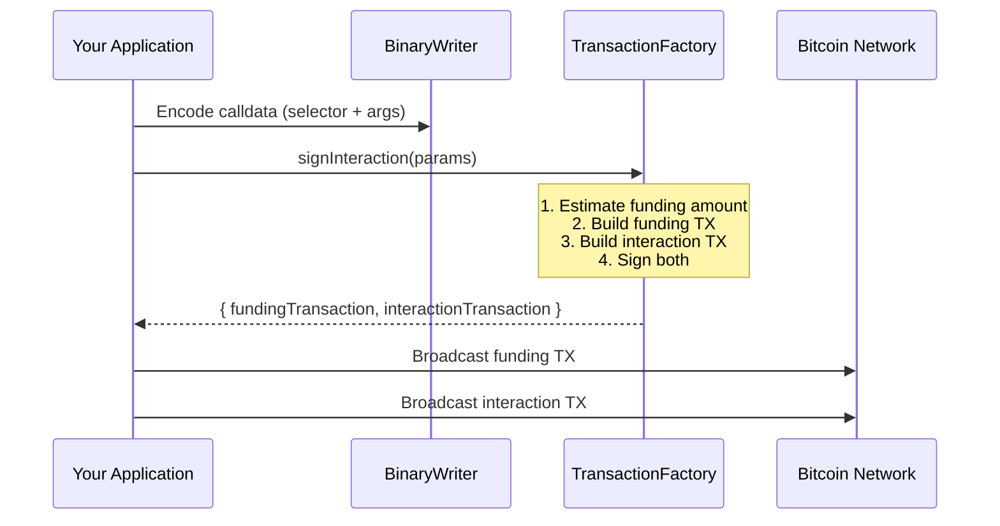

# Quick Start Guide

Complete, runnable examples for the most common OPNet Transaction Library operations.

## Table of Contents
- [Prerequisites](#prerequisites)
- [1. Creating a Wallet from Mnemonic](#1-creating-a-wallet-from-mnemonic)
- [2. Sending BTC (Funding Transaction)](#2-sending-btc-funding-transaction)
- [3. Deploying a Contract](#3-deploying-a-contract)
- [4. Calling a Contract Function](#4-calling-a-contract-function)
- [5. Message Signing](#5-message-signing)

## Prerequisites

Before running these examples, make sure you have the library installed:

```bash
npm install @btc-vision/transaction @btc-vision/bitcoin
```

All examples target **regtest** for local development. Replace `networks.regtest` with `networks.bitcoin` or `networks.testnet` for other environments.

## 1. Creating a Wallet from Mnemonic

Generate a new mnemonic phrase and derive a wallet with both classical (secp256k1) and quantum (ML-DSA) key pairs.

```typescript
import {
    Mnemonic,
    MnemonicStrength,
    MLDSASecurityLevel,
    Wallet,
} from '@btc-vision/transaction';
import { networks } from '@btc-vision/bitcoin';

// --- Generate a new mnemonic ---
const mnemonic = Mnemonic.generate(
    MnemonicStrength.MAXIMUM,       // 24 words (256-bit entropy)
    '',                              // No BIP39 passphrase
    networks.regtest,                // Network
    MLDSASecurityLevel.LEVEL2,       // ML-DSA-44 (BIP360 recommended default)
);

console.log('Mnemonic phrase:', mnemonic.phrase);
// => "abandon abandon abandon ... about"

// --- Derive the first wallet (account 0, index 0) ---
const wallet: Wallet = mnemonic.derive(0);

console.log('P2TR address:', wallet.p2tr);           // bcrt1p...
console.log('P2WPKH address:', wallet.p2wpkh);       // bcrt1q...
console.log('Legacy address:', wallet.legacy);        // m/n...
console.log('OPNet address:', wallet.address.toHex()); // 64 hex chars (SHA-256 of ML-DSA pubkey)

// --- Derive multiple wallets ---
const wallets: Wallet[] = mnemonic.deriveMultiple(
    5,      // count
    0,      // startIndex
    0,      // account
    false,  // isChange
);

for (let i = 0; i < wallets.length; i++) {
    const w = wallets[i]!;
    console.log(`Wallet ${i}: ${w.p2tr}`);
}

// --- Load an existing mnemonic ---
const existingPhrase = 'abandon abandon abandon abandon abandon abandon abandon abandon abandon abandon abandon about';
const restored = new Mnemonic(
    existingPhrase,
    '',
    networks.regtest,
    MLDSASecurityLevel.LEVEL2,
);
const restoredWallet = restored.derive(0);
console.log('Restored P2TR:', restoredWallet.p2tr);

// --- Clean up sensitive material ---
mnemonic.zeroize();
wallet.zeroize();
```

### Wallet Properties Reference

| Property | Type | Description |
|----------|------|-------------|
| `wallet.p2tr` | `string` | Taproot address (`bc1p...`) -- primary for OPNet |
| `wallet.p2wpkh` | `string` | Native SegWit address (`bc1q...`) |
| `wallet.legacy` | `string` | Legacy P2PKH address (`1...`) |
| `wallet.segwitLegacy` | `string` | Wrapped SegWit P2SH address (`3...`) |
| `wallet.keypair` | `UniversalSigner` | secp256k1 key pair for signing |
| `wallet.mldsaKeypair` | `QuantumBIP32Interface` | ML-DSA key pair for quantum signing |
| `wallet.address` | `Address` | 32-byte OPNet address |
| `wallet.publicKey` | `Uint8Array` | Compressed secp256k1 public key (33 bytes) |
| `wallet.quantumPublicKey` | `Uint8Array` | ML-DSA public key (1312 bytes for LEVEL2) |

## 2. Sending BTC (Funding Transaction)

Create a simple BTC transfer using `TransactionFactory.createBTCTransfer`. This produces a single Bitcoin transaction.

```typescript
import {
    Mnemonic,
    TransactionFactory,
    OPNetLimitedProvider,
    type UTXO,
} from '@btc-vision/transaction';
import { networks } from '@btc-vision/bitcoin';

// --- Setup ---
const network = networks.regtest;
const mnemonic = new Mnemonic(
    'your twelve word mnemonic phrase goes here abandon abandon abandon abandon about',
    '',
    network,
);
const wallet = mnemonic.derive(0);

// --- Fetch UTXOs from an OPNet node ---
const provider = new OPNetLimitedProvider('https://regtest.opnet.org');
const utxos: UTXO[] = await provider.fetchUTXO({
    address: wallet.p2tr,
    minAmount: 10_000n,
    requestedAmount: 100_000n,
});

// --- Build and sign the transfer ---
const factory = new TransactionFactory();

const result = await factory.createBTCTransfer({
    // Signer configuration
    signer: wallet.keypair,
    mldsaSigner: wallet.mldsaKeypair,
    network: network,

    // Transaction details
    from: wallet.p2tr,
    to: 'bcrt1p...recipient_taproot_address...',
    amount: 50_000n,         // 50,000 satoshis
    utxos: utxos,

    // Fee configuration
    feeRate: 2,              // sat/vB
    priorityFee: 0n,         // Additional priority fee (satoshis)
    gasSatFee: 0n,           // OPNet gas fee (0 for simple transfers)
});

console.log('Transaction hex:', result.tx);
console.log('Estimated fees:', result.estimatedFees, 'satoshis');
console.log('Remaining UTXOs:', result.nextUTXOs.length);

// --- Broadcast the transaction ---
// Use provider.broadcastTransaction(result.tx) or your own RPC node

// --- Clean up ---
mnemonic.zeroize();
wallet.zeroize();
```

### Transfer Parameters

| Parameter | Type | Required | Description |
|-----------|------|----------|-------------|
| `signer` | `UniversalSigner` | Yes | secp256k1 key pair |
| `mldsaSigner` | `QuantumBIP32Interface \| null` | Yes | ML-DSA key pair (or `null`) |
| `network` | `Network` | Yes | Bitcoin network |
| `from` | `string` | Yes | Sender P2TR address |
| `to` | `string` | Yes | Recipient address |
| `amount` | `bigint` | Yes | Amount in satoshis |
| `utxos` | `UTXO[]` | Yes | Available UTXOs |
| `feeRate` | `number` | Yes | Fee rate in sat/vB |
| `priorityFee` | `bigint` | Yes | Priority fee in satoshis |
| `gasSatFee` | `bigint` | Yes | OPNet gas fee in satoshis |

## 3. Deploying a Contract

Deploy an OPNet smart contract using `TransactionFactory.signDeployment`. This produces two transactions: a funding TX and a deployment TX.

```typescript
import {
    Mnemonic,
    TransactionFactory,
    ChallengeSolution,
    OPNetLimitedProvider,
    type UTXO,
    type RawChallenge,
} from '@btc-vision/transaction';
import { networks } from '@btc-vision/bitcoin';
import * as fs from 'fs';

// --- Setup ---
const network = networks.regtest;
const mnemonic = new Mnemonic(
    'your twelve word mnemonic phrase goes here abandon abandon abandon abandon about',
    '',
    network,
);
const wallet = mnemonic.derive(0);

// --- Fetch UTXOs ---
const provider = new OPNetLimitedProvider('https://regtest.opnet.org');
const utxos: UTXO[] = await provider.fetchUTXO({
    address: wallet.p2tr,
    minAmount: 100_000n,
    requestedAmount: 500_000n,
});

// --- Load contract bytecode ---
const bytecode: Uint8Array = fs.readFileSync('./my-contract.wasm');

// --- Obtain a challenge solution from the OPNet network ---
// The challenge is obtained from the OPNet API and proves the transaction
// is valid for the current epoch. This is a simplified representation;
// in practice, you fetch this from the OPNet node API.
const rawChallenge: RawChallenge = {
    epochNumber: '1',
    mldsaPublicKey: wallet.address.toHex(),
    legacyPublicKey: wallet.address.originalPublicKeyHex(),
    solution: '0x...challenge_solution_hex...',
    salt: '0x...salt_hex...',
    graffiti: '0x00',
    difficulty: 1,
    verification: {
        epochHash: '0x...epoch_hash...',
        epochRoot: '0x...epoch_root...',
        targetHash: '0x...target_hash...',
        targetChecksum: '0x...target_checksum...',
        startBlock: '0',
        endBlock: '100',
        proofs: [],
    },
};
const challenge = new ChallengeSolution(rawChallenge);

// --- Build and sign the deployment ---
const factory = new TransactionFactory();

const result = await factory.signDeployment({
    // Signer configuration
    signer: wallet.keypair,
    mldsaSigner: wallet.mldsaKeypair,
    network: network,

    // Deployment details
    from: wallet.p2tr,
    bytecode: bytecode,
    utxos: utxos,
    challenge: challenge,

    // Fee configuration
    feeRate: 2,
    priorityFee: 330n,
    gasSatFee: 330n,
});

console.log('Funding TX:', result.transaction[0]);
console.log('Deployment TX:', result.transaction[1]);
console.log('Contract address:', result.contractAddress);
console.log('Contract public key:', result.contractPubKey);
console.log('Remaining UTXOs:', result.utxos.length);

// Broadcast both transactions in order:
// 1. Broadcast result.transaction[0] (funding)
// 2. Broadcast result.transaction[1] (deployment)

// --- Clean up ---
mnemonic.zeroize();
wallet.zeroize();
```

### Deployment Result

| Field | Type | Description |
|-------|------|-------------|
| `transaction` | `[string, string]` | `[fundingTxHex, deploymentTxHex]` |
| `contractAddress` | `string` | The deployed contract's address |
| `contractPubKey` | `string` | The contract's public key |
| `challenge` | `RawChallenge` | The challenge used |
| `utxos` | `UTXO[]` | Remaining UTXOs (change) |
| `inputUtxos` | `UTXO[]` | UTXOs consumed as inputs |

## 4. Calling a Contract Function

Interact with a deployed contract using `TransactionFactory.signInteraction`. Encode the function calldata with `BinaryWriter`, then sign and broadcast.

```typescript
import {
    Mnemonic,
    TransactionFactory,
    BinaryWriter,
    ChallengeSolution,
    OPNetLimitedProvider,
    ABICoder,
    Address,
    type UTXO,
    type RawChallenge,
} from '@btc-vision/transaction';
import { networks, fromHex } from '@btc-vision/bitcoin';

// --- Setup ---
const network = networks.regtest;
const mnemonic = new Mnemonic(
    'your twelve word mnemonic phrase goes here abandon abandon abandon abandon about',
    '',
    network,
);
const wallet = mnemonic.derive(0);
const contractAddress = 'bcrt1p...the_contract_taproot_address...';

// --- Fetch UTXOs ---
const provider = new OPNetLimitedProvider('https://regtest.opnet.org');
const utxos: UTXO[] = await provider.fetchUTXO({
    address: wallet.p2tr,
    minAmount: 100_000n,
    requestedAmount: 500_000n,
});

// --- Encode calldata ---
// Example: calling a "transfer" function with (Address to, uint256 amount)
const abiCoder = new ABICoder();
const selectorHex = abiCoder.encodeSelector('transfer');   // First 4 bytes of SHA-256("transfer")
const selector = parseInt(selectorHex, 16);

const calldata = new BinaryWriter();
calldata.writeSelector(selector);

// Write the recipient address (32 bytes -- OPNet address)
const recipientAddress = Address.fromString(
    '0x...recipient_mldsa_pubkey_hash_hex...',    // ML-DSA public key hash
    '0x...recipient_legacy_pubkey_hex...',         // Legacy public key
);
calldata.writeAddress(recipientAddress);

// Write the amount (uint256)
calldata.writeU256(1_000_000_000n);    // 1 billion smallest units

// --- Obtain challenge from OPNet API ---
const rawChallenge: RawChallenge = {
    epochNumber: '1',
    mldsaPublicKey: wallet.address.toHex(),
    legacyPublicKey: wallet.address.originalPublicKeyHex(),
    solution: '0x...challenge_solution_hex...',
    salt: '0x...salt_hex...',
    graffiti: '0x00',
    difficulty: 1,
    verification: {
        epochHash: '0x...epoch_hash...',
        epochRoot: '0x...epoch_root...',
        targetHash: '0x...target_hash...',
        targetChecksum: '0x...target_checksum...',
        startBlock: '0',
        endBlock: '100',
        proofs: [],
    },
};
const challenge = new ChallengeSolution(rawChallenge);

// --- Build and sign the interaction ---
const factory = new TransactionFactory();

const result = await factory.signInteraction({
    // Signer configuration
    signer: wallet.keypair,
    mldsaSigner: wallet.mldsaKeypair,
    network: network,

    // Interaction details
    from: wallet.p2tr,
    to: contractAddress,
    calldata: calldata.getBuffer(),
    utxos: utxos,
    challenge: challenge,

    // Fee configuration
    feeRate: 2,
    priorityFee: 330n,
    gasSatFee: 330n,
});

console.log('Funding TX:', result.fundingTransaction);
console.log('Interaction TX:', result.interactionTransaction);
console.log('Estimated fees:', result.estimatedFees, 'satoshis');
console.log('Next UTXOs:', result.nextUTXOs.length);

// Broadcast both transactions in order:
// 1. Broadcast result.fundingTransaction
// 2. Broadcast result.interactionTransaction

// --- Clean up ---
mnemonic.zeroize();
wallet.zeroize();
```

### Interaction Result

| Field | Type | Description |
|-------|------|-------------|
| `fundingTransaction` | `string \| null` | Funding TX hex (null for P2WDA) |
| `interactionTransaction` | `string` | Interaction TX hex |
| `estimatedFees` | `bigint` | Total fees in satoshis |
| `nextUTXOs` | `UTXO[]` | Remaining UTXOs (change) |
| `fundingUTXOs` | `UTXO[]` | UTXOs used in the funding TX |
| `fundingInputUtxos` | `UTXO[]` | Original input UTXOs |
| `challenge` | `RawChallenge` | The challenge used |
| `interactionAddress` | `string \| null` | One-time Taproot script address |
| `compiledTargetScript` | `string \| null` | Compiled Tapscript hex |

### Transaction Flow



## 5. Message Signing

Sign messages using both classical (Schnorr) and quantum (ML-DSA) signatures. The `Auto` methods automatically detect browser wallet extensions.

### Schnorr Signing (Backend)

```typescript
import { Mnemonic, MessageSigner } from '@btc-vision/transaction';
import { networks } from '@btc-vision/bitcoin';

const network = networks.regtest;
const mnemonic = new Mnemonic(
    'your twelve word mnemonic phrase goes here abandon abandon abandon abandon about',
    '',
    network,
);
const wallet = mnemonic.derive(0);

// --- Sign a message with Schnorr ---
const message = 'Hello, OPNet!';
const signed = MessageSigner.signMessage(wallet.keypair, message);

console.log('Signature:', Buffer.from(signed.signature).toString('hex'));
console.log('Message hash:', Buffer.from(signed.message).toString('hex'));

// --- Verify the signature ---
const isValid = MessageSigner.verifySignature(
    wallet.publicKey,
    message,
    signed.signature,
);
console.log('Schnorr signature valid:', isValid);    // true

// --- Tweaked Schnorr signing (Taproot-compatible) ---
const tweakedSigned = MessageSigner.tweakAndSignMessage(
    wallet.keypair,
    message,
    network,
);

const isTweakedValid = MessageSigner.tweakAndVerifySignature(
    wallet.publicKey,
    message,
    tweakedSigned.signature,
);
console.log('Tweaked signature valid:', isTweakedValid);    // true

mnemonic.zeroize();
wallet.zeroize();
```

### ML-DSA Signing (Backend)

```typescript
import { Mnemonic, MessageSigner } from '@btc-vision/transaction';
import { networks } from '@btc-vision/bitcoin';

const network = networks.regtest;
const mnemonic = new Mnemonic(
    'your twelve word mnemonic phrase goes here abandon abandon abandon abandon about',
    '',
    network,
);
const wallet = mnemonic.derive(0);

// --- Sign with ML-DSA (quantum-resistant) ---
const message = 'Quantum-resistant message';
const mldsaSigned = MessageSigner.signMLDSAMessage(
    wallet.mldsaKeypair,
    message,
);

console.log('ML-DSA signature length:', mldsaSigned.signature.length, 'bytes');
console.log('ML-DSA public key length:', mldsaSigned.publicKey.length, 'bytes');
console.log('Security level:', mldsaSigned.securityLevel);

// --- Verify ML-DSA signature ---
const isQuantumValid = MessageSigner.verifyMLDSASignature(
    wallet.mldsaKeypair,
    message,
    mldsaSigned.signature,
);
console.log('ML-DSA signature valid:', isQuantumValid);    // true

mnemonic.zeroize();
wallet.zeroize();
```

### Auto Signing (Browser + Backend)

The `Auto` methods try the browser wallet extension (OP_WALLET) first, then fall back to the provided key pair. This allows the same code to work in both environments.

```typescript
import { Mnemonic, MessageSigner } from '@btc-vision/transaction';
import { networks } from '@btc-vision/bitcoin';

const network = networks.regtest;

// In a browser, the wallet keypair may be undefined (the extension handles signing).
// In Node.js, you must provide the keypair.
const wallet = /* your Wallet instance, or undefined in browser */ undefined;

// --- Auto Schnorr signing ---
// Browser: delegates to window.opnet.web3.signSchnorr()
// Backend: signs with the provided keypair
const schnorrResult = await MessageSigner.signMessageAuto(
    'Sign this message',
    wallet?.keypair,      // undefined in browser => uses OP_WALLET
);
console.log('Schnorr signature:', schnorrResult.signature);

// --- Auto tweaked Schnorr signing ---
const tweakedResult = await MessageSigner.tweakAndSignMessageAuto(
    'Sign this tweaked message',
    wallet?.keypair,
    network,               // Required when signing with a local keypair
);
console.log('Tweaked signature:', tweakedResult.signature);

// --- Auto ML-DSA signing ---
// Browser: delegates to window.opnet.web3.signMLDSAMessage()
// Backend: signs with the provided ML-DSA keypair
const mldsaResult = await MessageSigner.signMLDSAMessageAuto(
    'Quantum-resistant auto-sign',
    wallet?.mldsaKeypair,  // undefined in browser => uses OP_WALLET
);
console.log('ML-DSA signature:', mldsaResult.signature);

// --- Check if OP_WALLET is available ---
if (MessageSigner.isOPWalletAvailable()) {
    console.log('OP_WALLET extension detected');

    // Get ML-DSA public key directly from the wallet extension
    const pubKey = await MessageSigner.getMLDSAPublicKeyFromOPWallet();
    if (pubKey) {
        console.log('OP_WALLET ML-DSA public key length:', pubKey.length, 'bytes');
    }
}
```

### Signing Method Summary

| Method | Signature Type | Auto-detects OP_WALLET | Use Case |
|--------|---------------|------------------------|----------|
| `signMessage` | Schnorr | No | Backend-only signing |
| `tweakAndSignMessage` | Schnorr (tweaked) | No | Taproot-compatible backend signing |
| `signMLDSAMessage` | ML-DSA | No | Backend-only quantum signing |
| `signMessageAuto` | Schnorr | Yes | Universal (browser + backend) |
| `tweakAndSignMessageAuto` | Schnorr (tweaked) | Yes | Universal Taproot signing |
| `signMLDSAMessageAuto` | ML-DSA | Yes | Universal quantum signing |
| `verifySignature` | Schnorr | No | Verify classical signatures |
| `tweakAndVerifySignature` | Schnorr (tweaked) | No | Verify tweaked signatures |
| `verifyMLDSASignature` | ML-DSA | No | Verify quantum signatures |

---

**Previous:** [Architecture Overview](./overview.md) | **Up:** [Documentation Index](../README.md)
