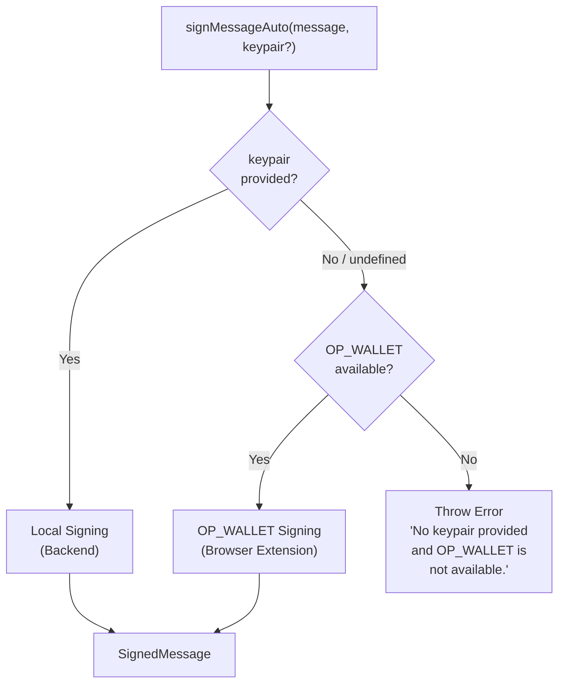
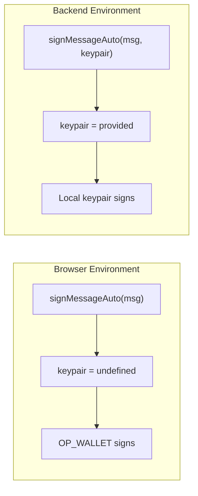

# MessageSigner

The `MessageSigner` is a singleton instance exported from `@btc-vision/transaction` that provides a unified API for cryptographic message signing and verification. It supports Schnorr signatures, Taproot-tweaked Schnorr signatures, and quantum-resistant ML-DSA (FIPS 204) signatures. Its most important feature is a set of **Auto methods** that transparently detect whether the code is running in a browser (with the OP_WALLET extension) or on a backend server, and delegate signing accordingly.

## Table of Contents

- [Architecture Overview](#architecture-overview)
- [Interfaces](#interfaces)
  - [SignedMessage](#signedmessage)
  - [MLDSASignedMessage](#mldsasignedmessage)
- [Environment Detection](#environment-detection)
  - [isOPWalletAvailable](#isopwalletavailable)
- [Auto Methods (Recommended)](#auto-methods-recommended)
  - [signMessageAuto](#signmessageauto)
  - [tweakAndSignMessageAuto](#tweakandsignmessageauto)
  - [signMLDSAMessageAuto](#signmldsamessageauto)
- [Non-Auto Methods (Backend Only)](#non-auto-methods-backend-only)
  - [signMessage](#signmessage)
  - [tweakAndSignMessage](#tweakandsignmessage)
  - [signMLDSAMessage](#signmldsamessage)
- [Browser Wallet Methods](#browser-wallet-methods)
  - [trySignSchnorrWithOPWallet](#trysignschnorrwithopwallet)
  - [trySignMLDSAWithOPWallet](#trysignmldsawithopwallet)
  - [verifyMLDSAWithOPWallet](#verifymldsawithopwallet)
  - [getMLDSAPublicKeyFromOPWallet](#getmldsapublickeyfromopwallet)
- [Verification Methods](#verification-methods)
  - [verifySignature](#verifysignature)
  - [tweakAndVerifySignature](#tweakandverifysignature)
  - [verifyMLDSASignature](#verifymldsasignature)
- [Utility Methods](#utility-methods)
  - [sha256](#sha256)
- [Auto vs Non-Auto: Critical Guidance](#auto-vs-non-auto-critical-guidance)
- [Code Examples](#code-examples)
  - [Backend Schnorr Signing](#backend-schnorr-signing)
  - [Backend Tweaked Signing](#backend-tweaked-signing)
  - [Backend ML-DSA Signing](#backend-ml-dsa-signing)
  - [Browser Auto Signing](#browser-auto-signing)
  - [Universal Code with Auto Methods](#universal-code-with-auto-methods)
  - [Full Verification Workflow](#full-verification-workflow)
- [Best Practices](#best-practices)
- [Navigation](#navigation)

## Architecture Overview

The MessageSigner auto-detection flow determines which signing backend to use at runtime:



The same flow applies to `tweakAndSignMessageAuto` and `signMLDSAMessageAuto`. The private `getOPWallet()` method checks for `window.opnet` and validates it with the `isOPWallet` type guard before delegating to the browser extension.

## Interfaces

### SignedMessage

Returned by all Schnorr signing methods (both standard and tweaked).

```typescript
interface SignedMessage {
    readonly signature: Uint8Array;  // 64-byte Schnorr signature
    readonly message: Uint8Array;    // SHA-256 hash of the original message
}
```

### MLDSASignedMessage

Returned by all ML-DSA signing methods. Includes additional metadata required for quantum-resistant verification.

```typescript
interface MLDSASignedMessage {
    readonly signature: Uint8Array;        // ML-DSA signature (2420-4627 bytes depending on level)
    readonly message: Uint8Array;          // SHA-256 hash of the original message
    readonly publicKey: Uint8Array;        // ML-DSA public key used for signing
    readonly securityLevel: MLDSASecurityLevel;  // LEVEL2, LEVEL3, or LEVEL5
}
```

## Environment Detection

### isOPWalletAvailable

Checks whether the OP_WALLET browser extension is present and valid.

```typescript
isOPWalletAvailable(): boolean
```

**Returns:** `true` if `window.opnet` exists and satisfies the `OPWallet` interface, `false` otherwise. Always returns `false` in Node.js / non-browser environments (where `window` is undefined).

**Example:**

```typescript
import { MessageSigner } from '@btc-vision/transaction';

if (MessageSigner.isOPWalletAvailable()) {
    console.log('OP_WALLET detected - browser signing available');
} else {
    console.log('No OP_WALLET - provide a keypair for signing');
}
```

## Auto Methods (Recommended)

The Auto methods are the **primary recommended API** for signing messages. They unify browser and backend signing behind a single call, making your code portable across environments.

**Key rule:** When `keypair` is `undefined` or omitted, the method attempts browser signing via OP_WALLET. When `keypair` is provided, it signs locally using the keypair directly.

### signMessageAuto

Signs a message with a Schnorr signature, automatically selecting browser or backend signing.

```typescript
async signMessageAuto(
    message: Uint8Array | string,
    keypair?: UniversalSigner
): Promise<SignedMessage>
```

**Parameters:**

| Parameter | Type | Required | Description |
|-----------|------|----------|-------------|
| `message` | `Uint8Array \| string` | Yes | The message to sign. Strings are UTF-8 encoded, then SHA-256 hashed before signing. |
| `keypair` | `UniversalSigner` | No | The signing keypair. Omit for browser (OP_WALLET) signing; provide for backend signing. |

**Returns:** `Promise<SignedMessage>` containing the 64-byte Schnorr signature and the SHA-256 hashed message.

**Throws:**
- `Error('No keypair provided and OP_WALLET is not available.')` if no keypair is given and OP_WALLET is not detected.

### tweakAndSignMessageAuto

Signs a message with a Taproot-tweaked Schnorr signature, automatically selecting browser or backend signing.

```typescript
async tweakAndSignMessageAuto(
    message: Uint8Array | string,
    keypair?: UniversalSigner,
    network?: Network
): Promise<SignedMessage>
```

**Parameters:**

| Parameter | Type | Required | Description |
|-----------|------|----------|-------------|
| `message` | `Uint8Array \| string` | Yes | The message to sign. Strings are UTF-8 encoded, then SHA-256 hashed before signing. |
| `keypair` | `UniversalSigner` | No | The signing keypair. Omit for browser signing; provide for backend signing. |
| `network` | `Network` | Conditionally | **Required when `keypair` is provided** (backend signing). The Bitcoin network configuration (`networks.bitcoin`, `networks.testnet`, or `networks.regtest`). Ignored when using OP_WALLET. |

**Returns:** `Promise<SignedMessage>` containing the 64-byte tweaked Schnorr signature and the SHA-256 hashed message.

**Throws:**
- `Error('No keypair provided and OP_WALLET is not available.')` if no keypair is given and OP_WALLET is not detected.
- `Error('Network is required when signing with a local keypair.')` if a keypair is provided but `network` is omitted.

**Note:** When signing via OP_WALLET (no keypair), the wallet handles tweaking internally through `wallet.web3.signSchnorr()`. The `network` parameter is not needed in this case.

### signMLDSAMessageAuto

Signs a message with a quantum-resistant ML-DSA signature, automatically selecting browser or backend signing.

```typescript
async signMLDSAMessageAuto(
    message: Uint8Array | string,
    mldsaKeypair?: QuantumBIP32Interface
): Promise<MLDSASignedMessage>
```

**Parameters:**

| Parameter | Type | Required | Description |
|-----------|------|----------|-------------|
| `message` | `Uint8Array \| string` | Yes | The message to sign. Strings are UTF-8 encoded, then SHA-256 hashed before signing. |
| `mldsaKeypair` | `QuantumBIP32Interface` | No | The ML-DSA keypair. Omit for browser (OP_WALLET) signing; provide for backend signing. |

**Returns:** `Promise<MLDSASignedMessage>` containing the ML-DSA signature, hashed message, public key, and security level.

**Throws:**
- `Error('No ML-DSA keypair provided and OP_WALLET is not available.')` if no keypair is given and OP_WALLET is not detected.

## Non-Auto Methods (Backend Only)

These methods sign directly with a provided keypair. They do **not** check for OP_WALLET and will throw errors if a valid keypair is not provided. Use these only when you are certain you are running in a backend environment with access to private keys.

### signMessage

Signs a message with a standard Schnorr signature using a local keypair.

```typescript
signMessage(
    keypair: UniversalSigner,
    message: Uint8Array | string
): SignedMessage
```

**Parameters:**

| Parameter | Type | Required | Description |
|-----------|------|----------|-------------|
| `keypair` | `UniversalSigner` | Yes | The signing keypair. Must contain a `privateKey`. |
| `message` | `Uint8Array \| string` | Yes | The message to sign. Strings are UTF-8 encoded, then SHA-256 hashed. |

**Returns:** `SignedMessage` (synchronous, not a Promise).

**Throws:**
- `Error('Private key not found in keypair.')` if `keypair.privateKey` is falsy.
- `Error('backend.signSchnorr is not available.')` if the ECC backend is not initialized.

### tweakAndSignMessage

Signs a message with a Taproot-tweaked Schnorr signature using a local keypair.

```typescript
tweakAndSignMessage(
    keypair: UniversalSigner,
    message: Uint8Array | string,
    network: Network
): SignedMessage
```

**Parameters:**

| Parameter | Type | Required | Description |
|-----------|------|----------|-------------|
| `keypair` | `UniversalSigner` | Yes | The signing keypair. Must contain a `privateKey`. |
| `message` | `Uint8Array \| string` | Yes | The message to sign. |
| `network` | `Network` | Yes | The Bitcoin network. Required for computing the Taproot tweak. |

**Returns:** `SignedMessage` (synchronous).

**Internal behavior:** Applies `TweakedSigner.tweakSigner(keypair, { network })` to derive a tweaked keypair, then delegates to `signMessage`.

### signMLDSAMessage

Signs a message with a quantum-resistant ML-DSA signature using a local keypair.

```typescript
signMLDSAMessage(
    mldsaKeypair: QuantumBIP32Interface,
    message: Uint8Array | string
): MLDSASignedMessage
```

**Parameters:**

| Parameter | Type | Required | Description |
|-----------|------|----------|-------------|
| `mldsaKeypair` | `QuantumBIP32Interface` | Yes | The ML-DSA keypair from BIP32 quantum wallet derivation. Must contain a `privateKey`. |
| `message` | `Uint8Array \| string` | Yes | The message to sign. |

**Returns:** `MLDSASignedMessage` (synchronous).

**Throws:**
- `Error('ML-DSA private key not found in keypair.')` if `mldsaKeypair.privateKey` is falsy.

## Browser Wallet Methods

These methods interact directly with the OP_WALLET browser extension. They return `null` when OP_WALLET is not available (instead of throwing), making them safe to call speculatively. The Auto methods use these internally.

### trySignSchnorrWithOPWallet

Attempts to sign a message via the OP_WALLET browser extension using Schnorr.

```typescript
async trySignSchnorrWithOPWallet(
    message: Uint8Array | string
): Promise<SignedMessage | null>
```

**Parameters:**

| Parameter | Type | Required | Description |
|-----------|------|----------|-------------|
| `message` | `Uint8Array \| string` | Yes | The message to sign. |

**Returns:** `Promise<SignedMessage | null>`. Returns `null` if OP_WALLET is not available. Otherwise returns the signed message from the wallet extension.

**Internal behavior:** Hashes the message with SHA-256, converts to hex, and calls `wallet.web3.signSchnorr(messageHex)`.

### trySignMLDSAWithOPWallet

Attempts to sign a message via the OP_WALLET browser extension using ML-DSA.

```typescript
async trySignMLDSAWithOPWallet(
    message: Uint8Array | string
): Promise<MLDSASignedMessage | null>
```

**Parameters:**

| Parameter | Type | Required | Description |
|-----------|------|----------|-------------|
| `message` | `Uint8Array \| string` | Yes | The message to sign. |

**Returns:** `Promise<MLDSASignedMessage | null>`. Returns `null` if OP_WALLET is not available. Otherwise returns the ML-DSA signed message including the public key and security level from the wallet.

**Internal behavior:** Hashes the message with SHA-256, converts to hex, and calls `wallet.web3.signMLDSAMessage(messageHex)`.

### verifyMLDSAWithOPWallet

Verifies an ML-DSA signature via the OP_WALLET browser extension.

```typescript
async verifyMLDSAWithOPWallet(
    message: Uint8Array | string,
    signature: MLDSASignedMessage
): Promise<boolean | null>
```

**Parameters:**

| Parameter | Type | Required | Description |
|-----------|------|----------|-------------|
| `message` | `Uint8Array \| string` | Yes | The original message that was signed. |
| `signature` | `MLDSASignedMessage` | Yes | The full ML-DSA signed message object to verify. |

**Returns:** `Promise<boolean | null>`. Returns `null` if OP_WALLET is not available. Returns `true` or `false` for the verification result from the wallet.

### getMLDSAPublicKeyFromOPWallet

Retrieves the user's ML-DSA public key from the OP_WALLET browser extension.

```typescript
async getMLDSAPublicKeyFromOPWallet(): Promise<Uint8Array | null>
```

**Returns:** `Promise<Uint8Array | null>`. Returns `null` if OP_WALLET is not available. Otherwise returns the ML-DSA public key as a `Uint8Array`.

## Verification Methods

All verification methods are synchronous and work in both browser and backend environments. They do not require private keys.

### verifySignature

Verifies a standard Schnorr signature against a public key and message.

```typescript
verifySignature(
    publicKey: Uint8Array,
    message: Uint8Array | string,
    signature: Uint8Array
): boolean
```

**Parameters:**

| Parameter | Type | Required | Description |
|-----------|------|----------|-------------|
| `publicKey` | `Uint8Array` | Yes | The signer's public key (33-byte compressed or 32-byte x-only). Internally converted to x-only via `toXOnly`. |
| `message` | `Uint8Array \| string` | Yes | The original message (not the hash). The method hashes it with SHA-256 internally. |
| `signature` | `Uint8Array` | Yes | The 64-byte Schnorr signature to verify. |

**Returns:** `boolean` -- `true` if the signature is valid, `false` otherwise.

**Throws:**
- `Error('Invalid signature length.')` if `signature.length !== 64`.
- `Error('backend.verifySchnorr is not available.')` if the ECC backend is not initialized.

### tweakAndVerifySignature

Verifies a Taproot-tweaked Schnorr signature. Internally tweaks the provided public key with `EcKeyPair.tweakPublicKey()` then delegates to `verifySignature`.

```typescript
tweakAndVerifySignature(
    publicKey: Uint8Array,
    message: Uint8Array | string,
    signature: Uint8Array
): boolean
```

**Parameters:**

| Parameter | Type | Required | Description |
|-----------|------|----------|-------------|
| `publicKey` | `Uint8Array` | Yes | The signer's **untweaked** public key. The method applies the Taproot tweak internally. |
| `message` | `Uint8Array \| string` | Yes | The original message (not the hash). |
| `signature` | `Uint8Array` | Yes | The 64-byte tweaked Schnorr signature. |

**Returns:** `boolean`

### verifyMLDSASignature

Verifies a quantum-resistant ML-DSA signature.

```typescript
verifyMLDSASignature(
    mldsaKeypair: QuantumBIP32Interface,
    message: Uint8Array | string,
    signature: Uint8Array
): boolean
```

**Parameters:**

| Parameter | Type | Required | Description |
|-----------|------|----------|-------------|
| `mldsaKeypair` | `QuantumBIP32Interface` | Yes | An ML-DSA keypair containing the public key. Can be a full keypair or a public-key-only keypair created via `QuantumBIP32Factory.fromPublicKey()`. |
| `message` | `Uint8Array \| string` | Yes | The original message (not the hash). |
| `signature` | `Uint8Array` | Yes | The ML-DSA signature bytes. |

**Returns:** `boolean`

**Note:** Unlike Schnorr verification which takes a raw public key, ML-DSA verification requires a keypair object because it embeds security level information and the ML-DSA verification algorithm structure. If you only have a raw public key, reconstruct a keypair with `QuantumBIP32Factory.fromPublicKey()`.

## Utility Methods

### sha256

Computes the SHA-256 hash of a message.

```typescript
sha256(message: Uint8Array): Uint8Array
```

**Parameters:**

| Parameter | Type | Required | Description |
|-----------|------|----------|-------------|
| `message` | `Uint8Array` | Yes | The data to hash. |

**Returns:** `Uint8Array` -- 32-byte SHA-256 digest.

**Note:** All signing methods call `sha256` internally before signing. You do not need to pre-hash messages unless you have a specific reason to do so (such as signing the same hash with multiple algorithms).

## Auto vs Non-Auto: Critical Guidance

This section explains the most important architectural decision in the MessageSigner API. Choosing incorrectly between Auto and Non-Auto methods will cause runtime crashes.

### The Problem

OPNet applications can run in two very different environments:

1. **Browser** -- The user's private keys are held by the OP_WALLET browser extension. Your JavaScript code does **not** have access to private keys. Signing is delegated to `window.opnet.web3.signSchnorr()` and related wallet methods.

2. **Backend (Node.js)** -- Your server has direct access to private keys via keypair objects (`UniversalSigner`, `QuantumBIP32Interface`). Signing is done locally using the ECC/ML-DSA backends.

### The Solution: Auto Methods

The Auto methods (`signMessageAuto`, `tweakAndSignMessageAuto`, `signMLDSAMessageAuto`) solve this by using a simple convention:



| Scenario | `keypair` parameter | What happens |
|----------|---------------------|--------------|
| Browser with OP_WALLET | `undefined` (omitted) | OP_WALLET handles signing via browser extension |
| Backend with keypair | Provided (`UniversalSigner`) | Local signing with the keypair's private key |
| Browser without OP_WALLET | `undefined` (omitted) | **Throws error** -- no signing mechanism available |
| Backend without keypair | `undefined` (omitted) | Checks OP_WALLET (fails in Node.js), then **throws error** |

### When to Use Auto Methods

**Always use Auto methods when writing library code or shared modules** that may run in either environment. They are the safe, portable choice.

```typescript
// This function works in BOTH browser and backend
async function signTransaction(message: string, keypair?: UniversalSigner) {
    return MessageSigner.signMessageAuto(message, keypair);
}
```

### When to Use Non-Auto Methods

Use Non-Auto methods **only** when you are 100% certain you are in a backend environment and you want synchronous behavior. The Non-Auto methods (`signMessage`, `tweakAndSignMessage`, `signMLDSAMessage`) are synchronous and return `SignedMessage` directly (not a Promise).

```typescript
// Backend-only code -- this WILL crash in a browser without a keypair
const signed = MessageSigner.signMessage(keypair, message);
```

### Common Mistakes

**Mistake 1: Using Non-Auto methods in browser code**

```typescript
// WRONG -- will crash in browser because there is no keypair
const signed = MessageSigner.signMessage(undefined as any, message);

// CORRECT -- use Auto method, which falls back to OP_WALLET
const signed = await MessageSigner.signMessageAuto(message);
```

**Mistake 2: Forgetting the network parameter for tweaked backend signing**

```typescript
// WRONG -- network is required for local tweaked signing
const signed = await MessageSigner.tweakAndSignMessageAuto(message, keypair);

// CORRECT -- provide network when keypair is present
const signed = await MessageSigner.tweakAndSignMessageAuto(message, keypair, network);
```

**Mistake 3: Not awaiting Auto methods**

```typescript
// WRONG -- Auto methods return Promises
const signed = MessageSigner.signMessageAuto(message, keypair);
console.log(signed.signature); // undefined! signed is a Promise

// CORRECT
const signed = await MessageSigner.signMessageAuto(message, keypair);
console.log(signed.signature); // Uint8Array
```

## Code Examples

### Backend Schnorr Signing

```typescript
import { MessageSigner, EcKeyPair } from '@btc-vision/transaction';
import { networks, toHex } from '@btc-vision/bitcoin';

const network = networks.bitcoin;
const keypair = EcKeyPair.fromWIF('your-private-key-wif', network);

// Sign a message (synchronous, backend only)
const message = 'Authenticate this action';
const signed = MessageSigner.signMessage(keypair, message);

console.log('Signature:', toHex(signed.signature));       // 64-byte hex
console.log('Message hash:', toHex(signed.message));      // 32-byte SHA-256 hex

// Verify the signature
const isValid = MessageSigner.verifySignature(
    keypair.publicKey,
    message,               // Pass the original message, not the hash
    signed.signature,
);

console.log('Valid:', isValid);  // true
```

### Backend Tweaked Signing

```typescript
import { MessageSigner, EcKeyPair } from '@btc-vision/transaction';
import { networks, toHex } from '@btc-vision/bitcoin';

const network = networks.bitcoin;
const keypair = EcKeyPair.fromWIF('your-private-key-wif', network);

// Sign with Taproot tweak (synchronous, backend only)
const message = 'Taproot-compatible signature';
const signed = MessageSigner.tweakAndSignMessage(keypair, message, network);

console.log('Tweaked signature:', toHex(signed.signature));

// Verify with the UNTWEAKED public key
// tweakAndVerifySignature applies the tweak internally
const isValid = MessageSigner.tweakAndVerifySignature(
    keypair.publicKey,     // Untweaked public key
    message,
    signed.signature,
);

console.log('Valid:', isValid);  // true
```

### Backend ML-DSA Signing

```typescript
import {
    MessageSigner,
    Mnemonic,
    QuantumBIP32Factory,
    MLDSASecurityLevel,
} from '@btc-vision/transaction';
import { networks, toHex } from '@btc-vision/bitcoin';

const network = networks.bitcoin;
const securityLevel = MLDSASecurityLevel.LEVEL2;

// Generate a quantum wallet
const mnemonic = Mnemonic.generate(undefined, '', network, securityLevel);
const wallet = mnemonic.derive(0);

// Sign with ML-DSA (synchronous, backend only)
const message = 'Quantum-resistant authentication';
const signed = MessageSigner.signMLDSAMessage(wallet.mldsaKeypair, message);

console.log('Signature size:', signed.signature.length, 'bytes');  // 2420 for LEVEL2
console.log('Public key size:', signed.publicKey.length, 'bytes'); // 1312 for LEVEL2
console.log('Security level:', signed.securityLevel);

// Verify with the original keypair
const isValid = MessageSigner.verifyMLDSASignature(
    wallet.mldsaKeypair,
    message,
    signed.signature,
);

console.log('Valid:', isValid);  // true

// Verify with a public-key-only keypair (e.g., on a different machine)
const publicKeyOnly = QuantumBIP32Factory.fromPublicKey(
    signed.publicKey,
    wallet.chainCode,
    network,
    securityLevel,
);

const isValidRemote = MessageSigner.verifyMLDSASignature(
    publicKeyOnly,
    message,
    signed.signature,
);

console.log('Remote verification:', isValidRemote);  // true
```

### Browser Auto Signing

```typescript
import { MessageSigner } from '@btc-vision/transaction';

// In a browser with OP_WALLET installed:
// No keypair needed -- OP_WALLET handles everything

async function browserSign() {
    // Check wallet availability (optional, Auto methods handle this)
    if (!MessageSigner.isOPWalletAvailable()) {
        alert('Please install the OP_WALLET extension');
        return;
    }

    // Schnorr signing via OP_WALLET
    const schnorrSigned = await MessageSigner.signMessageAuto(
        'Sign this with your wallet',
    );
    console.log('Schnorr signature:', schnorrSigned.signature);

    // Tweaked signing via OP_WALLET (no network needed)
    const tweakedSigned = await MessageSigner.tweakAndSignMessageAuto(
        'Taproot-compatible browser signature',
    );
    console.log('Tweaked signature:', tweakedSigned.signature);

    // ML-DSA signing via OP_WALLET
    const mldsaSigned = await MessageSigner.signMLDSAMessageAuto(
        'Quantum-resistant browser signature',
    );
    console.log('ML-DSA signature:', mldsaSigned.signature);
    console.log('ML-DSA public key:', mldsaSigned.publicKey);
    console.log('Security level:', mldsaSigned.securityLevel);
}
```

### Universal Code with Auto Methods

This pattern writes code that works in **both** browser and backend environments without modification.

```typescript
import { MessageSigner } from '@btc-vision/transaction';
import type { UniversalSigner } from '@btc-vision/ecpair';
import type { Network } from '@btc-vision/bitcoin';

/**
 * Signs an authentication challenge.
 * - In the browser: call with just the message (OP_WALLET signs).
 * - On the backend: call with the message and a keypair.
 */
async function signAuthChallenge(
    challenge: string,
    keypair?: UniversalSigner,
): Promise<Uint8Array> {
    const signed = await MessageSigner.signMessageAuto(challenge, keypair);
    return signed.signature;
}

/**
 * Signs with Taproot tweak.
 * - In the browser: call without keypair/network.
 * - On the backend: call with keypair and network.
 */
async function signTweakedChallenge(
    challenge: string,
    keypair?: UniversalSigner,
    network?: Network,
): Promise<Uint8Array> {
    const signed = await MessageSigner.tweakAndSignMessageAuto(
        challenge,
        keypair,
        network,
    );
    return signed.signature;
}

// Browser usage:
// const sig = await signAuthChallenge('challenge-string');

// Backend usage:
// const sig = await signAuthChallenge('challenge-string', myKeypair);
```

### Full Verification Workflow

```typescript
import {
    MessageSigner,
    EcKeyPair,
    Mnemonic,
    QuantumBIP32Factory,
    MLDSASecurityLevel,
} from '@btc-vision/transaction';
import { networks, toHex, fromHex } from '@btc-vision/bitcoin';

const network = networks.regtest;

// --- Schnorr ---
const keypair = EcKeyPair.generateRandomKeyPair(network);
const message = 'Verify all the things';

const schnorrSigned = MessageSigner.signMessage(keypair, message);
const schnorrValid = MessageSigner.verifySignature(
    keypair.publicKey,
    message,
    schnorrSigned.signature,
);
console.log('Schnorr valid:', schnorrValid);  // true

// Tampered message fails
const schnorrInvalid = MessageSigner.verifySignature(
    keypair.publicKey,
    'Wrong message',
    schnorrSigned.signature,
);
console.log('Schnorr tampered:', schnorrInvalid);  // false

// --- Tweaked Schnorr ---
const tweakedSigned = MessageSigner.tweakAndSignMessage(keypair, message, network);
const tweakedValid = MessageSigner.tweakAndVerifySignature(
    keypair.publicKey,     // Pass the UNTWEAKED key
    message,
    tweakedSigned.signature,
);
console.log('Tweaked valid:', tweakedValid);  // true

// --- ML-DSA ---
const securityLevel = MLDSASecurityLevel.LEVEL2;
const mnemonic = Mnemonic.generate(undefined, '', network, securityLevel);
const wallet = mnemonic.derive(0);

const mldsaSigned = MessageSigner.signMLDSAMessage(wallet.mldsaKeypair, message);

// Verify with public-key-only reconstruction (simulating remote verification)
const remoteKeypair = QuantumBIP32Factory.fromPublicKey(
    mldsaSigned.publicKey,
    wallet.chainCode,
    network,
    securityLevel,
);

const mldsaValid = MessageSigner.verifyMLDSASignature(
    remoteKeypair,
    message,
    mldsaSigned.signature,
);
console.log('ML-DSA valid:', mldsaValid);  // true

// --- Browser ML-DSA verification via OP_WALLET ---
// (only works in browser with OP_WALLET)
const walletResult = await MessageSigner.verifyMLDSAWithOPWallet(message, mldsaSigned);
if (walletResult !== null) {
    console.log('OP_WALLET ML-DSA valid:', walletResult);
} else {
    console.log('OP_WALLET not available, skipping wallet verification');
}
```

## Best Practices

1. **Default to Auto methods.** Unless you have a specific reason to use Non-Auto methods (synchronous signing in a guaranteed backend context), always prefer `signMessageAuto`, `tweakAndSignMessageAuto`, and `signMLDSAMessageAuto`. They handle environment detection for you and future-proof your code.

2. **Always verify signatures.** Never trust signed data without verification, especially data received over a network. Use `verifySignature`, `tweakAndVerifySignature`, or `verifyMLDSASignature` before acting on signed messages.

3. **Pass original messages to verification methods.** All verification methods hash the message internally with SHA-256. Pass the original message string or bytes, not a pre-computed hash. The only exception is if both signer and verifier explicitly agree on a pre-hashed protocol.

4. **Pass the untweaked public key to `tweakAndVerifySignature`.** The method applies the Taproot tweak internally. Passing an already-tweaked key will produce a double-tweaked key and verification will fail.

5. **Provide `network` for tweaked backend signing.** When calling `tweakAndSignMessageAuto` or `tweakAndSignMessage` with a local keypair, the `network` parameter is required for computing the correct Taproot tweak. Omitting it throws an error.

6. **Use `QuantumBIP32Factory.fromPublicKey()` for remote ML-DSA verification.** When you only have a public key (not the original keypair), reconstruct a public-key-only keypair before calling `verifyMLDSASignature`. This is required because the verification algorithm needs security level metadata embedded in the keypair object.

7. **Structure signed messages with context.** Include action type, timestamps, and nonces in your signed messages to prevent replay attacks:

    ```typescript
    const message = JSON.stringify({
        action: 'transfer',
        amount: '50000',
        timestamp: Date.now(),
        nonce: toHex(crypto.getRandomValues(new Uint8Array(16))),
    });

    const signed = await MessageSigner.signMessageAuto(message, keypair);
    ```

8. **Never expose private keys.** The OP_WALLET architecture exists specifically to keep private keys inside the browser extension. In backend code, load keys from secure storage (environment variables, HSM, encrypted vaults) and avoid logging them.

9. **Handle OP_WALLET absence gracefully.** In browser code, check `isOPWalletAvailable()` before signing to provide a user-friendly error message instead of an unhandled exception.

10. **Match security levels for ML-DSA.** When verifying ML-DSA signatures, the security level used for `QuantumBIP32Factory.fromPublicKey()` must match the level used during signing. Mismatched levels cause verification failure.

## Navigation

- [Transaction Building Guide](../transaction-building.md)
- [Offline Transaction Signing](../offline-transaction-signing.md)
- [Quantum Support: Message Signing](../quantum-support/04-message-signing.md)
- [Documentation Index](../README.md)
