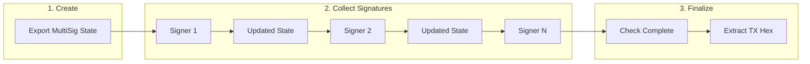

# Offline Transaction Signing

This module enables secure offline transaction signing workflows. Transactions can be built in an online environment, exported to an air-gapped offline server for signing, then broadcast from the online environment.

## Overview

The offline signing workflow separates transaction construction from signing:


## Quick Start

### Basic Usage

```typescript
import {
    OfflineTransactionManager,
    IFundingTransactionParameters
} from '@btc-vision/transaction';
import { networks } from '@btc-vision/bitcoin';

// Phase 1: Online - Export transaction state
const params: IFundingTransactionParameters = {
    signer: onlineSigner,
    mldsaSigner: null,
    network: networks.bitcoin,
    utxos: [...],
    from: 'bc1p...',
    to: 'bc1p...',
    feeRate: 10,
    priorityFee: 1000n,
    gasSatFee: 500n,
    amount: 50000n,
};

const exportedState = OfflineTransactionManager.exportFunding(params);
// Send exportedState (base64 string) to offline environment

// Phase 2: Offline - Sign and export
const signedTxHex = await OfflineTransactionManager.importSignAndExport(
    exportedState,
    { signer: offlineSigner }
);
// Send signedTxHex back to online environment for broadcast
```

### Fee Bumping (RBF)


```typescript
// Rebuild with higher fee rate (returns new state, not signed)
const bumpedState = OfflineTransactionManager.rebuildWithNewFees(
    originalState,
    50, // New fee rate in sat/vB
);

// Or rebuild and sign in one step
const signedBumpedTx = await OfflineTransactionManager.rebuildSignAndExport(
    originalState,
    50,
    { signer: offlineSigner }
);
```

## API Reference

### OfflineTransactionManager

The main entry point for offline transaction workflows.

#### Export Methods

```typescript
// Export a FundingTransaction
static exportFunding(
    params: IFundingTransactionParameters,
    precomputed?: Partial<PrecomputedData>
): string;

// Export a DeploymentTransaction
static exportDeployment(
    params: IDeploymentParameters,
    precomputed: { compiledTargetScript: string; randomBytes: string; }
): string;

// Export an InteractionTransaction
static exportInteraction(
    params: IInteractionParameters,
    precomputed: { compiledTargetScript: string; randomBytes: string; }
): string;

// Export a MultiSignTransaction
static exportMultiSig(
    params: MultiSigParams,
    precomputed?: Partial<PrecomputedData>
): string;

// Export a CustomScriptTransaction
static exportCustomScript(
    params: CustomScriptParams,
    precomputed?: Partial<PrecomputedData>
): string;

// Export a CancelTransaction
static exportCancel(
    params: CancelParams,
    precomputed?: Partial<PrecomputedData>
): string;
```

#### Import and Sign Methods

```typescript
// Import state and prepare for signing
static importForSigning(
    serializedState: string,
    options: ReconstructionOptions
): TransactionBuilder<TransactionType>;

// Sign a reconstructed builder
static async signAndExport(
    builder: TransactionBuilder<TransactionType>
): Promise<string>;

// Convenience: Import, sign, and export in one call
static async importSignAndExport(
    serializedState: string,
    options: ReconstructionOptions
): Promise<string>;
```

#### Fee Bumping Methods

```typescript
// Rebuild state with new fee rate (returns new state, not signed)
static rebuildWithNewFees(
    serializedState: string,
    newFeeRate: number
): string;

// Rebuild, sign, and export with new fee rate
static async rebuildSignAndExport(
    serializedState: string,
    newFeeRate: number,
    options: ReconstructionOptions
): Promise<string>;
```

#### Utility Methods

```typescript
// Inspect serialized state without signing
static inspect(serializedState: string): ISerializableTransactionState;

// Validate state integrity (checksum verification)
static validate(serializedState: string): boolean;

// Get transaction type from state
static getType(serializedState: string): TransactionType;

// Parse/serialize state objects
static fromBase64(base64State: string): ISerializableTransactionState;
static toBase64(state: ISerializableTransactionState): string;

// Format conversion (base64 <-> hex)
static toHex(serializedState: string): string;
static fromHex(hexState: string): string;
```

### ReconstructionOptions

Options for reconstructing a transaction from serialized state:

```typescript
interface ReconstructionOptions {
    // Primary signer (required)
    signer: Signer | ECPairInterface;

    // Optional: Override fee rate for fee bumping
    newFeeRate?: number;

    // Optional: Override priority fee
    newPriorityFee?: bigint;

    // Optional: Override gas sat fee
    newGasSatFee?: bigint;

    // Signer map for address rotation mode
    signerMap?: SignerMap;

    // MLDSA signer for quantum-resistant features
    mldsaSigner?: QuantumBIP32Interface | null;
}
```

## Address Rotation Mode

For wallets with multiple addresses (different signers per UTXO):


```typescript
import {
    OfflineTransactionManager,
    createSignerMap,
    createAddressRotation
} from '@btc-vision/transaction';

// Phase 1: Export with address rotation enabled
// createSignerMap takes an array of [address, signer] tuples
const signerMap = createSignerMap([
    ['bc1p...address1', signer1],
    ['bc1p...address2', signer2],
]);

const params: IFundingTransactionParameters = {
    signer: signer1,
    mldsaSigner: null,
    network,
    utxos: [
        { /* UTXO from address1 */ },
        { /* UTXO from address2 */ },
    ],
    from: 'bc1p...address1',
    to: 'bc1p...recipient',
    feeRate: 10,
    priorityFee: 1000n,
    gasSatFee: 500n,
    amount: 50000n,
    addressRotation: createAddressRotation(signerMap),
};

const exported = OfflineTransactionManager.exportFunding(params);

// Phase 2: Provide signers for each address
const offlineSignerMap = createSignerMap([
    { address: 'bc1p...address1', signer: offlineSigner1 },
    { address: 'bc1p...address2', signer: offlineSigner2 },
], network);

const signedTx = await OfflineTransactionManager.importSignAndExport(
    exported,
    {
        signer: offlineSigner1,
        signerMap: offlineSignerMap,
    }
);
```

## Serialization Format

The serialized state uses a compact binary format with the following structure:

```
┌─────────────────────────────────────────────────────────────────┐
│                        HEADER (16 bytes)                        │
├────────┬────────┬───────────┬────────┬───────────┬─────────────┤
│ 0x42   │ Format │ Consensus │  Type  │ Chain ID  │  Timestamp  │
│  1B    │   1B   │    1B     │   1B   │    4B     │     8B      │
├────────┴────────┴───────────┴────────┴───────────┴─────────────┤
│                        BODY (variable)                          │
├─────────────────────────────────────────────────────────────────┤
│  Base Params (from, to, feeRate, priorityFee, gasSatFee)        │
├─────────────────────────────────────────────────────────────────┤
│  UTXOs Array                                                    │
├─────────────────────────────────────────────────────────────────┤
│  Optional Inputs                                                │
├─────────────────────────────────────────────────────────────────┤
│  Optional Outputs                                               │
├─────────────────────────────────────────────────────────────────┤
│  Signer Mappings (address → input indices)                      │
├─────────────────────────────────────────────────────────────────┤
│  Type-Specific Data                                             │
├─────────────────────────────────────────────────────────────────┤
│  Precomputed Data                                               │
├─────────────────────────────────────────────────────────────────┤
│                      CHECKSUM (32 bytes)                        │
├─────────────────────────────────────────────────────────────────┤
│                      Double SHA256 Hash                         │
└─────────────────────────────────────────────────────────────────┘
```

### Header Fields

| Offset | Size | Field |
|--------|------|-------|
| 0 | 1 | Magic byte (0x42) |
| 1 | 1 | Format version |
| 2 | 1 | Consensus version |
| 3 | 1 | Transaction type |
| 4-7 | 4 | Chain ID |
| 8-15 | 8 | Timestamp |

## Supported Transaction Types

| Type | Export Method | Type-Specific Data |
|------|---------------|-------------------|
| Funding | `exportFunding()` | amount, splitInputsInto |
| Deployment | `exportDeployment()` | bytecode, calldata, challenge |
| Interaction | `exportInteraction()` | calldata, contract, challenge, loadedStorage |
| MultiSig | `exportMultiSig()` | pubkeys, minimumSignatures, receiver, existingPsbtBase64 |
| CustomScript | `exportCustomScript()` | scriptElements, witnesses, annex |
| Cancel | `exportCancel()` | compiledTargetScript |

## MultiSig Transactions

MultiSig transactions require collecting signatures from multiple parties before broadcasting. The offline signing module provides specialized methods for this workflow.



### MultiSig API Methods

```typescript
// Add a signature from one signer
static async multiSigAddSignature(
    serializedState: string,
    signer: Signer | ECPairInterface
): Promise<{
    state: string;      // Updated state with new signature
    signed: boolean;    // Whether signing succeeded
    final: boolean;     // Whether all signatures collected
    psbtBase64: string; // Current PSBT state
}>;

// Check if a public key has already signed
static multiSigHasSigned(
    serializedState: string,
    signerPubKey: Buffer | string
): boolean;

// Get current signature status
static multiSigGetSignatureStatus(serializedState: string): {
    required: number;   // Minimum signatures needed
    collected: number;  // Current signature count
    isComplete: boolean;
    signers: string[];  // Public keys that have signed
};

// Finalize and extract transaction hex
static multiSigFinalize(serializedState: string): string;

// Get PSBT for external signing tools
static multiSigGetPsbt(serializedState: string): string | null;

// Update PSBT after external signing
static multiSigUpdatePsbt(
    serializedState: string,
    psbtBase64: string
): string;
```

### MultiSig Example

```typescript
import {
    OfflineTransactionManager,
    EcKeyPair,
} from '@btc-vision/transaction';
import { networks } from '@btc-vision/bitcoin';

const network = networks.regtest;

// Create 3 signers for a 2-of-3 multisig
const signer1 = EcKeyPair.generateRandomKeyPair(network);
const signer2 = EcKeyPair.generateRandomKeyPair(network);
const signer3 = EcKeyPair.generateRandomKeyPair(network);

const pubkeys = [
    signer1.publicKey,
    signer2.publicKey,
    signer3.publicKey,
];

// Export initial multisig state
const params = {
    network,
    mldsaSigner: null,
    utxos: [/* vault UTXOs */],
    feeRate: 10,
    pubkeys,
    minimumSignatures: 2,
    receiver: 'bcrt1q...recipient',
    requestedAmount: 50000n,
    refundVault: 'bcrt1q...vault',
};

let state = OfflineTransactionManager.exportMultiSig(params);

// Signer 1 adds their signature
const result1 = await OfflineTransactionManager.multiSigAddSignature(state, signer1);
console.log('Signer 1 signed:', result1.signed);
console.log('Complete:', result1.final);
state = result1.state;

// Check status
const status = OfflineTransactionManager.multiSigGetSignatureStatus(state);
console.log(`Signatures: ${status.collected}/${status.required}`);

// Signer 2 adds their signature
const result2 = await OfflineTransactionManager.multiSigAddSignature(state, signer2);
console.log('Signer 2 signed:', result2.signed);
console.log('Complete:', result2.final); // true - we have 2 of 3
state = result2.state;

// Finalize and get transaction hex
if (OfflineTransactionManager.multiSigGetSignatureStatus(state).isComplete) {
    const txHex = OfflineTransactionManager.multiSigFinalize(state);
    console.log('Ready to broadcast:', txHex);
}
```

### External Signing Tools

For hardware wallets or external signing tools, you can extract and update the PSBT directly:

```typescript
// Get PSBT for external tool
const psbtBase64 = OfflineTransactionManager.multiSigGetPsbt(state);

// Send psbtBase64 to hardware wallet / external tool
// ... external signing happens ...

// Update state with signed PSBT
const signedPsbtBase64 = '...'; // From external tool
state = OfflineTransactionManager.multiSigUpdatePsbt(state, signedPsbtBase64);
```

## Precomputed Data

Some transaction types require precomputed data that must be preserved for deterministic rebuilds:

```typescript
interface PrecomputedData {
    // Script signer seed - changing this changes signatures
    randomBytes?: string;

    // Complex scripts that are expensive to recompute
    compiledTargetScript?: string;

    // For deployment transactions
    contractSeed?: string;
    contractAddress?: string;

    // Estimated fees
    estimatedFees?: string;
}
```

For Deployment and Interaction transactions, `randomBytes` and `compiledTargetScript` are required:

```typescript
const exported = OfflineTransactionManager.exportDeployment(params, {
    randomBytes: builder.getRandomBytes().toString('hex'),
    compiledTargetScript: builder.getCompiledScript().toString('hex'),
});
```

## State Manipulation

You can parse, modify, and re-serialize state objects:

```typescript
// Parse state from base64
const state = OfflineTransactionManager.fromBase64(exportedState);

// Inspect or modify the state
console.log('Original fee rate:', state.baseParams.feeRate);
console.log('Transaction type:', state.header.transactionType);

// Modify state (e.g., update fee rate manually)
state.baseParams.feeRate = 30;

// Re-serialize to base64
const modifiedState = OfflineTransactionManager.toBase64(state);

// Sign the modified state
const signedTx = await OfflineTransactionManager.importSignAndExport(
    modifiedState,
    { signer: offlineSigner }
);
```

## Security Considerations

1. **Private keys are never serialized** - Only public keys and addresses are stored
2. **Signers must be provided at reconstruction time** by the offline device
3. **Checksum verification** prevents tampering with serialized state
4. **Format versioning** allows future security improvements

## Error Handling

```typescript
try {
    const state = OfflineTransactionManager.inspect(serializedState);
} catch (error) {
    if (error.message.includes('Invalid magic byte')) {
        // Not a valid offline transaction state
    } else if (error.message.includes('Invalid checksum')) {
        // Data corrupted or tampered with
    } else if (error.message.includes('Unsupported format version')) {
        // State created with newer version
    }
}

// Validate before processing
if (!OfflineTransactionManager.validate(serializedState)) {
    throw new Error('Invalid transaction state');
}
```

## Complete Example

```typescript
import {
    OfflineTransactionManager,
    IFundingTransactionParameters,
    TransactionType,
    EcKeyPair,
} from '@btc-vision/transaction';
import { networks } from '@btc-vision/bitcoin';

// === ONLINE ENVIRONMENT ===

const network = networks.bitcoin;
const signer = EcKeyPair.generateRandomKeyPair(network);
const address = EcKeyPair.getTaprootAddress(signer, network);

// Create transaction parameters
const params: IFundingTransactionParameters = {
    signer,
    mldsaSigner: null,
    network,
    utxos: [{
        transactionId: 'abc123...'.padEnd(64, '0'),
        outputIndex: 0,
        value: 100000n,
        scriptPubKey: {
            hex: '5120...',
            address,
        },
    }],
    from: address,
    to: 'bc1p...recipient',
    feeRate: 10,
    priorityFee: 1000n,
    gasSatFee: 500n,
    amount: 50000n,
};

// Export state (send this to offline environment)
const exportedState = OfflineTransactionManager.exportFunding(params);
console.log('Exported state length:', exportedState.length);

// Validate the export
console.log('Valid:', OfflineTransactionManager.validate(exportedState));

// Inspect metadata
const metadata = OfflineTransactionManager.inspect(exportedState);
console.log('Transaction type:', TransactionType[metadata.header.transactionType]);
console.log('Fee rate:', metadata.baseParams.feeRate);

// === OFFLINE ENVIRONMENT ===

// Import and sign (using the same signer for this example)
const signedTxHex = await OfflineTransactionManager.importSignAndExport(
    exportedState,
    { signer }
);

console.log('Signed transaction:', signedTxHex);

// === FEE BUMPING (if needed) ===

// Create new state with higher fee
const bumpedState = OfflineTransactionManager.rebuildWithNewFees(
    exportedState,
    50, // 5x higher fee rate
);

// Verify the new fee rate
const bumpedMetadata = OfflineTransactionManager.inspect(bumpedState);
console.log('New fee rate:', bumpedMetadata.baseParams.feeRate); // 50

// Sign the bumped transaction
const signedBumpedTx = await OfflineTransactionManager.importSignAndExport(
    bumpedState,
    { signer }
);

console.log('Signed bumped transaction:', signedBumpedTx);
```
