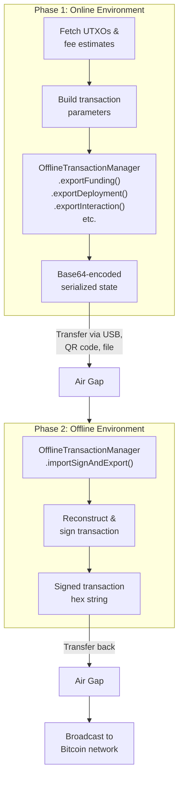
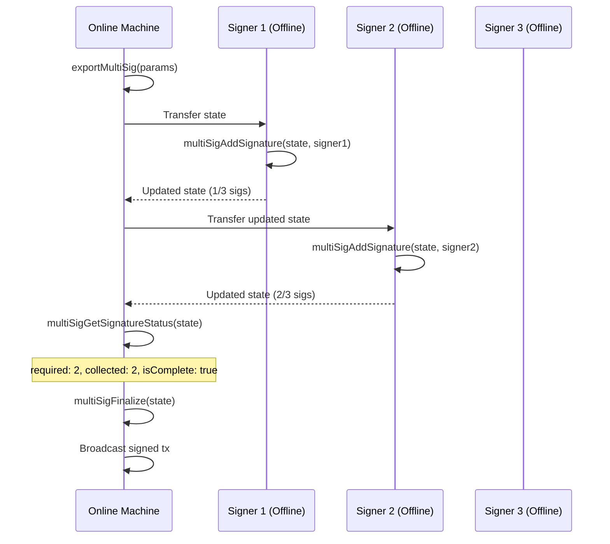

# Offline Transaction Signing

Comprehensive guide to building, exporting, and signing OPNet transactions in air-gapped or offline environments. The offline signing system supports all transaction types, fee bumping (RBF), and multi-signature workflows.

**Source files:**
- [`src/transaction/offline/OfflineTransactionManager.ts`](../../src/transaction/offline/OfflineTransactionManager.ts) -- Main entry point
- [`src/transaction/offline/TransactionStateCapture.ts`](../../src/transaction/offline/TransactionStateCapture.ts) -- State capture
- [`src/transaction/offline/TransactionSerializer.ts`](../../src/transaction/offline/TransactionSerializer.ts) -- Binary serialization
- [`src/transaction/offline/TransactionReconstructor.ts`](../../src/transaction/offline/TransactionReconstructor.ts) -- Reconstruction and signing

---

## Table of Contents

- [Overview](#overview)
- [Workflow Diagram](#workflow-diagram)
- [OfflineTransactionManager](#offlinetransactionmanager)
  - [Export Methods](#export-methods)
  - [Import and Sign Methods](#import-and-sign-methods)
  - [Fee Bumping Methods](#fee-bumping-methods)
  - [Inspection and Validation](#inspection-and-validation)
  - [Serialization Utilities](#serialization-utilities)
  - [MultiSig Methods](#multisig-methods)
- [TransactionStateCapture](#transactionstatecapture)
- [TransactionSerializer](#transactionserializer)
- [TransactionReconstructor](#transactionreconstructor)
  - [ReconstructionOptions](#reconstructionoptions)
- [PrecomputedData Interface](#precomputeddata-interface)
- [ISerializableTransactionState](#iserializabletransactionstate)
- [Examples](#examples)
  - [Air-Gapped Signing Workflow](#air-gapped-signing-workflow)
  - [Fee Bumping (RBF)](#fee-bumping-rbf)
  - [MultiSig Offline Workflow](#multisig-offline-workflow)
  - [Deployment Transaction Offline](#deployment-transaction-offline)
- [Navigation](#navigation)

---

## Overview

The offline transaction signing system enables a two-phase workflow where transaction construction (which requires network access for UTXOs and fee estimation) is separated from signing (which requires private keys). This is essential for:

- **Air-gapped security** -- Private keys never touch a network-connected machine.
- **Hardware wallet integration** -- Export transactions for signing on a hardware device.
- **Multi-party signing** -- Different signers can add signatures independently.
- **Fee bumping** -- Rebuild and re-sign transactions with higher fees without re-fetching UTXOs.

The system serializes complete transaction state (UTXOs, parameters, precomputed scripts, challenge data) into a compact binary format with double-SHA256 checksums for integrity verification.

---

## Workflow Diagram



---

## OfflineTransactionManager

The `OfflineTransactionManager` class is the main entry point for offline signing. All methods are **static**.

```typescript
import { OfflineTransactionManager } from '@btc-vision/transaction';
```

### Export Methods

These methods capture all necessary state and serialize it to a base64 string for transport.

#### `exportFunding(params, precomputed?): string`

Export a funding (BTC transfer) transaction for offline signing.

| Parameter | Type | Required | Description |
|-----------|------|----------|-------------|
| `params` | `IFundingTransactionParameters` | Yes | Funding transaction parameters |
| `precomputed` | `Partial<PrecomputedData>` | No | Optional precomputed data |

**Returns:** `string` -- Base64-encoded serialized state.

```typescript
const state = OfflineTransactionManager.exportFunding({
    signer: onlineSigner,  // Only public key is needed for export
    mldsaSigner: null,
    network: networks.bitcoin,
    from: 'bc1p...sender',
    to: 'bc1p...receiver',
    utxos: myUtxos,
    feeRate: 10,
    priorityFee: 0n,
    gasSatFee: 0n,
    amount: 50000n,
});
```

---

#### `exportDeployment(params, precomputed): string`

Export a contract deployment transaction. Requires precomputed `compiledTargetScript` and `randomBytes`.

| Parameter | Type | Required | Description |
|-----------|------|----------|-------------|
| `params` | `IDeploymentParameters` | Yes | Deployment parameters |
| `precomputed` | `Partial<PrecomputedData> & { compiledTargetScript: string; randomBytes: string }` | Yes | Must include compiled script and random bytes |

**Returns:** `string` -- Base64-encoded serialized state.

---

#### `exportInteraction(params, precomputed): string`

Export a contract interaction transaction. Requires precomputed `compiledTargetScript` and `randomBytes`.

| Parameter | Type | Required | Description |
|-----------|------|----------|-------------|
| `params` | `IInteractionParameters` | Yes | Interaction parameters |
| `precomputed` | `Partial<PrecomputedData> & { compiledTargetScript: string; randomBytes: string }` | Yes | Must include compiled script and random bytes |

**Returns:** `string` -- Base64-encoded serialized state.

---

#### `exportMultiSig(params, precomputed?): string`

Export a multi-signature transaction.

| Parameter | Type | Required | Description |
|-----------|------|----------|-------------|
| `params` | `ITransactionParameters & { pubkeys, minimumSignatures, receiver, requestedAmount, refundVault, ... }` | Yes | MultiSig parameters |
| `precomputed` | `Partial<PrecomputedData>` | No | Optional precomputed data |

**Returns:** `string` -- Base64-encoded serialized state.

---

#### `exportCustomScript(params, precomputed?): string`

Export a custom script transaction.

| Parameter | Type | Required | Description |
|-----------|------|----------|-------------|
| `params` | `ITransactionParameters & { scriptElements, witnesses, annex? }` | Yes | Custom script parameters |
| `precomputed` | `Partial<PrecomputedData>` | No | Optional precomputed data |

**Returns:** `string` -- Base64-encoded serialized state.

---

#### `exportCancel(params, precomputed?): string`

Export a cancellation transaction.

| Parameter | Type | Required | Description |
|-----------|------|----------|-------------|
| `params` | `ITransactionParameters & { compiledTargetScript }` | Yes | Cancel parameters |
| `precomputed` | `Partial<PrecomputedData>` | No | Optional precomputed data |

**Returns:** `string` -- Base64-encoded serialized state.

---

#### `exportFromBuilder(builder, params, precomputed?): string`

Export state from an already-constructed builder instance. The builder must have been built but not yet signed.

| Parameter | Type | Required | Description |
|-----------|------|----------|-------------|
| `builder` | `TransactionBuilder<T>` | Yes | Constructed transaction builder |
| `params` | `ITransactionParameters` | Yes | Original construction parameters |
| `precomputed` | `Partial<PrecomputedData>` | No | Precomputed data from the builder |

**Returns:** `string` -- Base64-encoded serialized state.

---

### Import and Sign Methods

#### `importSignAndExport(serializedState, options): Promise<string>`

Convenience method that performs the complete Phase 2 in one call: import state, reconstruct the transaction, sign it, and return the signed hex.

| Parameter | Type | Required | Description |
|-----------|------|----------|-------------|
| `serializedState` | `string` | Yes | Base64-encoded state from Phase 1 |
| `options` | `ReconstructionOptions` | Yes | Signer and optional fee overrides |

**Returns:** `Promise<string>` -- Signed transaction hex ready for broadcast.

```typescript
const signedTxHex = await OfflineTransactionManager.importSignAndExport(
    serializedState,
    { signer: offlineSigner },
);
```

---

#### `importForSigning(serializedState, options): TransactionBuilder`

Import and reconstruct a transaction builder from serialized state. Returns the builder for manual signing control.

| Parameter | Type | Required | Description |
|-----------|------|----------|-------------|
| `serializedState` | `string` | Yes | Base64-encoded state |
| `options` | `ReconstructionOptions` | Yes | Signer and optional fee overrides |

**Returns:** `TransactionBuilder<TransactionType>` -- Reconstructed builder ready for signing.

---

#### `signAndExport(builder): Promise<string>`

Sign a reconstructed builder and export the signed transaction hex.

| Parameter | Type | Required | Description |
|-----------|------|----------|-------------|
| `builder` | `TransactionBuilder<TransactionType>` | Yes | Reconstructed builder from `importForSigning` |

**Returns:** `Promise<string>` -- Signed transaction hex.

---

### Fee Bumping Methods

#### `rebuildWithNewFees(serializedState, newFeeRate): string`

Create a new serialized state with an updated fee rate. The result is not signed -- pass it to `importSignAndExport` to sign.

| Parameter | Type | Required | Description |
|-----------|------|----------|-------------|
| `serializedState` | `string` | Yes | Original base64-encoded state |
| `newFeeRate` | `number` | Yes | New fee rate in sat/vB |

**Returns:** `string` -- New base64-encoded state with updated fees.

---

#### `rebuildSignAndExport(serializedState, newFeeRate, options): Promise<string>`

Rebuild with new fees, sign, and export in one call.

| Parameter | Type | Required | Description |
|-----------|------|----------|-------------|
| `serializedState` | `string` | Yes | Original state |
| `newFeeRate` | `number` | Yes | New fee rate in sat/vB |
| `options` | `ReconstructionOptions` | Yes | Signer options |

**Returns:** `Promise<string>` -- Signed transaction hex with new fees.

---

### Inspection and Validation

#### `inspect(serializedState): ISerializableTransactionState`

Deserialize and return the full state object for inspection without signing.

#### `validate(serializedState): boolean`

Validate the integrity of a serialized state (checksum and format). Returns `true` if valid, `false` otherwise.

#### `getType(serializedState): TransactionType`

Extract the transaction type from a serialized state.

---

### Serialization Utilities

| Method | Description |
|--------|-------------|
| `fromBase64(base64State): ISerializableTransactionState` | Parse base64 to state object |
| `toBase64(state): string` | Serialize state object to base64 |
| `toHex(serializedState): string` | Convert base64 state to hex format |
| `fromHex(hexState): string` | Convert hex state back to base64 |

---

### MultiSig Methods

These methods support the multi-signature offline workflow where multiple signers add their signatures independently.

#### `multiSigAddSignature(serializedState, signer): Promise<{ state, signed, final, psbtBase64 }>`

Add a partial signature to a multisig transaction state.

| Parameter | Type | Description |
|-----------|------|-------------|
| `serializedState` | `string` | Base64-encoded multisig state |
| `signer` | `Signer \| UniversalSigner` | The signer to add a signature with |

**Returns:**

| Field | Type | Description |
|-------|------|-------------|
| `state` | `string` | Updated state with new signature |
| `signed` | `boolean` | Whether this signer's signature was added |
| `final` | `boolean` | Whether all required signatures are collected |
| `psbtBase64` | `string` | Updated PSBT in base64 format |

---

#### `multiSigHasSigned(serializedState, signerPubKey): boolean`

Check if a specific public key has already signed the multisig transaction.

---

#### `multiSigGetSignatureStatus(serializedState): { required, collected, isComplete, signers }`

Get the current signature count and status for a multisig transaction.

| Field | Type | Description |
|-------|------|-------------|
| `required` | `number` | Minimum signatures needed |
| `collected` | `number` | Signatures collected so far |
| `isComplete` | `boolean` | Whether enough signatures are collected |
| `signers` | `string[]` | Hex public keys of signers who have signed |

---

#### `multiSigFinalize(serializedState): string`

Finalize the multisig transaction and extract the signed transaction hex. Only call when all required signatures have been collected.

**Returns:** `string` -- Signed transaction hex ready for broadcast.

**Throws:** `Error` if not enough signatures have been collected.

---

#### `multiSigGetPsbt(serializedState): string | null`

Extract the PSBT from a multisig state for use with external signing tools.

---

#### `multiSigUpdatePsbt(serializedState, psbtBase64): string`

Update the PSBT in a multisig state after external signing.

---

## TransactionStateCapture

Captures transaction state from parameters for serialization. Each static method corresponds to a transaction type.

```typescript
import { TransactionStateCapture } from '@btc-vision/transaction';
```

| Method | Parameters | Description |
|--------|-----------|-------------|
| `fromFunding(params, precomputed?)` | `IFundingTransactionParameters` | Capture funding state |
| `fromDeployment(params, precomputed)` | `IDeploymentParameters` | Capture deployment state (requires compiled script and random bytes) |
| `fromInteraction(params, precomputed)` | `IInteractionParameters` | Capture interaction state (requires compiled script and random bytes) |
| `fromMultiSig(params, precomputed?)` | `ITransactionParameters & {...}` | Capture multisig state |
| `fromCustomScript(params, precomputed?)` | `ITransactionParameters & {...}` | Capture custom script state |
| `fromCancel(params, precomputed?)` | `ITransactionParameters & {...}` | Capture cancel state |

All methods return `ISerializableTransactionState`.

The capture process extracts:
- **Header:** Format version, consensus version, transaction type, chain ID, timestamp.
- **Base parameters:** From/to addresses, fee rate, priority fee, gas sat fee, network, tx version.
- **UTXOs:** All primary and optional input UTXOs with full script data.
- **Outputs:** Optional additional outputs.
- **Signer mappings:** Address rotation configuration (address to input index mappings).
- **Type-specific data:** Parameters unique to each transaction type.
- **Precomputed data:** Compiled scripts, random bytes, estimated fees, contract seed/address.

---

## TransactionSerializer

Binary serialization and deserialization of transaction state with double-SHA256 checksum integrity verification.

```typescript
import { TransactionSerializer } from '@btc-vision/transaction';
```

| Method | Description |
|--------|-------------|
| `serialize(state): Uint8Array` | Serialize state to binary format with checksum |
| `deserialize(data): ISerializableTransactionState` | Deserialize and verify checksum |
| `toBase64(state): string` | Serialize state to base64 string |
| `fromBase64(base64): ISerializableTransactionState` | Deserialize from base64 string |
| `toHex(state): string` | Serialize state to hex string |
| `fromHex(hex): ISerializableTransactionState` | Deserialize from hex string |

### Binary Format

The serialized format uses the following structure:

| Section | Content |
|---------|---------|
| Magic byte | `0x42` (`'B'` for Bitcoin) |
| Header | Format version, consensus version, transaction type, chain ID, timestamp |
| Base params | From, to, fee rate, priority fee, gas sat fee, network (`mainnet`, `testnet`, `opnetTestnet`, `regtest`), tx version, note, anchor |
| UTXOs | Primary UTXOs array (u16 count + entries) |
| Optional inputs | Additional UTXOs (u16 count + entries) |
| Optional outputs | Additional outputs (u16 count + entries) |
| Address rotation | Boolean flag + signer mappings |
| Type-specific data | Data unique to the transaction type |
| Precomputed data | Compiled script, random bytes, fees, contract info |
| Checksum | Double SHA256 of all preceding data (32 bytes) |

---

## TransactionReconstructor

Reconstructs transaction builders from serialized state. Supports fee bumping via parameter overrides.

```typescript
import { TransactionReconstructor } from '@btc-vision/transaction';
```

### `reconstruct(state, options): TransactionBuilder`

Reconstruct a transaction builder from serialized state.

| Parameter | Type | Description |
|-----------|------|-------------|
| `state` | `ISerializableTransactionState` | Deserialized transaction state |
| `options` | `ReconstructionOptions` | Signer(s) and optional fee overrides |

**Returns:** The appropriate `TransactionBuilder` subclass (`FundingTransaction`, `DeploymentTransaction`, `InteractionTransaction`, `MultiSignTransaction`, `CustomScriptTransaction`, or `CancelTransaction`).

### ReconstructionOptions

```typescript
interface ReconstructionOptions {
    /** Primary signer (used for normal mode or as default in rotation mode) */
    signer: Signer | UniversalSigner;

    /** Override fee rate for fee bumping (sat/vB) */
    newFeeRate?: number;

    /** Override priority fee */
    newPriorityFee?: bigint;

    /** Override gas sat fee */
    newGasSatFee?: bigint;

    /** Signer map for address rotation mode (keyed by address) */
    signerMap?: SignerMap;

    /** MLDSA signer for quantum-resistant features */
    mldsaSigner?: QuantumBIP32Interface | null;
}
```

| Property | Type | Required | Description |
|----------|------|----------|-------------|
| `signer` | `Signer \| UniversalSigner` | Yes | The private key holder for signing |
| `newFeeRate` | `number` | No | Override the original fee rate (for RBF) |
| `newPriorityFee` | `bigint` | No | Override the OPNet priority fee |
| `newGasSatFee` | `bigint` | No | Override the OPNet gas sat fee |
| `signerMap` | `SignerMap` | No | Required if address rotation was enabled during export |
| `mldsaSigner` | `QuantumBIP32Interface \| null` | No | Quantum signer for ML-DSA features |

---

## PrecomputedData Interface

Data that must be preserved for deterministic reconstruction of the transaction.

```typescript
interface PrecomputedData {
    /** Compiled target script (hex) -- saves recomputation */
    readonly compiledTargetScript?: string;

    /** Random bytes used (hex) -- MUST be preserved for determinism */
    readonly randomBytes?: string;

    /** Estimated fees from initial build */
    readonly estimatedFees?: string;

    /** Contract seed for deployment */
    readonly contractSeed?: string;

    /** Contract address for deployment */
    readonly contractAddress?: string;
}
```

> **Important:** The `randomBytes` field is critical. If the same transaction is reconstructed with different random bytes, the resulting scripts will differ and the transaction will be invalid. Always preserve and pass through the original random bytes.

---

## ISerializableTransactionState

The complete serializable state object.

```typescript
interface ISerializableTransactionState {
    readonly header: SerializationHeader;
    readonly baseParams: SerializedBaseParams;
    readonly utxos: SerializedUTXO[];
    readonly optionalInputs: SerializedUTXO[];
    readonly optionalOutputs: SerializedOutput[];
    readonly addressRotationEnabled: boolean;
    readonly signerMappings: SerializedSignerMapping[];
    readonly typeSpecificData: TypeSpecificData;
    readonly precomputedData: PrecomputedData;
}
```

| Field | Type | Description |
|-------|------|-------------|
| `header` | `SerializationHeader` | Format version, consensus version, transaction type, chain ID, timestamp |
| `baseParams` | `SerializedBaseParams` | From, to, fee rate, priority fee, gas sat fee, network name, tx version |
| `utxos` | `SerializedUTXO[]` | Primary input UTXOs |
| `optionalInputs` | `SerializedUTXO[]` | Additional input UTXOs |
| `optionalOutputs` | `SerializedOutput[]` | Additional outputs |
| `addressRotationEnabled` | `boolean` | Whether address rotation is active |
| `signerMappings` | `SerializedSignerMapping[]` | Address-to-input-index mappings |
| `typeSpecificData` | `TypeSpecificData` | Discriminated union of type-specific data |
| `precomputedData` | `PrecomputedData` | Preserved deterministic data |

---

## Examples

### Air-Gapped Signing Workflow

Complete example of the two-phase offline signing process.

```typescript
import {
    OfflineTransactionManager,
    EcKeyPair,
} from '@btc-vision/transaction';
import { networks } from '@btc-vision/bitcoin';

// ============================================================
// PHASE 1: Online machine (has UTXOs but NOT the private key)
// ============================================================

// Use a watch-only signer (public key only) for building
const watchOnlySigner = EcKeyPair.fromPublicKey(publicKeyHex, networks.bitcoin);

const serializedState = OfflineTransactionManager.exportFunding({
    signer: watchOnlySigner,
    mldsaSigner: null,
    network: networks.bitcoin,
    from: 'bc1p...sender',
    to: 'bc1p...receiver',
    utxos: fetchedUtxos,
    feeRate: 10,
    priorityFee: 0n,
    gasSatFee: 0n,
    amount: 50000n,
});

// Validate before transfer
const isValid = OfflineTransactionManager.validate(serializedState);
console.log('State valid:', isValid);

// Inspect the state
const inspected = OfflineTransactionManager.inspect(serializedState);
console.log('Transaction type:', inspected.header.transactionType);
console.log('Fee rate:', inspected.baseParams.feeRate);
console.log('UTXOs:', inspected.utxos.length);

// Transfer `serializedState` to offline machine (USB, QR code, file, etc.)

// ============================================================
// PHASE 2: Offline machine (has the private key)
// ============================================================

// Load the private key on the air-gapped machine
const offlineSigner = EcKeyPair.fromWIF('L1...privateKeyWIF', networks.bitcoin);

// Import, sign, and export in one call
const signedTxHex = await OfflineTransactionManager.importSignAndExport(
    serializedState,
    { signer: offlineSigner },
);

console.log('Signed transaction hex:', signedTxHex);

// Transfer `signedTxHex` back to online machine for broadcast

// ============================================================
// PHASE 3: Online machine -- broadcast
// ============================================================

// Broadcast via any Bitcoin RPC or OPNetLimitedProvider
await provider.sendRawTransaction(signedTxHex);
```

### Fee Bumping (RBF)

Replace-by-fee: rebuild a transaction with a higher fee rate using the original state.

```typescript
import { OfflineTransactionManager } from '@btc-vision/transaction';

// Original state from Phase 1
const originalState = '...base64...';

// Option A: Rebuild state with new fees, then sign separately
const bumpedState = OfflineTransactionManager.rebuildWithNewFees(
    originalState,
    25, // New fee rate: 25 sat/vB (was 10)
);

const signedBumpedTx = await OfflineTransactionManager.importSignAndExport(
    bumpedState,
    { signer: offlineSigner },
);

// Option B: Rebuild + sign in one call
const signedBumpedTx2 = await OfflineTransactionManager.rebuildSignAndExport(
    originalState,
    25,
    { signer: offlineSigner },
);

// Option C: Override multiple fee parameters
const signedBumpedTx3 = await OfflineTransactionManager.importSignAndExport(
    originalState,
    {
        signer: offlineSigner,
        newFeeRate: 25,
        newPriorityFee: 500n,
        newGasSatFee: 20000n,
    },
);
```

### MultiSig Offline Workflow

Multi-signature transactions where each signer adds their signature independently.



```typescript
import { OfflineTransactionManager } from '@btc-vision/transaction';
import { networks } from '@btc-vision/bitcoin';

// ============================================================
// STEP 1: Export multisig transaction (online)
// ============================================================

const multisigState = OfflineTransactionManager.exportMultiSig({
    signer: coordinatorSigner,
    mldsaSigner: null,
    network: networks.bitcoin,
    utxos: sharedUtxos,
    feeRate: 10,
    from: 'bc1p...multisig',
    pubkeys: [pubkey1, pubkey2, pubkey3],
    minimumSignatures: 2,
    receiver: 'bc1p...destination',
    requestedAmount: 100000n,
    refundVault: 'bc1p...refund',
});

// ============================================================
// STEP 2: First signer adds signature (offline)
// ============================================================

const result1 = await OfflineTransactionManager.multiSigAddSignature(
    multisigState,
    signer1,
);
console.log('Signer 1 signed:', result1.signed);
console.log('All signatures collected:', result1.final);

// ============================================================
// STEP 3: Second signer adds signature (offline)
// ============================================================

const result2 = await OfflineTransactionManager.multiSigAddSignature(
    result1.state,  // Pass the updated state
    signer2,
);
console.log('Signer 2 signed:', result2.signed);
console.log('All signatures collected:', result2.final);

// ============================================================
// STEP 4: Check status and finalize (online)
// ============================================================

const status = OfflineTransactionManager.multiSigGetSignatureStatus(result2.state);
console.log(`Signatures: ${status.collected}/${status.required}`);
console.log('Complete:', status.isComplete);
console.log('Signers:', status.signers);

if (status.isComplete) {
    const signedTxHex = OfflineTransactionManager.multiSigFinalize(result2.state);
    console.log('Ready to broadcast:', signedTxHex);

    // Broadcast
    await provider.sendRawTransaction(signedTxHex);
}

// ============================================================
// UTILITY: Check if a specific key has signed
// ============================================================

const hasSigner1Signed = OfflineTransactionManager.multiSigHasSigned(
    result2.state,
    pubkey1,
);
console.log('Signer 1 has signed:', hasSigner1Signed);

// UTILITY: Extract PSBT for external tools
const psbtBase64 = OfflineTransactionManager.multiSigGetPsbt(result2.state);

// UTILITY: Update PSBT after external signing
const updatedState = OfflineTransactionManager.multiSigUpdatePsbt(
    multisigState,
    externallySignedPsbtBase64,
);
```

### Deployment Transaction Offline

Deploying a contract with offline signing requires precomputed data.

```typescript
import {
    OfflineTransactionManager,
    Compressor,
} from '@btc-vision/transaction';
import { toHex } from '@btc-vision/bitcoin';

// Phase 1: Online -- build and export
const bytecode = await Compressor.compress(contractWasm);

// These must be precomputed online and preserved for deterministic rebuild
const randomBytes = crypto.getRandomValues(new Uint8Array(32));
const compiledTargetScript = buildTargetScript(/* ... */);

const deployState = OfflineTransactionManager.exportDeployment(
    {
        signer: watchOnlySigner,
        mldsaSigner: null,
        network: networks.bitcoin,
        from: 'bc1p...deployer',
        to: 'bc1p...contract',
        utxos: myUtxos,
        feeRate: 15,
        priorityFee: 330n,
        gasSatFee: 10000n,
        bytecode,
        challenge: myChallenge,
    },
    {
        compiledTargetScript: toHex(compiledTargetScript),
        randomBytes: toHex(randomBytes),
    },
);

// Phase 2: Offline -- sign
const signedDeployTx = await OfflineTransactionManager.importSignAndExport(
    deployState,
    {
        signer: offlineSigner,
        mldsaSigner: offlineQuantumSigner, // Optional quantum signer
    },
);
```

---

## Navigation

- **Related:** [Transaction Factory](../transaction-building/transaction-factory.md) -- How transactions are constructed
- **Related:** [MultiSig Transactions](../transaction-building/multisig-transactions.md) -- Multi-signature transaction details
- **Related:** [Address Rotation](../signer/address-rotation.md) -- Per-UTXO signing (works with offline signing)
- **Up:** [README](../README.md) -- Table of Contents
