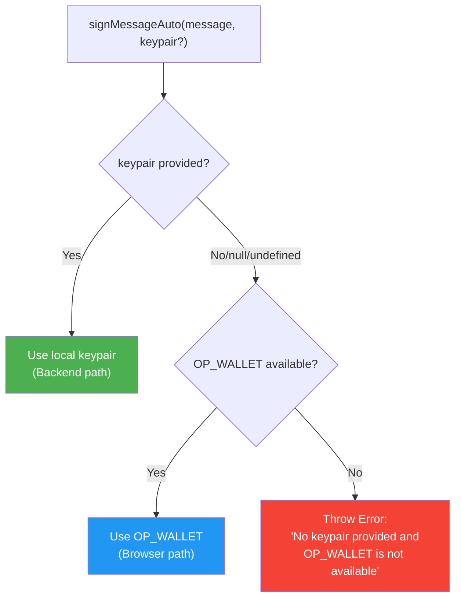

# Message Signing Guide

## Table of Contents
- [ML-DSA Signing](#ml-dsa-signing)
- [Schnorr Signing](#schnorr-signing)
- [Input Formats](#input-formats)
- [Signature Verification](#signature-verification)
- [Tweaked Signatures](#tweaked-signatures)
- [Best Practices](#best-practices)

## ML-DSA Signing

### Basic ML-DSA Signing

Sign messages with quantum-resistant ML-DSA signatures:

```typescript
import { Mnemonic, MessageSigner, MLDSASecurityLevel } from '@btc-vision/transaction';
import { networks, toHex } from '@btc-vision/bitcoin';

// Generate wallet
const mnemonic = Mnemonic.generate(undefined, '', networks.bitcoin, MLDSASecurityLevel.LEVEL2);
const wallet = mnemonic.derive(0);

// Sign a message
const message = 'Hello, Quantum World!';
const signed = MessageSigner.signMLDSAMessage(wallet.mldsaKeypair, message);

console.log('Message:', signed.message);
console.log('Signature:', toHex(signed.signature));
console.log('Public Key:', toHex(signed.publicKey));
console.log('Security Level:', signed.securityLevel);
```

### ML-DSA Signature Sizes

Different security levels produce different signature sizes:

```typescript
// LEVEL2 (ML-DSA-44)
const level2Mnemonic = Mnemonic.generate(undefined, '', networks.bitcoin, MLDSASecurityLevel.LEVEL2);
const level2Wallet = level2Mnemonic.derive(0);
const level2Sig = MessageSigner.signMLDSAMessage(level2Wallet.mldsaKeypair, 'test');
console.log('LEVEL2 Signature Size:', level2Sig.signature.length); // 2420 bytes

// LEVEL3 (ML-DSA-65)
const level3Mnemonic = Mnemonic.generate(undefined, '', networks.bitcoin, MLDSASecurityLevel.LEVEL3);
const level3Wallet = level3Mnemonic.derive(0);
const level3Sig = MessageSigner.signMLDSAMessage(level3Wallet.mldsaKeypair, 'test');
console.log('LEVEL3 Signature Size:', level3Sig.signature.length); // 3309 bytes

// LEVEL5 (ML-DSA-87)
const level5Mnemonic = Mnemonic.generate(undefined, '', networks.bitcoin, MLDSASecurityLevel.LEVEL5);
const level5Wallet = level5Mnemonic.derive(0);
const level5Sig = MessageSigner.signMLDSAMessage(level5Wallet.mldsaKeypair, 'test');
console.log('LEVEL5 Signature Size:', level5Sig.signature.length); // 4627 bytes
```

### Verifying ML-DSA Signatures

When verifying signatures, you need to create a public-key-only keypair using `QuantumBIP32Factory.fromPublicKey()`:

```typescript
import { MessageSigner, QuantumBIP32Factory } from '@btc-vision/transaction';

// Sign message
const message = 'Verify this quantum signature';
const signed = MessageSigner.signMLDSAMessage(wallet.mldsaKeypair, message);

// Create public-key-only keypair for verification
const publicKeyPair = QuantumBIP32Factory.fromPublicKey(
    signed.publicKey,       // ML-DSA public key from signature
    wallet.chainCode,       // Chain code from wallet
    network,                // Network (mainnet/testnet/regtest)
    securityLevel          // ML-DSA security level (LEVEL2/LEVEL3/LEVEL5)
);

// Verify signature
const isValid = MessageSigner.verifyMLDSASignature(
    publicKeyPair,         // Use the public-key-only keypair
    signed.message,
    signed.signature
);

console.log('Signature valid:', isValid);  // true

// Verify with wrong message fails
const isInvalid = MessageSigner.verifyMLDSASignature(
    publicKeyPair,
    'Wrong message',
    signed.signature
);
console.log('Invalid signature:', isInvalid);  // false
```

**Important:** The `verifyMLDSASignature` method requires a keypair object, not just a raw public key.

- **If you have the original keypair:** Use it directly (e.g., `wallet.mldsaKeypair`)
- **If you only have the public key:** Use `QuantumBIP32Factory.fromPublicKey()` to reconstruct the keypair

### When to Use QuantumBIP32Factory.fromPublicKey()

**Use it when you DON'T have the original keypair:**
- Receiving a signature from someone else over the network
- Verifying signatures from stored public keys in a database
- Working with public keys in distributed systems
- Validating signatures from external sources

**Don't use it when you already have the keypair:**
- Verifying your own signatures in the same session
- Testing signatures you just created
- When you have access to `wallet.mldsaKeypair`

### Creating a Public-Key-Only Keypair

Parameters for `QuantumBIP32Factory.fromPublicKey()`:

```typescript
const keypair = QuantumBIP32Factory.fromPublicKey(
    publicKey,      // Uint8Array - ML-DSA public key (1312-2592 bytes)
    chainCode,      // Uint8Array - Chain code (32 bytes)
    network,        // Network - networks.bitcoin, networks.testnet, or networks.regtest
    securityLevel   // MLDSASecurityLevel - LEVEL2, LEVEL3, or LEVEL5
);
```

**Parameter Details:**
- `publicKey`: The ML-DSA public key (1312 bytes for LEVEL2, 1952 for LEVEL3, 2592 for LEVEL5)
- `chainCode`: BIP32 chain code (32 bytes) - available from `wallet.chainCode`
- `network`: Bitcoin network configuration object
- `securityLevel`: **Must match** the security level used to generate the original key

**Why is this needed?**

The `verifyMLDSASignature` method requires a keypair object (not just a raw public key) because:
1. It needs the security level information embedded in the keypair
2. It needs the proper key structure for the ML-DSA verification algorithm
3. It maintains consistency with BIP32 hierarchical deterministic key derivation

### Common Verification Scenarios

**Scenario 1: Verifying your own signature (same session)**

```typescript
const message = 'My message';
const signed = MessageSigner.signMLDSAMessage(wallet.mldsaKeypair, message);

// You already have the keypair - use it directly
const valid = MessageSigner.verifyMLDSASignature(
    wallet.mldsaKeypair,  // Use existing keypair
    signed.message,
    signed.signature
);

console.log('Valid:', valid);  // true
```

**Scenario 2: Verifying a signature from someone else**

```typescript
import { fromHex } from '@btc-vision/bitcoin';

// You receive these from the network/API:
const receivedPublicKey = fromHex(/* hex string from network */);
const receivedMessage = 'Message from sender';
const receivedSignature = fromHex(/* hex string from network */);
const receivedChainCode = fromHex(/* hex string from network */);
const receivedSecurityLevel = MLDSASecurityLevel.LEVEL2;

// Reconstruct keypair from public key
const keypair = QuantumBIP32Factory.fromPublicKey(
    receivedPublicKey,
    receivedChainCode,
    networks.bitcoin,
    receivedSecurityLevel
);

// Verify the signature
const valid = MessageSigner.verifyMLDSASignature(
    keypair,
    receivedMessage,
    receivedSignature
);

console.log('Signature from other party valid:', valid);
```

**Scenario 3: Verifying stored signatures**

```typescript
import { fromHex } from '@btc-vision/bitcoin';

// Load public key and signature from database
const storedPublicKey = await db.getPublicKey(userId);
const storedChainCode = await db.getChainCode(userId);
const storedSecurityLevel = await db.getSecurityLevel(userId);
const signature = await db.getSignature(messageId);
const message = await db.getMessage(messageId);

// Reconstruct keypair
const keypair = QuantumBIP32Factory.fromPublicKey(
    fromHex(storedPublicKey),
    fromHex(storedChainCode),
    networks.bitcoin,
    storedSecurityLevel
);

// Verify
const valid = MessageSigner.verifyMLDSASignature(
    keypair,
    message,
    fromHex(signature)
);

console.log('Stored signature valid:', valid);
```

### Security Considerations

**Chain Code:**
- The chain code is public information in BIP32
- Store it alongside the public key for verification
- It's not sensitive but required for keypair reconstruction

**Security Level Matching:**
- Always use the same security level for verification as was used for signing
- Mismatched security levels will cause verification to fail
- Store the security level with the public key

**Network Matching:**
- Ensure the network parameter matches the original signing network
- Mainnet keys won't verify correctly if checked against testnet

**Message Integrity:**
- The message must match exactly between signing and verification
- Even a single byte difference will cause verification to fail

## Schnorr Signing

### Basic Schnorr Signing

Sign messages with classical Schnorr signatures:

```typescript
import { MessageSigner } from '@btc-vision/transaction';

const wallet = mnemonic.derive(0);

// Sign with Schnorr
const message = 'Hello, Bitcoin!';
const signed = MessageSigner.signMessage(wallet.keypair, message);

console.log('Message:', toHex(signed.message));
console.log('Signature:', toHex(signed.signature));
console.log('Signature Size:', signed.signature.length);  // 64 bytes (Schnorr)
```

### Verifying Schnorr Signatures

```typescript
// Sign message
const message = 'Verify this Schnorr signature';
const signed = MessageSigner.signMessage(wallet.keypair, message);

// Verify signature (use the keypair's publicKey, not signed.publicKey which doesn't exist on SignedMessage)
const isValid = MessageSigner.verifySignature(
    wallet.keypair.publicKey,
    signed.message,
    signed.signature
);

console.log('Signature valid:', isValid);  // true
```

## Input Formats

Both ML-DSA and Schnorr signing support multiple input formats:

### String Messages

```typescript
// UTF-8 string
const signed1 = MessageSigner.signMLDSAMessage(wallet.mldsaKeypair, 'Hello, World!');

// Any string content
const signed2 = MessageSigner.signMLDSAMessage(
    wallet.mldsaKeypair,
    'Emoji test: 🚀 Quantum 🔐'
);
```

### Uint8Array Messages

```typescript
// From UTF-8 string
const message1 = new TextEncoder().encode('Hello, Uint8Array!');
const signed1 = MessageSigner.signMLDSAMessage(wallet.mldsaKeypair, message1);

// Binary data
const message2 = new Uint8Array([0x01, 0x02, 0x03, 0x04]);
const signed2 = MessageSigner.signMLDSAMessage(wallet.mldsaKeypair, message2);

// From hex
import { fromHex } from '@btc-vision/bitcoin';
const message3 = fromHex('abcdef1234567890');
const signed3 = MessageSigner.signMLDSAMessage(wallet.mldsaKeypair, message3);
```

### Uint8Array Messages

```typescript
// Uint8Array
const message = new Uint8Array([0x48, 0x65, 0x6c, 0x6c, 0x6f]); // "Hello"
const signed = MessageSigner.signMLDSAMessage(wallet.mldsaKeypair, message);
```

### Hex String Messages

```typescript
// Hex string (with 0x prefix)
const signed1 = MessageSigner.signMLDSAMessage(
    wallet.mldsaKeypair,
    '0xdeadbeef'
);

// Hex string (without 0x prefix)
const signed2 = MessageSigner.signMLDSAMessage(
    wallet.mldsaKeypair,
    'abcdef1234567890'
);
```

### Cross-Format Verification

Verification works across all input formats:

```typescript
const message = 'Test message';

// Sign with string
const signed = MessageSigner.signMLDSAMessage(wallet.mldsaKeypair, message);

// Create public-key-only keypair for verification
const publicKeyPair = QuantumBIP32Factory.fromPublicKey(
    signed.publicKey,
    wallet.chainCode,
    network,
    securityLevel
);

// Verify with Uint8Array
const messageBytes = new TextEncoder().encode(message);
const valid1 = MessageSigner.verifyMLDSASignature(
    publicKeyPair,
    messageBytes,
    signed.signature
);

// Verify with string directly
const valid2 = MessageSigner.verifyMLDSASignature(
    publicKeyPair,
    message,
    signed.signature
);

console.log(valid1 && valid2);  // true - all formats work!
```

## Tweaked Signatures

### Tweaked Schnorr Signing

Sign with tweaked keys for Taproot compatibility:

```typescript
import { MessageSigner } from '@btc-vision/transaction';

const wallet = mnemonic.derive(0);

// Sign with tweaked key
const message = 'Taproot message';
const signed = MessageSigner.tweakAndSignMessage(wallet.keypair, message);

console.log('Tweaked Signature:', toHex(signed.signature));
console.log('Tweaked Public Key:', toHex(signed.publicKey));
```

### Verifying Tweaked Signatures

```typescript
// Sign with tweak
const message = 'Verify tweaked signature';
const signed = MessageSigner.tweakAndSignMessage(wallet.keypair, message);

// Verify with tweak
const isValid = MessageSigner.tweakAndVerifySignature(
    signed.publicKey,
    signed.message,
    signed.signature
);

console.log('Tweaked signature valid:', isValid);  // true
```

## Message Hashing

### SHA-256 Hashing

The MessageSigner automatically hashes messages before signing:

```typescript
import { MessageSigner } from '@btc-vision/transaction';

// Long message
const longMessage = 'This is a very long message that will be hashed before signing...';

// Automatically hashed to 32 bytes before signing
const hash = MessageSigner.sha256(new TextEncoder().encode(longMessage));
console.log('Message hash:', toHex(hash));
console.log('Hash length:', hash.length);  // 32 bytes

// Then signed (signMLDSAMessage accepts string directly and hashes internally)
const signed = MessageSigner.signMLDSAMessage(wallet.mldsaKeypair, longMessage);
```

### Pre-hashed Messages

```typescript
// You can also sign pre-hashed data
const message = 'Original message';
const hash = MessageSigner.sha256(new TextEncoder().encode(message));

// Sign the hash directly (passing Uint8Array)
const signed = MessageSigner.signMLDSAMessage(wallet.mldsaKeypair, hash);
```

## Best Practices

### ✅ DO:

```typescript
// Use appropriate security level for your use case
const standardWallet = Mnemonic.generate(
    undefined,                            // Default strength (24 words)
    '',                                   // No passphrase
    networks.bitcoin,                     // Mainnet
    MLDSASecurityLevel.LEVEL2            // Good for most applications
);

// Include context in your messages
const message = JSON.stringify({
    action: 'transfer',
    amount: 1000,
    timestamp: Date.now(),
    nonce: crypto.randomBytes(16).toString('hex')
});

// Verify signatures before trusting (first param is QuantumBIP32Interface keypair, not raw publicKey)
const isValid = MessageSigner.verifyMLDSASignature(
    mldsaKeypair,
    message,
    signature
);
if (!isValid) {
    throw new Error('Invalid signature');
}

// Store signatures with metadata
const signatureData = {
    message: signed.message,
    signature: toHex(signed.signature),
    publicKey: toHex(signed.publicKey),
    securityLevel: signed.securityLevel,
    timestamp: Date.now()
};
```

### ❌ DON'T:

```typescript
// Don't sign without verification
MessageSigner.signMLDSAMessage(wallet.mldsaKeypair, userInput);  // Dangerous!

// Don't use signatures without checking validity
// Always verify!

// Don't expose private keys
console.log(wallet.privateKey);  // Never do this!

// Don't sign arbitrary untrusted data
const untrustedData = externalAPI.getData();
// Validate and sanitize first!

// Don't reuse signatures for different messages
// Generate new signature for each unique message
```

### Message Structure

```typescript
// Good: Structured, verifiable message
interface SignedMessage {
    version: number;
    action: string;
    payload: any;
    timestamp: number;
    nonce: string;
}

const message: SignedMessage = {
    version: 1,
    action: 'authenticate',
    payload: { userId: '123' },
    timestamp: Date.now(),
    nonce: crypto.randomBytes(16).toString('hex')
};

const messageString = JSON.stringify(message);
const signed = MessageSigner.signMLDSAMessage(wallet.mldsaKeypair, messageString);
```

## Complete Example

```typescript
import {
    MessageSigner,
    MLDSASecurityLevel,
    Mnemonic,
    QuantumBIP32Factory,
} from '@btc-vision/transaction';
import { networks, toHex } from '@btc-vision/bitcoin';

const network = networks.regtest;
const securityLevel = MLDSASecurityLevel.LEVEL2;

// Setup
const mnemonic = Mnemonic.generate(undefined, undefined, network, securityLevel);

const wallet = mnemonic.derive(0);

// 1. Sign with ML-DSA (Quantum-resistant)
console.log('=== ML-DSA Signing ===');
const quantumMessage = 'Quantum-resistant message';
const quantumSigned = MessageSigner.signMLDSAMessage(wallet.mldsaKeypair, quantumMessage);

console.log('Message:', quantumSigned.message);
console.log('Signature Size:', quantumSigned.signature.length, 'bytes');
console.log('Public Key Size:', quantumSigned.publicKey.length, 'bytes');
console.log('Security Level:', quantumSigned.securityLevel);

const keypair = QuantumBIP32Factory.fromPublicKey(
    quantumSigned.publicKey,
    wallet.chainCode,
    network,
    securityLevel,
);

// Verify ML-DSA
const quantumValid = MessageSigner.verifyMLDSASignature(
    keypair,
    quantumMessage,
    quantumSigned.signature,
);

console.log('ML-DSA Valid:', quantumValid);

// 2. Sign with Schnorr (Classical)
console.log('\n=== Schnorr Signing ===');
const classicalMessage = 'Classical signature';
const classicalSigned = MessageSigner.signMessage(wallet.keypair, classicalMessage);

console.log('Message:', classicalSigned.message);
console.log('Signature Size:', classicalSigned.signature.length, 'bytes');

// Verify Schnorr
const classicalValid = MessageSigner.verifySignature(
    wallet.keypair.publicKey,
    classicalMessage,
    classicalSigned.signature,
);
console.log('Schnorr Valid:', classicalValid);

// 3. Multiple Input Formats
console.log('\n=== Input Format Tests ===');

const testMessage = 'Format test';

// String
const sig1 = MessageSigner.signMLDSAMessage(wallet.mldsaKeypair, testMessage);

// Uint8Array
const sig2 = MessageSigner.signMLDSAMessage(
    wallet.mldsaKeypair,
    new TextEncoder().encode(testMessage),
);

// All verify successfully
console.log(
    'String format valid:',
    MessageSigner.verifyMLDSASignature(wallet.mldsaKeypair, testMessage, sig1.signature),
);
console.log(
    'Uint8Array format valid:',
    MessageSigner.verifyMLDSASignature(
        wallet.mldsaKeypair,
        new TextEncoder().encode(testMessage),
        sig2.signature,
    ),
);
```

## Auto Methods (CRITICAL - Browser/Backend Auto-Detection)

> **This is the MOST important section for production applications.** Auto methods automatically detect whether you're running in a browser (with OP_WALLET extension) or backend (with local keypair) and call the correct underlying method. **ALWAYS use Auto methods unless you have an explicit reason not to.**

### Why Auto Methods Exist

| Environment | Non-Auto Method | Auto Method |
|-------------|----------------|-------------|
| **Browser** (OP_WALLET) | `signMessage()` → **CRASHES** (no private key) | `signMessageAuto()` → uses OP_WALLET |
| **Backend** (local keypair) | `signMessage()` → works | `signMessageAuto()` → uses local keypair |
| **Browser** (no OP_WALLET) | `signMessage()` → **CRASHES** | `signMessageAuto()` → **throws clear error** |

### Environment Detection Flow



### signMessageAuto

Auto-detect environment and sign with Schnorr:

```typescript
import { MessageSigner } from '@btc-vision/transaction';

// BROWSER: Pass no keypair → OP_WALLET signs
const browserSigned = await MessageSigner.signMessageAuto('Hello, OPNet!');

// BACKEND: Pass keypair → local signing
const backendSigned = await MessageSigner.signMessageAuto('Hello, OPNet!', wallet.keypair);
```

#### Signature

```typescript
async signMessageAuto(
    message: Uint8Array | string,
    keypair?: UniversalSigner
): Promise<SignedMessage>
```

| Parameter | Type | Required | Description |
|-----------|------|----------|-------------|
| `message` | `Uint8Array \| string` | Yes | Message to sign |
| `keypair` | `UniversalSigner` | No | Pass for backend; omit/null for browser (OP_WALLET) |

### tweakAndSignMessageAuto

Auto-detect environment and sign with tweaked Schnorr (Taproot-compatible):

```typescript
// BROWSER: OP_WALLET handles tweaking internally
const browserSigned = await MessageSigner.tweakAndSignMessageAuto('Taproot message');

// BACKEND: Local tweaked signing (network required)
const backendSigned = await MessageSigner.tweakAndSignMessageAuto(
    'Taproot message',
    wallet.keypair,
    networks.bitcoin
);
```

#### Signature

```typescript
async tweakAndSignMessageAuto(
    message: Uint8Array | string,
    keypair?: UniversalSigner,
    network?: Network
): Promise<SignedMessage>
```

| Parameter | Type | Required | Description |
|-----------|------|----------|-------------|
| `message` | `Uint8Array \| string` | Yes | Message to sign |
| `keypair` | `UniversalSigner` | No | Pass for backend; omit for browser |
| `network` | `Network` | Backend only | Required when keypair is provided |

### signMLDSAMessageAuto

Auto-detect environment and sign with quantum-resistant ML-DSA:

```typescript
// BROWSER: OP_WALLET handles ML-DSA signing
const browserSigned = await MessageSigner.signMLDSAMessageAuto('Quantum message');

// BACKEND: Local ML-DSA signing
const backendSigned = await MessageSigner.signMLDSAMessageAuto(
    'Quantum message',
    wallet.mldsaKeypair
);
```

#### Signature

```typescript
async signMLDSAMessageAuto(
    message: Uint8Array | string,
    mldsaKeypair?: QuantumBIP32Interface
): Promise<MLDSASignedMessage>
```

| Parameter | Type | Required | Description |
|-----------|------|----------|-------------|
| `message` | `Uint8Array \| string` | Yes | Message to sign |
| `mldsaKeypair` | `QuantumBIP32Interface` | No | Pass for backend; omit for browser (OP_WALLET) |

### isOPWalletAvailable

Check if OP_WALLET browser extension is available:

```typescript
if (MessageSigner.isOPWalletAvailable()) {
    // Browser with OP_WALLET - can use Auto methods without keypair
    const signed = await MessageSigner.signMessageAuto('message');
} else {
    // Backend or browser without OP_WALLET - must provide keypair
    const signed = await MessageSigner.signMessageAuto('message', wallet.keypair);
}
```

### Complete Auto Method Example

```typescript
import {
    MessageSigner,
    Mnemonic,
    MLDSASecurityLevel,
} from '@btc-vision/transaction';
import { networks } from '@btc-vision/bitcoin';

/**
 * Universal signing function that works in both browser and backend.
 * In browser: pass no keypair/mldsaKeypair → OP_WALLET handles signing.
 * In backend: pass wallet keypairs → local signing.
 */
async function signForContract(
    message: string,
    keypair?: UniversalSigner,
    mldsaKeypair?: QuantumBIP32Interface,
    network?: Network,
): Promise<{
    schnorr: SignedMessage;
    tweaked: SignedMessage;
    quantum: MLDSASignedMessage;
}> {
    // All three Auto methods follow the same pattern:
    // - keypair provided → backend path (local signing)
    // - keypair omitted → browser path (OP_WALLET signing)
    const schnorr = await MessageSigner.signMessageAuto(message, keypair);
    const tweaked = await MessageSigner.tweakAndSignMessageAuto(message, keypair, network);
    const quantum = await MessageSigner.signMLDSAMessageAuto(message, mldsaKeypair);

    return { schnorr, tweaked, quantum };
}

// BACKEND USAGE:
const network = networks.regtest;
const mnemonic = Mnemonic.generate(undefined, '', network, MLDSASecurityLevel.LEVEL2);
const wallet = mnemonic.derive(0);

const backendResult = await signForContract(
    'Claim airdrop',
    wallet.keypair,
    wallet.mldsaKeypair,
    network,
);

// BROWSER USAGE (in a React component, for example):
// No keypair needed - OP_WALLET extension handles everything
const browserResult = await signForContract('Claim airdrop');
```

> **Rule of thumb:** If your code might run in both browser and backend, **ALWAYS use Auto methods**. The non-Auto methods (`signMessage`, `signMLDSAMessage`, `tweakAndSignMessage`) are environment-specific and will crash in the wrong context.

---

## OP_WALLET Integration Methods

These methods are used internally by the Auto methods but can also be called directly:

### trySignSchnorrWithOPWallet

```typescript
async trySignSchnorrWithOPWallet(
    message: Uint8Array | string
): Promise<SignedMessage | null>
```

Returns `null` if OP_WALLET is not available (safe to call in any environment).

### trySignMLDSAWithOPWallet

```typescript
async trySignMLDSAWithOPWallet(
    message: Uint8Array | string
): Promise<MLDSASignedMessage | null>
```

Returns `null` if OP_WALLET is not available.

### verifyMLDSAWithOPWallet

```typescript
async verifyMLDSAWithOPWallet(
    message: Uint8Array | string,
    signature: MLDSASignedMessage
): Promise<boolean | null>
```

Returns `null` if OP_WALLET is not available.

### getMLDSAPublicKeyFromOPWallet

```typescript
async getMLDSAPublicKeyFromOPWallet(): Promise<Uint8Array | null>
```

Returns the ML-DSA public key from OP_WALLET, or `null` if unavailable.

---

## See Also

- [Address Generation](./03-address-generation.md) - P2MR and P2TR address types, including quantum-safe P2MR outputs via `useP2MR`

## Next Steps

- [Address Verification](./05-address-verification.md) - Validate addresses and public keys
- [Introduction](./01-introduction.md) - Back to overview

---

[← Previous: Address Generation](./03-address-generation.md) | [Next: Address Verification →](./05-address-verification.md)
