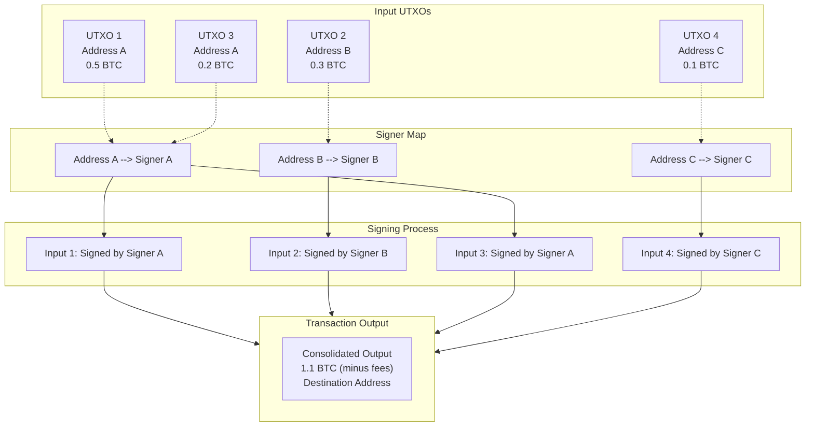
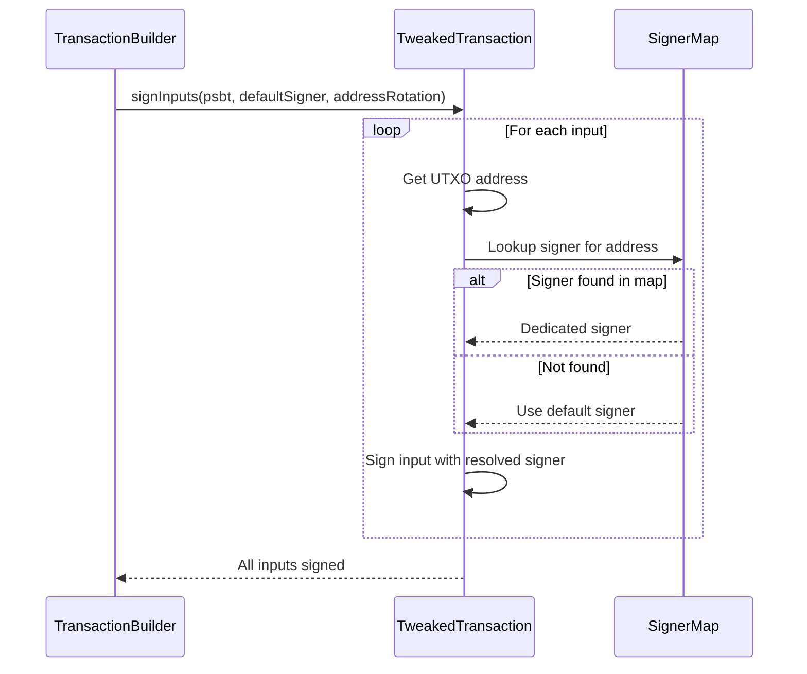

# Address Rotation

Per-UTXO signing with different keys. Address rotation mode allows each input in a transaction to be signed by a different key pair, based on the address that controls the UTXO.

**Source:** [`src/signer/AddressRotation.ts`](../../src/signer/AddressRotation.ts), [`src/signer/IRotationSigner.ts`](../../src/signer/IRotationSigner.ts)

---

## Table of Contents

- [Overview](#overview)
- [When to Use Address Rotation](#when-to-use-address-rotation)
- [Types and Interfaces](#types-and-interfaces)
  - [RotationSignerBase](#rotationsignerbase)
  - [RotationSigner](#rotationsigner)
  - [SignerMap](#signermap)
  - [AddressRotationConfigBase](#addressrotationconfigbase)
  - [AddressRotationConfig](#addressrotationconfig)
- [API Reference](#api-reference)
  - [createSignerMap](#createsignermap)
  - [createAddressRotation](#createaddressrotation)
  - [disabledAddressRotation](#disabledaddressrotation)
- [How It Works](#how-it-works)
- [Examples](#examples)
  - [Basic Address Rotation](#basic-address-rotation)
  - [Mixed-Address UTXO Consolidation](#mixed-address-utxo-consolidation)
  - [Using with TransactionFactory](#using-with-transactionfactory)
- [Navigation](#navigation)

---

## Overview

In standard Bitcoin transactions, a single signer signs all inputs. However, when consolidating UTXOs from multiple addresses, each input may be controlled by a different private key. Address rotation solves this by mapping each UTXO address to its own signer.



---

## When to Use Address Rotation

| Use Case | Description |
|----------|-------------|
| **UTXO consolidation** | Combine UTXOs from multiple addresses into a single output |
| **Privacy** | Spend UTXOs from different derivation paths or wallets in one transaction |
| **HD wallet spending** | Spend from multiple derived addresses (different BIP44/BIP84 paths) |
| **Multi-party consolidation** | Multiple parties contribute UTXOs to a single transaction |
| **Browser wallet mixing** | Combine UTXOs signed by browser extensions with programmatic signers |

---

## Types and Interfaces

### RotationSignerBase

The base signer type for address rotation. Accepts either a basic `Signer` or a `UniversalSigner` (which includes the private key).

```typescript
type RotationSignerBase = Signer | UniversalSigner;
```

### RotationSigner

Extended signer type that also supports browser wallet signers (e.g., Unisat). This is the type used in the `SignerMap`.

```typescript
type RotationSigner = RotationSignerBase | UnisatSigner;
```

### SignerMap

A `Map` from address strings to their respective signers. Each key is a Bitcoin address, and each value is the signer that controls UTXOs at that address.

```typescript
type SignerMap = Map<string, RotationSigner>;
```

### AddressRotationConfigBase

Base configuration interface for address rotation mode (without browser signer support).

```typescript
interface AddressRotationConfigBase {
    /** Whether address rotation mode is enabled */
    readonly enabled: boolean;

    /** Map of addresses to their respective signers */
    readonly signerMap: SignerMapBase;
}
```

### AddressRotationConfig

Full configuration interface that includes browser signer support.

```typescript
interface AddressRotationConfig {
    /** Whether address rotation mode is enabled */
    readonly enabled: boolean;

    /**
     * Map of addresses to their respective signers.
     * Key: address string (from UTXO.scriptPubKey.address)
     * Value: signer that controls that address
     */
    readonly signerMap: SignerMap;
}
```

| Property | Type | Description |
|----------|------|-------------|
| `enabled` | `boolean` | `true` to use per-UTXO signing; `false` for single-signer mode |
| `signerMap` | `SignerMap` | Map of address strings to signer instances |

---

## API Reference

### `createSignerMap`

Creates a `SignerMap` from an array of address-signer pairs.

```typescript
function createSignerMap(
    pairs: ReadonlyArray<readonly [string, RotationSigner]>,
): SignerMap;
```

**Parameters:**

| Parameter | Type | Description |
|-----------|------|-------------|
| `pairs` | `ReadonlyArray<readonly [string, RotationSigner]>` | Array of `[address, signer]` tuples |

**Returns:** `SignerMap` -- A `Map<string, RotationSigner>` ready for use.

```typescript
import { createSignerMap } from '@btc-vision/transaction';

const signerMap = createSignerMap([
    ['bc1q...addr1', signerA],
    ['bc1q...addr2', signerB],
    ['bc1q...addr3', signerC],
]);
```

---

### `createAddressRotation`

Creates an `AddressRotationConfig` with rotation enabled. Accepts either a `SignerMap` directly or an array of pairs.

```typescript
function createAddressRotation(
    signers: SignerMap | ReadonlyArray<readonly [string, RotationSigner]>,
): AddressRotationConfig;
```

**Parameters:**

| Parameter | Type | Description |
|-----------|------|-------------|
| `signers` | `SignerMap` or `[string, RotationSigner][]` | Signer mappings (Map or array of pairs) |

**Returns:** `AddressRotationConfig` -- Configuration with `enabled: true` and the provided signer map.

```typescript
import { createAddressRotation } from '@btc-vision/transaction';

// From array of pairs
const rotation = createAddressRotation([
    ['bc1q...addr1', signerA],
    ['bc1q...addr2', signerB],
]);

// From existing Map
const map = new Map([['bc1q...addr1', signerA]]);
const rotation2 = createAddressRotation(map);
```

---

### `disabledAddressRotation`

Creates a disabled `AddressRotationConfig` (single-signer mode). This is a convenience function for explicitly opting out of rotation.

```typescript
function disabledAddressRotation(): AddressRotationConfig;
```

**Returns:** `AddressRotationConfig` -- Configuration with `enabled: false` and an empty signer map.

```typescript
import { disabledAddressRotation } from '@btc-vision/transaction';

const config = disabledAddressRotation();
// { enabled: false, signerMap: Map(0) }
```

---

## How It Works

When address rotation is enabled, the transaction signing process changes:

1. **UTXO address lookup:** For each input UTXO, the system reads `utxo.scriptPubKey.address`.
2. **Signer resolution:** The address is looked up in the `signerMap` to find the corresponding signer.
3. **Per-input signing:** Each input is signed with its own dedicated signer.
4. **Fallback:** If an address is not found in the map, the default signer (passed as the `signer` parameter in transaction params) is used.



---

## Examples

### Basic Address Rotation

```typescript
import {
    createAddressRotation,
    EcKeyPair,
    TransactionFactory,
} from '@btc-vision/transaction';
import { networks } from '@btc-vision/bitcoin';

// Generate key pairs for different addresses
const keyPairA = EcKeyPair.fromWIF('L1...', networks.bitcoin);
const keyPairB = EcKeyPair.fromWIF('L2...', networks.bitcoin);

const addressA = 'bc1p...addressA';
const addressB = 'bc1p...addressB';

// Create address rotation config
const addressRotation = createAddressRotation([
    [addressA, keyPairA],
    [addressB, keyPairB],
]);

// Use in transaction parameters
const params = {
    signer: keyPairA,  // Default/fallback signer
    network: networks.bitcoin,
    from: addressA,
    to: 'bc1p...destination',
    utxos: [
        { /* UTXO at addressA */ },
        { /* UTXO at addressB */ },
    ],
    feeRate: 10,
    priorityFee: 0n,
    addressRotation,
    // ... other params
};
```

### Mixed-Address UTXO Consolidation

A common scenario: consolidating UTXOs from multiple HD wallet derivation paths into a single address.

```typescript
import {
    createAddressRotation,
    EcKeyPair,
    Mnemonic,
} from '@btc-vision/transaction';
import { networks } from '@btc-vision/bitcoin';

// Derive multiple wallets from a mnemonic
const mnemonic = Mnemonic.fromPhrase('your mnemonic phrase here...');
const wallet0 = mnemonic.derive(0);
const wallet1 = mnemonic.derive(1);
const wallet2 = mnemonic.derive(2);

// Each wallet has a different address
const address0 = wallet0.p2tr;
const address1 = wallet1.p2tr;
const address2 = wallet2.p2tr;

// Collect UTXOs from all addresses
const allUtxos = [
    // UTXOs from address 0
    { transactionId: 'abc...', outputIndex: 0, value: 50000n,
      scriptPubKey: { hex: '...', address: address0 } },
    // UTXOs from address 1
    { transactionId: 'def...', outputIndex: 1, value: 30000n,
      scriptPubKey: { hex: '...', address: address1 } },
    // UTXOs from address 2
    { transactionId: 'ghi...', outputIndex: 0, value: 20000n,
      scriptPubKey: { hex: '...', address: address2 } },
];

// Map each address to its wallet's keypair
const addressRotation = createAddressRotation([
    [address0, wallet0.keypair],
    [address1, wallet1.keypair],
    [address2, wallet2.keypair],
]);

// Build a consolidation transaction
const factory = new TransactionFactory();
const result = await factory.createBTCTransfer({
    signer: wallet0.keypair,
    network: networks.bitcoin,
    from: address0,
    to: address0,  // Consolidate everything to address 0
    utxos: allUtxos,
    feeRate: 5,
    amount: 95000n, // Total minus fees
    priorityFee: 0n,
    addressRotation,
});

console.log('Consolidated tx:', result.tx);
```

### Using with TransactionFactory

```typescript
import {
    createSignerMap,
    TransactionFactory,
} from '@btc-vision/transaction';
import { networks } from '@btc-vision/bitcoin';

const signerMap = createSignerMap([
    ['bc1p...alice', aliceSigner],
    ['bc1p...bob', bobSigner],
]);

const factory = new TransactionFactory();

const interaction = await factory.signInteraction({
    signer: aliceSigner,
    mldsaSigner: null,
    network: networks.bitcoin,
    from: 'bc1p...alice',
    to: 'bc1p...contract',
    utxos: mixedUtxos,
    feeRate: 10,
    priorityFee: 330n,
    gasSatFee: 10000n,
    calldata: myCalldata,
    challenge: myChallenge,
    addressRotation: {
        enabled: true,
        signerMap,
    },
});
```

---

## Navigation

- **Previous:** [TweakedSigner](./tweaked-signer.md) -- Taproot key tweaking
- **Next:** [Parallel Signer](./parallel-signer.md) -- Parallel signing adapters
- **Up:** [README](../README.md) -- Table of Contents
