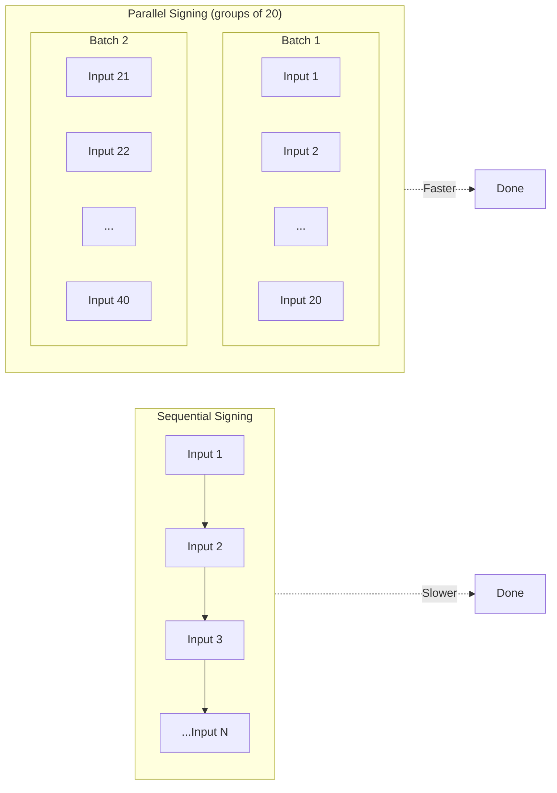

# Parallel Signer

Adapter functions for converting signers into `PsbtParallelKeyPair` objects, enabling batched parallel signing of PSBT inputs. Used internally by the transaction signing system to sign groups of inputs concurrently.

**Source:** [`src/signer/ParallelSignerAdapter.ts`](../../src/signer/ParallelSignerAdapter.ts)

---

## Table of Contents

- [Overview](#overview)
- [When Parallel Signing Is Used](#when-parallel-signing-is-used)
- [PsbtParallelKeyPair Interface](#psbtparallelkeypair-interface)
- [API Reference](#api-reference)
  - [toParallelKeyPair](#toparallelkeypairsigner-psbtparallelkeypair)
  - [toTweakedParallelKeyPair](#totweakedparallelkeypairuntweaked-tweaked-psbtparallelkeypair)
- [Performance Benefits](#performance-benefits)
- [Examples](#examples)
- [Navigation](#navigation)

---

## Overview

The PSBT (Partially Signed Bitcoin Transaction) signing process typically signs inputs one at a time. For transactions with many inputs, this can be slow. The parallel signer adapters wrap `UniversalSigner` instances into `PsbtParallelKeyPair` objects that expose both the public key and the raw private key, allowing the PSBT library to sign inputs in batches.



---

## When Parallel Signing Is Used

Parallel signing is used internally by `TweakedTransaction` during the PSBT signing step. The system:

1. Converts the signer to a `PsbtParallelKeyPair` using one of the adapter functions.
2. Groups inputs into batches (typically groups of 20).
3. Signs each batch using `psbt.signAllInputsAsync()` with the parallel key pair.

There are two adapter functions for the two signing scenarios:

| Function | Use Case |
|----------|----------|
| `toParallelKeyPair` | **Script-path signing** -- Uses the raw (untweaked) private key. For inputs that require script-path witness signatures. |
| `toTweakedParallelKeyPair` | **Key-path signing** -- Uses the untweaked public key for PSBT input matching, but the tweaked private key for producing valid Taproot Schnorr signatures. |

---

## PsbtParallelKeyPair Interface

The `PsbtParallelKeyPair` interface (from `@btc-vision/bitcoin`) provides everything the PSBT library needs for parallel signing:

```typescript
interface PsbtParallelKeyPair {
    /** Public key for matching against PSBT input expectations */
    publicKey: Uint8Array;

    /** Returns the raw private key bytes for batch signing */
    getPrivateKey(): Uint8Array;

    /** ECDSA sign (for legacy/SegWit inputs) */
    sign(hash: Uint8Array, lowR?: boolean): Uint8Array;

    /** Schnorr sign (for Taproot inputs) */
    signSchnorr(hash: Uint8Array): Uint8Array;
}
```

---

## API Reference

### `toParallelKeyPair(signer): PsbtParallelKeyPair`

Wraps an untweaked `UniversalSigner` as a `PsbtParallelKeyPair`. Used for **script-path signing** where the raw (untweaked) private key is needed.

**Parameters:**

| Parameter | Type | Description |
|-----------|------|-------------|
| `signer` | `UniversalSigner` | The signer to wrap (must have `privateKey` and optionally `signSchnorr`) |

**Returns:** `PsbtParallelKeyPair` -- Adapter object with the signer's public key and signing methods.

**Throws:** `Error` if:
- `signer.privateKey` is null/undefined (when `getPrivateKey()` is called).
- `signer.signSchnorr` is not available (when `signSchnorr()` is called).

```typescript
import { toParallelKeyPair } from '@btc-vision/transaction';

const parallelKeyPair = toParallelKeyPair(mySigner);

// The adapter exposes:
// - parallelKeyPair.publicKey (original public key)
// - parallelKeyPair.getPrivateKey() (original private key)
// - parallelKeyPair.sign(hash, lowR?) (ECDSA signing)
// - parallelKeyPair.signSchnorr(hash) (Schnorr signing)
```

---

### `toTweakedParallelKeyPair(untweaked, tweaked): PsbtParallelKeyPair`

Creates a hybrid adapter that combines the **untweaked public key** (for PSBT input matching) with the **tweaked private key** (for correct Taproot key-path Schnorr signatures).

This is necessary because PSBT inputs reference the untweaked internal key, but the actual Schnorr signature must be made with the tweaked key.

**Parameters:**

| Parameter | Type | Description |
|-----------|------|-------------|
| `untweakedSigner` | `UniversalSigner` | The original (untweaked) signer -- provides the public key |
| `tweakedSigner` | `UniversalSigner` | The tweaked signer (from `TweakedSigner.tweakSigner()`) -- provides the private key and signing |

**Returns:** `PsbtParallelKeyPair` -- Hybrid adapter with untweaked public key and tweaked signing.

**Throws:** `Error` if:
- `tweakedSigner.privateKey` is null/undefined (when `getPrivateKey()` is called).
- `tweakedSigner.signSchnorr` is not available (when `signSchnorr()` is called).

```typescript
import { toTweakedParallelKeyPair, TweakedSigner } from '@btc-vision/transaction';

const tweaked = TweakedSigner.tweakSigner(originalSigner);

const parallelKeyPair = toTweakedParallelKeyPair(originalSigner, tweaked);

// parallelKeyPair.publicKey === originalSigner.publicKey (untweaked, for PSBT matching)
// parallelKeyPair.getPrivateKey() returns tweaked private key
// parallelKeyPair.sign() uses tweaked signer
// parallelKeyPair.signSchnorr() uses tweaked signer
```

---

## Performance Benefits

Parallel signing provides significant performance improvements for transactions with many inputs:

| Input Count | Sequential (approx.) | Parallel, batches of 20 (approx.) | Speedup |
|-------------|----------------------|-------------------------------------|---------|
| 1--20 | Baseline | ~Same | 1x |
| 40 | 2x baseline | ~1x baseline | ~2x |
| 100 | 5x baseline | ~1x baseline | ~5x |
| 200 | 10x baseline | ~1x baseline | ~10x |

The batching approach also reduces memory pressure by processing inputs in fixed-size groups rather than all at once, making it suitable for transactions with very large UTXO sets (e.g., dust consolidation).

---

## Examples

### Script-Path Parallel Signing

```typescript
import { toParallelKeyPair, EcKeyPair } from '@btc-vision/transaction';
import { Psbt, networks } from '@btc-vision/bitcoin';

const signer = EcKeyPair.fromWIF('L1...', networks.bitcoin);
const parallelKP = toParallelKeyPair(signer);

// Use with PSBT parallel signing
const psbt = new Psbt({ network: networks.bitcoin });
// ... add inputs and outputs ...

await psbt.signAllInputsAsync(parallelKP);
```

### Key-Path Parallel Signing (Taproot)

```typescript
import {
    toTweakedParallelKeyPair,
    TweakedSigner,
    EcKeyPair,
} from '@btc-vision/transaction';
import { Psbt, networks } from '@btc-vision/bitcoin';

const signer = EcKeyPair.fromWIF('L1...', networks.bitcoin);
const tweaked = TweakedSigner.tweakSigner(signer, { network: networks.bitcoin });
const parallelKP = toTweakedParallelKeyPair(signer, tweaked);

const psbt = new Psbt({ network: networks.bitcoin });
// ... add Taproot inputs and outputs ...

// Signs with tweaked key but matches inputs using untweaked pubkey
await psbt.signAllInputsAsync(parallelKP);
```

### Combined with Address Rotation

When using address rotation with parallel signing, create a parallel key pair for each signer in the rotation map:

```typescript
import {
    toTweakedParallelKeyPair,
    TweakedSigner,
} from '@btc-vision/transaction';

function createParallelSigners(
    signerMap: Map<string, UniversalSigner>,
): Map<string, PsbtParallelKeyPair> {
    const parallelMap = new Map<string, PsbtParallelKeyPair>();

    for (const [address, signer] of signerMap) {
        const tweaked = TweakedSigner.tweakSigner(signer);
        parallelMap.set(address, toTweakedParallelKeyPair(signer, tweaked));
    }

    return parallelMap;
}
```

---

## Navigation

- **Previous:** [Address Rotation](./address-rotation.md) -- Per-UTXO signing with different keys
- **Related:** [TweakedSigner](./tweaked-signer.md) -- Taproot key tweaking
- **Up:** [README](../README.md) -- Table of Contents
