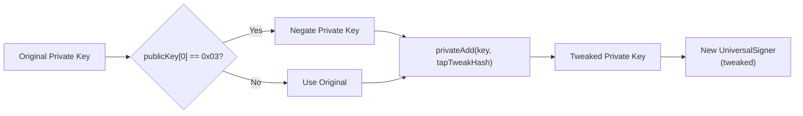
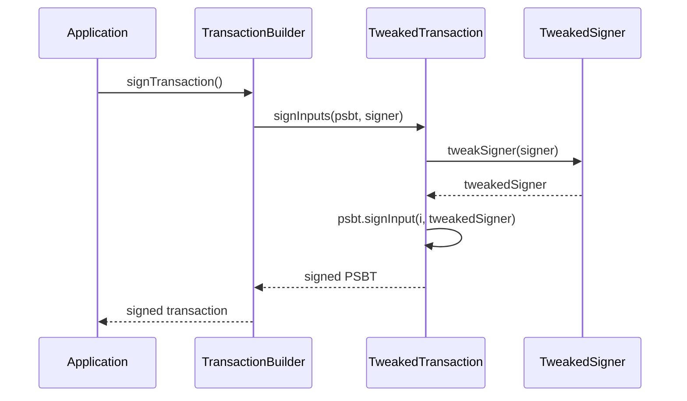

# TweakedSigner

Tweak secp256k1 key pairs for Taproot key-path spending. The `TweakedSigner` class produces a new signer whose private key incorporates the Taproot tweak, enabling valid Schnorr signatures for P2TR outputs.

**Source:** [`src/signer/TweakedSigner.ts`](../../src/signer/TweakedSigner.ts)

---

## Table of Contents

- [Overview](#overview)
- [Why Tweaked Signers?](#why-tweaked-signers)
- [TweakSettings Interface](#tweaksettings-interface)
- [API Reference](#api-reference)
  - [TweakedSigner.tweakSigner](#tweakedsignertweaksignersigner-opts-universalsigner)
  - [isUniversalSigner](#isuniversalsignersigner-boolean)
- [Integration with TweakedTransaction](#integration-with-tweakedtransaction)
- [Examples](#examples)
- [Navigation](#navigation)

---

## Overview

Bitcoin Taproot (BIP341) requires that the internal key be "tweaked" with a hash commitment before it can be used for key-path spending. The `TweakedSigner` class handles this process:



The tweaking process:

1. If the public key has an odd Y coordinate (`0x03` prefix), the private key is negated.
2. The `tapTweakHash` is computed from the X-only public key and an optional tweak hash.
3. The tweak hash is added to the (possibly negated) private key via elliptic curve addition.
4. A new `UniversalSigner` is created from the resulting tweaked private key.

---

## Why Tweaked Signers?

Taproot (P2TR) addresses commit to a tweaked public key. To spend a P2TR output via the key path, you must sign with the corresponding tweaked private key. You need a tweaked signer whenever:

- **Signing Taproot key-path inputs** in any transaction type.
- **Building PSBTs** that include P2TR inputs where you control the internal key.
- **Parallel signing** with `toTweakedParallelKeyPair()` (see [Parallel Signer](./parallel-signer.md)), which requires both the untweaked public key (for PSBT input matching) and the tweaked private key (for correct signatures).

The `TweakedTransaction` base class (used by all transaction builders) automatically handles tweaking during the signing process. You typically only need to call `TweakedSigner.tweakSigner()` directly when working with low-level PSBT operations or the parallel signer adapter.

---

## TweakSettings Interface

```typescript
interface TweakSettings {
    /** The Bitcoin network (mainnet, testnet, regtest). Used when deriving the new key pair. */
    readonly network?: Network;

    /** Optional tweak hash. If omitted, the standard BIP341 tweak is used (hash of the X-only public key). */
    tweakHash?: Bytes32;
}
```

| Property | Type | Required | Description |
|----------|------|----------|-------------|
| `network` | `Network` | No | Network for the resulting key pair. Defaults to the library default. |
| `tweakHash` | `Bytes32` | No | Custom tweak hash (32 bytes). If omitted, the standard Taproot tweak hash is computed from the signer's X-only public key. |

---

## API Reference

### `TweakedSigner.tweakSigner(signer, opts?): UniversalSigner`

Static method that creates a new `UniversalSigner` with a tweaked private key suitable for Taproot key-path signing.

**Parameters:**

| Parameter | Type | Required | Description |
|-----------|------|----------|-------------|
| `signer` | `UniversalSigner` | Yes | The original signer (must have a `privateKey` property) |
| `opts` | `TweakSettings` | No | Optional tweak settings (network, custom tweak hash) |

**Returns:** `UniversalSigner` -- A new signer with the tweaked private key.

**Throws:** `Error` if:
- The signer does not have a private key.
- The tweaked private key is invalid (extremely rare edge case).

```typescript
import { TweakedSigner } from '@btc-vision/transaction';
import { networks } from '@btc-vision/bitcoin';

const tweakedSigner = TweakedSigner.tweakSigner(originalSigner, {
    network: networks.bitcoin,
});
```

---

### `isUniversalSigner(signer): boolean`

Type guard function that checks whether a `Signer` has a `privateKey` property, identifying it as a `UniversalSigner`.

**Parameters:**

| Parameter | Type | Description |
|-----------|------|-------------|
| `signer` | `Signer` | Any Bitcoin signer |

**Returns:** `boolean` -- `true` if the signer has a `privateKey` and can be used with `TweakedSigner.tweakSigner()`.

```typescript
import { isUniversalSigner, TweakedSigner } from '@btc-vision/transaction';

if (isUniversalSigner(signer)) {
    const tweaked = TweakedSigner.tweakSigner(signer);
    // Use tweaked signer for Taproot key-path signing
}
```

---

## Integration with TweakedTransaction

The `TweakedTransaction` base class (which all transaction builders extend) uses `TweakedSigner` internally during the signing process. The typical flow is:



For most use cases, you do not need to call `TweakedSigner` directly -- the transaction builders handle it automatically. Direct usage is needed only for:

- Custom PSBT workflows
- Parallel signing adapters (see [Parallel Signer](./parallel-signer.md))
- Manual Taproot script-path constructions

---

## Examples

### Basic Tweaking

```typescript
import { EcKeyPair, TweakedSigner } from '@btc-vision/transaction';
import { networks } from '@btc-vision/bitcoin';

// Create a key pair
const keyPair = EcKeyPair.generateRandom(networks.bitcoin);

// Tweak it for Taproot
const tweaked = TweakedSigner.tweakSigner(keyPair, {
    network: networks.bitcoin,
});

console.log('Original pubkey:', keyPair.publicKey);
console.log('Tweaked pubkey:', tweaked.publicKey);
```

### Custom Tweak Hash

```typescript
import { TweakedSigner } from '@btc-vision/transaction';

// Use a custom tweak hash (e.g., for a specific Taproot tree commitment)
const customTweakHash = new Uint8Array(32); // Your 32-byte tweak hash
customTweakHash.set(/* ... */);

const tweaked = TweakedSigner.tweakSigner(signer, {
    tweakHash: customTweakHash,
    network: networks.bitcoin,
});
```

### Guard Before Tweaking

```typescript
import { isUniversalSigner, TweakedSigner } from '@btc-vision/transaction';

function signTaprootInput(signer: Signer): UniversalSigner {
    if (!isUniversalSigner(signer)) {
        throw new Error('Signer must have a private key for Taproot tweaking');
    }

    return TweakedSigner.tweakSigner(signer);
}
```

---

## Navigation

- **Next:** [Address Rotation](./address-rotation.md) -- Per-UTXO signing with different keys
- **Related:** [Parallel Signer](./parallel-signer.md) -- Parallel signing adapters using tweaked keys
- **Up:** [README](../README.md) -- Table of Contents
