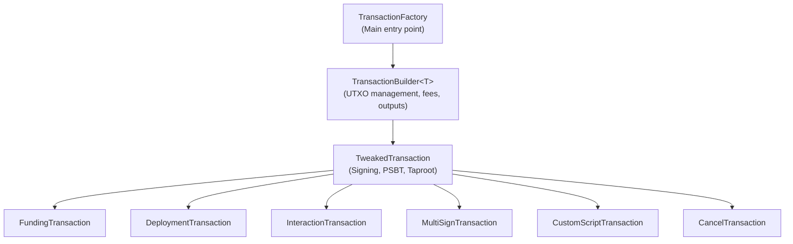
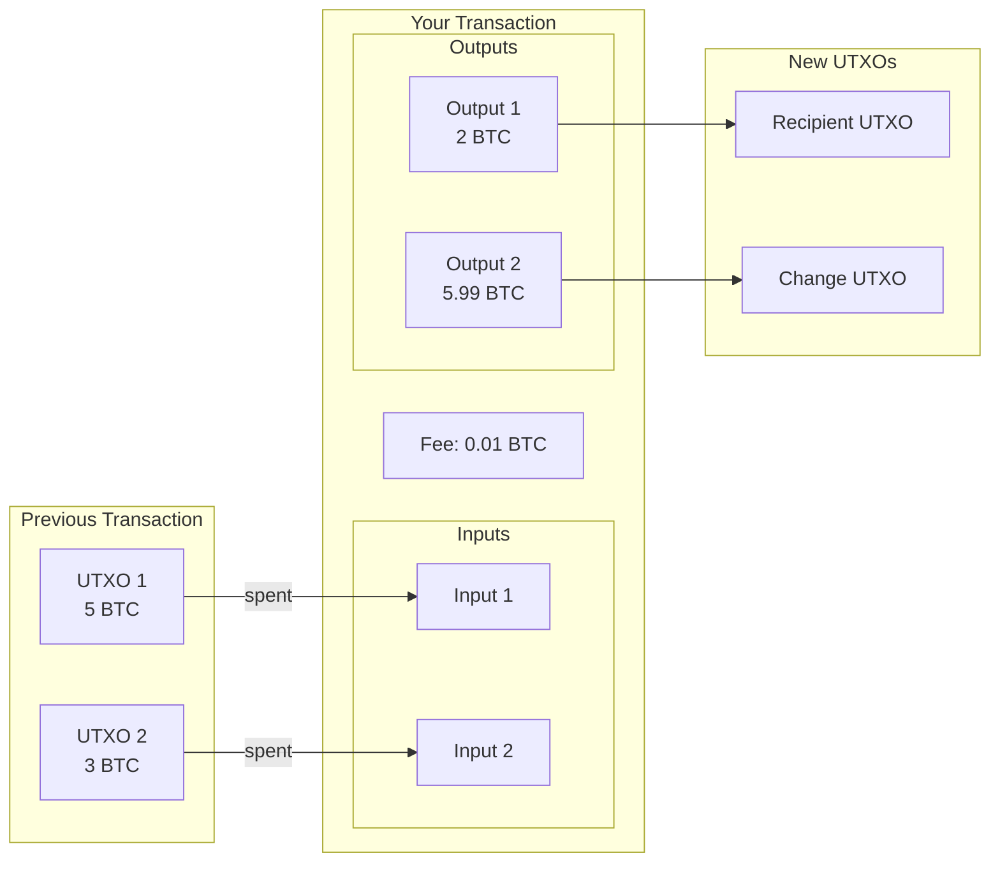
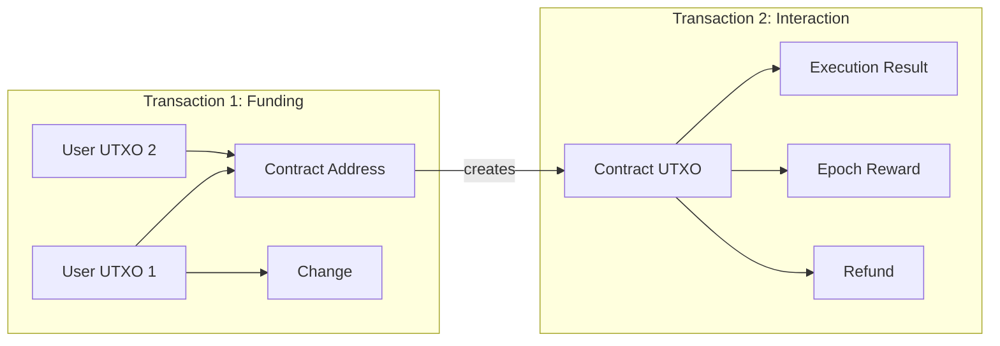
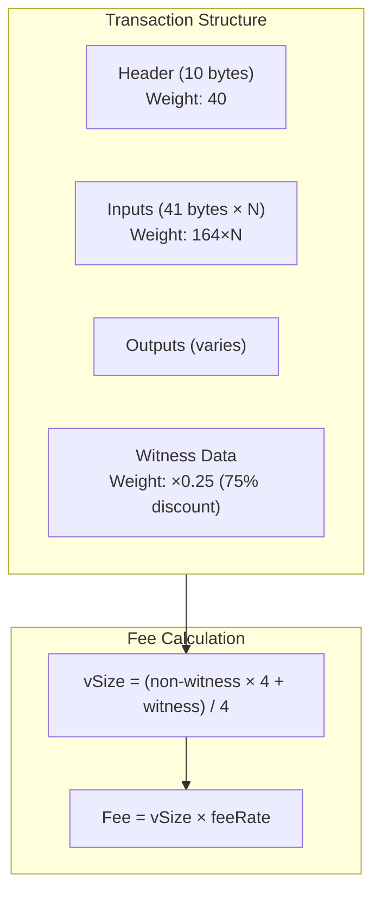
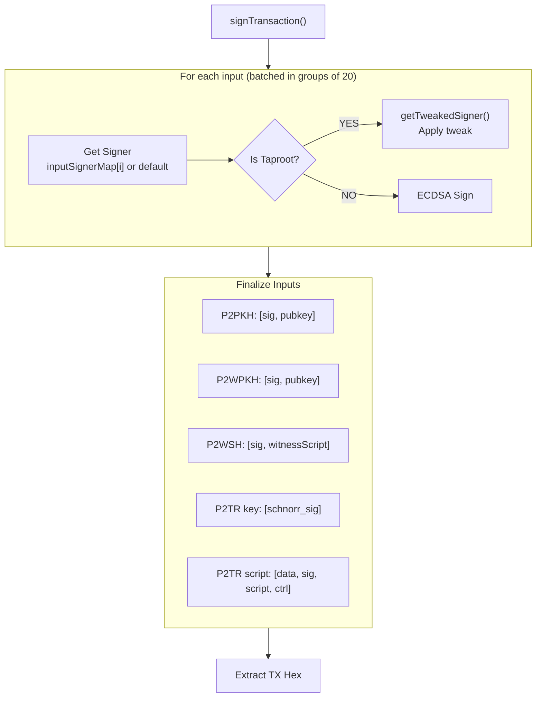
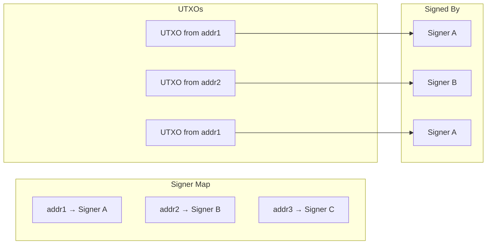
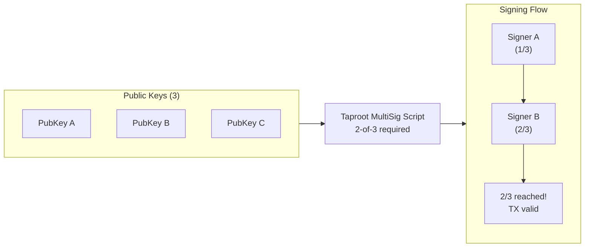

# Transaction Building Guide

Complete guide to building Bitcoin transactions with the OPNet Transaction Library.

## Overview

The transaction building system provides a layered architecture for creating, signing, and broadcasting Bitcoin transactions with support for:

- All Bitcoin address types (P2PKH, P2WPKH, P2WSH, P2SH, P2TR)
- Smart contract deployment and interaction
- Multi-signature transactions
- Custom scripts
- Address rotation (per-UTXO signing)
- Quantum-resistant signatures (ML-DSA)

## Architecture



## Transaction Types

| Type | Enum Value | Purpose |
|------|------------|---------|
| `FUNDING` | 1 | Simple BTC transfers |
| `DEPLOYMENT` | 2 | Deploy smart contracts |
| `INTERACTION` | 3 | Call contract functions |
| `MULTI_SIG` | 4 | Multi-signature transactions |
| `CUSTOM_CODE` | 5 | Custom script execution |
| `CANCEL` | 6 | Cancel/recover stuck transactions |

## UTXO Flow

UTXOs (Unspent Transaction Outputs) are the fundamental building blocks of Bitcoin transactions.

### UTXO Lifecycle



**Total In: 8 BTC = Total Out: 7.99 BTC + 0.01 BTC Fee**

### UTXO Interface

```typescript
interface UTXO {
    // Required fields
    readonly transactionId: string;     // Previous tx hash (64 hex chars)
    readonly outputIndex: number;       // Output index in previous tx
    readonly value: bigint;             // Amount in satoshis
    readonly scriptPubKey: {
        hex: string;                    // Locking script
        address: string;                // Derived address
    };

    // Optional fields (for specific script types)
    redeemScript?: string | Buffer;     // P2SH redeem script
    witnessScript?: string | Buffer;    // P2WSH witness script
    nonWitnessUtxo?: string | Buffer;   // Full previous tx (legacy)

    // Address rotation support
    signer?: RotationSigner;            // Per-UTXO signer
}
```

### UTXO Processing Flow

```mermaid
flowchart LR
    subgraph Inputs["Input UTXOs"]
        U1["UTXO 1<br/>50,000 sat"]
        U2["UTXO 2<br/>30,000 sat"]
        U3["UTXO 3<br/>20,000 sat"]
    end

    subgraph Processing["TransactionBuilder"]
        S1["1. calculateTotalAmount()<br/>Total: 100,000 sat"]
        S2["2. addInputsFromUTXO()<br/>registerInputSigner()"]
        S3["3. buildTransaction()<br/>Add outputs"]
        S4["4. estimateTransactionFees()<br/>Calculate vSize"]
        S5["5. addRefundOutput()<br/>Calculate change"]
        S6["6. signTransaction()<br/>Finalize PSBT"]

        S1 --> S2 --> S3 --> S4 --> S5 --> S6
    end

    subgraph Outputs["Outputs"]
        O1["Payment"]
        O2["Change"]
        O3["Optional"]
        Fee["Fee (miners)"]
    end

    Inputs --> S1
    S6 --> Outputs
```



## TransactionFactory

The `TransactionFactory` is the main entry point for creating transactions.

### Basic Usage

```typescript
import { TransactionFactory, EcKeyPair, UTXO } from '@btc-vision/transaction';
import { networks } from '@btc-vision/bitcoin';

const network = networks.bitcoin;
const signer = EcKeyPair.fromWIF('your-private-key-wif', network);
const address = EcKeyPair.getTaprootAddress(signer, network);

// Your available UTXOs
const utxos: UTXO[] = [{
    transactionId: 'abc123...'.padEnd(64, '0'),
    outputIndex: 0,
    value: 100000n,
    scriptPubKey: {
        hex: '5120...',
        address: address,
    },
}];

const factory = new TransactionFactory();
```

### Funding Transaction (Simple Transfer)

```typescript
const result = await factory.createBTCTransfer({
    signer,
    mldsaSigner: null,
    network,
    utxos,
    from: address,
    to: 'bc1p...recipient',
    feeRate: 10,              // sat/vB
    priorityFee: 1000n,       // OPNet priority fee
    gasSatFee: 500n,          // OPNet gas fee
    amount: 50000n,           // Amount to send (satoshis)
    splitInputsInto: 1,       // Optional: split into N outputs
});

console.log('Transaction hex:', result.tx);
console.log('Fee paid:', result.estimatedFees);
console.log('Change UTXOs:', result.nextUTXOs);
```

### Contract Deployment

```typescript
const deployResult = await factory.signDeployment({
    signer,
    mldsaSigner: null,
    network,
    utxos,
    from: address,
    feeRate: 10,
    priorityFee: 1000n,
    gasSatFee: 500n,
    bytecode: contractBytecode,     // Contract bytecode (Buffer)
    calldata: constructorData,       // Constructor params (Buffer, optional)
    challenge: epochChallenge,       // ChallengeSolution
    randomBytes: crypto.randomBytes(32),
});

console.log('Funding TX:', deployResult.transaction[0]);
console.log('Deployment TX:', deployResult.transaction[1]);
console.log('Contract Address:', deployResult.contractAddress);
```

### Contract Interaction

```typescript
const interactResult = await factory.signInteraction({
    signer,
    mldsaSigner: null,
    network,
    utxos,
    from: address,
    to: contractAddress,
    feeRate: 10,
    priorityFee: 1000n,
    gasSatFee: 500n,
    calldata: functionCalldata,      // Encoded function call (Buffer)
    challenge: epochChallenge,
    randomBytes: crypto.randomBytes(32),
});

console.log('Funding TX:', interactResult.fundingTransaction);
console.log('Interaction TX:', interactResult.interactionTransaction);
console.log('Refund UTXOs:', interactResult.nextUTXOs);
```

## Two-Transaction Model

Standard contract interactions use a two-transaction model:



## Fee Calculation



### Fee Estimation Process

```typescript
estimateTransactionFees():
  1. Create dummy signatures for each input type:
     - Schnorr (Taproot): 64 bytes
     - ECDSA (Legacy/SegWit): 72 bytes
     - Public key: 33 bytes

  2. Build dummy witness stack per input:
     - P2PKH: [sig, pubkey]
     - P2WPKH: [sig, pubkey]
     - P2WSH: [sig, witnessScript]
     - P2TR key-path: [schnorr_sig]
     - P2TR script-path: [data, sig, script, controlBlock]

  3. Calculate virtual size with witness discount

  4. Apply fee rate: fee = vSize × feeRate
```

## Signing Process



### Address Rotation (Per-UTXO Signing)

Different UTXOs can be signed by different signers:



```typescript
import { createSignerMap, createAddressRotation } from '@btc-vision/transaction';

// Create signer map
const signerMap = createSignerMap([
    ['bc1p...address1', signer1],
    ['bc1p...address2', signer2],
]);

// Use in transaction
const result = await factory.createBTCTransfer({
    signer: defaultSigner,
    utxos: mixedUtxos,
    addressRotation: createAddressRotation(signerMap),
    // ... other params
});
```

## MultiSig Transactions

Create M-of-N multi-signature transactions:



```typescript
import { MultiSignTransaction } from '@btc-vision/transaction';

const multiSigTx = new MultiSignTransaction({
    network,
    utxos: vaultUtxos,
    feeRate: 10,
    pubkeys: [pubkeyA, pubkeyB, pubkeyC],
    minimumSignatures: 2,
    receiver: recipientAddress,
    requestedAmount: 100000n,
    refundVault: vaultAddress,
});

// First signer
const psbt = await multiSigTx.signPSBT();
const psbtBase64 = psbt.toBase64();

// Send to second signer...
// Use MultiSignTransaction.signPartial() for additional signatures
```

## Custom Script Transactions

Execute arbitrary Bitcoin scripts:

```typescript
import { CustomScriptTransaction } from '@btc-vision/transaction';
import { opcodes } from '@btc-vision/bitcoin';

const customTx = new CustomScriptTransaction({
    signer,
    network,
    utxos,
    from: address,
    to: recipientAddress,
    feeRate: 10,
    priorityFee: 1000n,
    gasSatFee: 500n,
    script: [
        Buffer.from('hello'),
        opcodes.OP_DROP,
        opcodes.OP_TRUE,
    ],
    witnesses: [Buffer.from('witness data')],
});
```

## Cancel Transactions

Recover funds from stuck interactions:

```typescript
import { CancelTransaction } from '@btc-vision/transaction';

const cancelTx = new CancelTransaction({
    signer,
    network,
    utxos: stuckUtxos,
    from: address,
    to: recoveryAddress,
    feeRate: 15,  // Higher fee to ensure confirmation
    priorityFee: 0n,
    gasSatFee: 0n,
    compiledTargetScript: originalScript,
});

const signedCancel = await cancelTx.signTransaction();
```

## Response Types

### BitcoinTransferResponse (Funding)

```typescript
interface BitcoinTransferResponse {
    tx: string;                  // Signed transaction hex
    estimatedFees: bigint;       // Fees paid
    nextUTXOs: UTXO[];          // Change outputs (spendable)
    inputUtxos: UTXO[];         // UTXOs that were spent
    original: FundingTransaction;
}
```

### DeploymentResult

```typescript
interface DeploymentResult {
    transaction: [string, string];  // [fundingTx, deploymentTx]
    contractAddress: string;
    contractPubKey: string;
    challenge: RawChallenge;
    utxos: UTXO[];                  // Refund UTXOs
    inputUtxos: UTXO[];
}
```

### InteractionResponse

```typescript
interface InteractionResponse {
    fundingTransaction: string | null;    // null for P2WDA
    interactionTransaction: string;
    estimatedFees: bigint;
    nextUTXOs: UTXO[];                    // Refund outputs
    fundingUTXOs: UTXO[];
    fundingInputUtxos: UTXO[];
    challenge: RawChallenge;
    interactionAddress: string | null;
    compiledTargetScript: string | null;
}
```

## Supported Address Types

The library supports all major Bitcoin address types:

| Type | Prefix | Weight Efficiency | Support |
|------|--------|-------------------|---------|
| P2PKH | `1...` | 1x (legacy) | Full |
| P2SH | `3...` | 1x (legacy) | Full |
| P2WPKH | `bc1q...` | ~0.68x | Full |
| P2WSH | `bc1q...` (longer) | ~0.68x | Full |
| P2TR | `bc1p...` | ~0.57x | Full |
| P2A | Anchor | Minimal | Full |

## Error Handling

```typescript
try {
    const result = await factory.createBTCTransfer(params);
} catch (error) {
    if (error.message.includes('Insufficient funds')) {
        // Not enough UTXOs to cover amount + fees
    } else if (error.message.includes('Invalid UTXO')) {
        // UTXO validation failed
    } else if (error.message.includes('Dust output')) {
        // Output below minimum (330 sats)
    }
}
```

## Best Practices

1. **UTXO Management**: Track and reuse change UTXOs from `nextUTXOs`
2. **Fee Estimation**: Use realistic fee rates from mempool data
3. **Address Rotation**: Use different addresses for privacy
4. **Error Recovery**: Implement retry logic for network issues
5. **UTXO Consolidation**: Periodically combine small UTXOs to reduce future fees

## Complete Example

```typescript
import {
    TransactionFactory,
    EcKeyPair,
    UTXO,
    createSignerMap,
    createAddressRotation,
} from '@btc-vision/transaction';
import { networks } from '@btc-vision/bitcoin';

async function sendBitcoin() {
    const network = networks.bitcoin;
    const factory = new TransactionFactory();

    // Create signer from WIF
    const signer = EcKeyPair.fromWIF(process.env.PRIVATE_KEY!, network);
    const address = EcKeyPair.getTaprootAddress(signer, network);

    // Fetch UTXOs from your provider
    const utxos: UTXO[] = await fetchUTXOs(address);

    // Create transfer
    const result = await factory.createBTCTransfer({
        signer,
        mldsaSigner: null,
        network,
        utxos,
        from: address,
        to: 'bc1p...recipient',
        feeRate: 10,
        priorityFee: 0n,
        gasSatFee: 0n,
        amount: 50000n,
    });

    // Broadcast transaction
    await broadcastTransaction(result.tx);

    // Save change UTXOs for next transaction
    saveUTXOs(result.nextUTXOs);

    console.log('Transaction sent!');
    console.log('Fee:', result.estimatedFees, 'sats');
}
```
