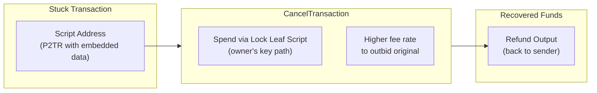
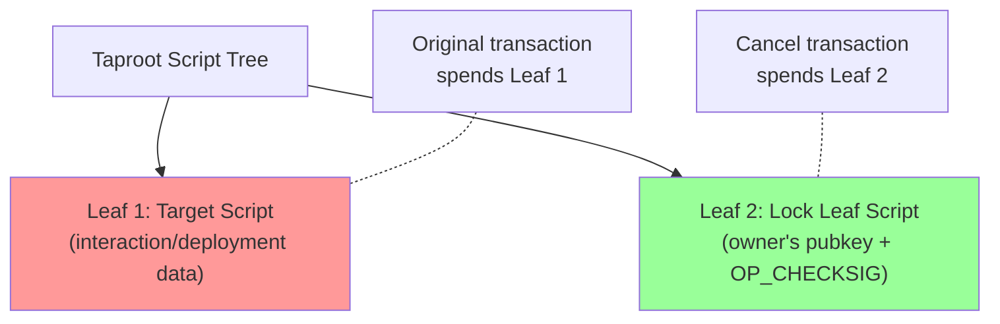
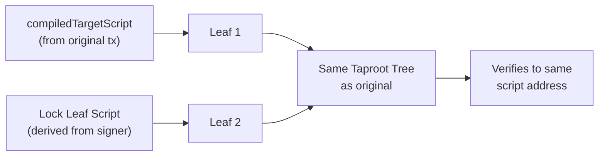
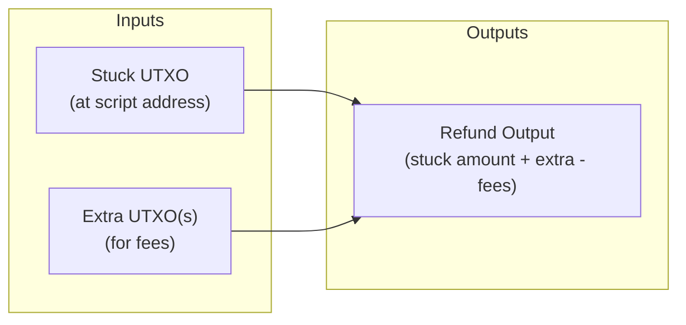
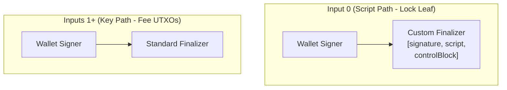

# Cancel Transactions

Recover funds from stuck or failed transactions using `CancelTransaction`.

## Overview

A `CancelTransaction` recovers funds that are locked in a Taproot script address from a previous interaction or deployment that failed to confirm or got stuck. It spends the script UTXO via the lock leaf (the second leaf in the Taproot script tree) and sends the funds back to the sender's address.



## When to Use

Cancel transactions are needed in the following scenarios:

| Scenario | Description |
|----------|-------------|
| **Stuck interaction** | The funding transaction confirmed but the interaction transaction did not |
| **Failed broadcast** | The interaction transaction was rejected by the network |
| **Fee too low** | The interaction transaction is stuck in the mempool due to low fees |
| **Network congestion** | Transactions are not confirming in a reasonable time |
| **Application error** | The application crashed after broadcasting the funding transaction but before the interaction |

In all these cases, funds are locked at the Taproot script address created by the funding transaction. The `CancelTransaction` spends the lock leaf of that script tree to recover the funds.

## Factory Method

Cancel transactions are created through `TransactionFactory.createCancellableTransaction()`:

```typescript
import { TransactionFactory } from '@btc-vision/transaction';

const factory = new TransactionFactory();
const result = await factory.createCancellableTransaction(parameters);
```

## Parameters

`ICancelTransactionParameters` extends `ITransactionParameters` (with `priorityFee` and `gasSatFee` omitted):

| Parameter | Type | Required | Default | Description |
|-----------|------|----------|---------|-------------|
| `signer` | `Signer \| UniversalSigner` | Yes | - | The same key pair that created the original transaction |
| `network` | `Network` | Yes | - | Bitcoin network |
| `utxos` | `UTXO[]` | Yes | - | The stuck UTXO(s) at the script address, plus additional UTXOs for fees |
| `from` | `string` | Yes | - | Sender address (must match the original transaction's sender) |
| `to` | `string` | Yes | - | Recovery address (typically the same as `from`) |
| `feeRate` | `number` | Yes | - | Fee rate in sat/vB (should be higher than the stuck transaction) |
| `compiledTargetScript` | `string \| Uint8Array` | Yes | - | The compiled target script from the original interaction/deployment |

The `compiledTargetScript` is the script that was embedded in the first leaf of the original Taproot tree. It is available from:
- `InteractionResponse.compiledTargetScript` (after `signInteraction()`)
- `DeploymentTransaction.exportCompiledTargetScript()` (from the deployment instance)
- Saved application state

Note: The `priorityFee` and `gasSatFee` are set internally to `1n` (minimal) since cancel transactions do not perform OPNet operations.

## Response Type

`CancelledTransaction`:

| Field | Type | Description |
|-------|------|-------------|
| `transaction` | `string` | Signed cancel transaction hex, ready to broadcast |
| `nextUTXOs` | `UTXO[]` | Recovered UTXOs for subsequent transactions |
| `inputUtxos` | `UTXO[]` | The original UTXOs that were consumed |

## How It Works

The cancel transaction leverages the Taproot script tree structure used by all OPNet transactions. Every interaction and deployment creates a two-leaf tree:



The cancel transaction reconstructs the same script tree (using the `compiledTargetScript` for Leaf 1 and the lock leaf for Leaf 2), then spends via Leaf 2 using only the owner's signature.

### Script Tree Reconstruction



The cancel transaction must produce the exact same Taproot output key as the original transaction. This is why the `compiledTargetScript` is required -- without it, the script tree hash would differ and the UTXO could not be spent.

## Fee Considerations

Cancel transactions must include **additional UTXOs** beyond the stuck script UTXO to pay for miner fees. The stuck UTXO itself is fully refunded to the sender.



If no extra UTXOs are provided to cover fees, the transaction will fail with:

```
Error: Must add extra UTXOs to cancel this transaction
```

To outbid a stuck transaction in the mempool, use a higher `feeRate` than the original.

## Complete Recovery Example

```typescript
import {
    TransactionFactory,
    EcKeyPair,
    UTXO,
} from '@btc-vision/transaction';
import { networks } from '@btc-vision/bitcoin';

async function recoverStuckFunds() {
    const network = networks.bitcoin;
    const factory = new TransactionFactory();

    // Use the same signer as the original transaction
    const signer = EcKeyPair.fromWIF(process.env.PRIVATE_KEY!, network);
    const address = EcKeyPair.getTaprootAddress(signer, network);

    // The stuck UTXO at the script address (from the funding transaction)
    const stuckUtxo: UTXO = {
        transactionId: 'abcd...'.padEnd(64, '0'),
        outputIndex: 0,
        value: 50000n,
        scriptPubKey: {
            hex: '5120...',
            address: 'bc1p...scriptAddress',
        },
    };

    // Additional UTXOs to cover the cancel transaction's fees
    const feeUtxo: UTXO = {
        transactionId: 'efgh...'.padEnd(64, '0'),
        outputIndex: 1,
        value: 10000n,
        scriptPubKey: {
            hex: '5120...',
            address: address,
        },
    };

    // The compiled target script saved from the original interaction
    const compiledTargetScript = '0a1b2c3d...';  // hex string or Uint8Array

    // Create the cancel transaction with a higher fee rate
    const result = await factory.createCancellableTransaction({
        signer,
        mldsaSigner: null,
        network,
        utxos: [stuckUtxo, feeUtxo],
        from: address,
        to: address,              // Recover to own address
        feeRate: 25,              // Higher than original to ensure confirmation
        compiledTargetScript,
    });

    // Broadcast
    await broadcastTransaction(result.transaction);

    console.log('Funds recovered!');
    console.log('Recovered UTXOs:', result.nextUTXOs);
}
```

## Signing Process

The cancel transaction signs input 0 via the lock leaf script path, then signs remaining inputs (fee UTXOs) via standard key path:



Unlike interaction and deployment transactions, the cancel transaction only needs the wallet signer's signature for the lock leaf (no script signer needed).

## Saving the Compiled Target Script

Always save the `compiledTargetScript` after creating an interaction or deployment. Without it, recovery is not possible.

```typescript
// After signInteraction()
const interactionResult = await factory.signInteraction(params);
const savedScript = interactionResult.compiledTargetScript;

// Store savedScript persistently (database, file, etc.)
await saveToDatabase('pending_interaction', {
    txId: interactionResult.interactionTransaction,
    compiledTargetScript: savedScript,
    fundingUtxos: interactionResult.fundingUTXOs,
});

// If recovery is needed later:
const saved = await loadFromDatabase('pending_interaction', txId);
const cancelResult = await factory.createCancellableTransaction({
    // ...
    compiledTargetScript: saved.compiledTargetScript,
    utxos: [...saved.fundingUtxos, ...feeUtxos],
});
```

## Error Handling

```typescript
try {
    const result = await factory.createCancellableTransaction(params);
} catch (error) {
    const message = (error as Error).message;

    if (message.includes('Must add extra UTXOs to cancel this transaction')) {
        // Not enough UTXOs to cover fees -- add more fee UTXOs
    } else if (message.includes('From address is required')) {
        // The 'from' field is missing
    } else if (message.includes('Field "to" not provided')) {
        // The 'to' field is missing
    } else if (message.includes('Missing at least one UTXO')) {
        // No UTXOs provided
    } else if (message.includes('Left over funds script redeem is required')) {
        // Internal error reconstructing the script tree
    }
}
```

## Best Practices

1. **Always save `compiledTargetScript`.** Store it alongside pending transaction records so you can recover funds if anything goes wrong.
2. **Use a higher fee rate.** If the original transaction is stuck in the mempool, the cancel transaction needs a higher fee to be prioritized.
3. **Include fee UTXOs.** The stuck UTXO alone cannot cover fees -- you must provide additional UTXOs.
4. **Recover to your own address.** Set `to` to the same address as `from` for straightforward fund recovery.
5. **Use the same signer.** The cancel transaction must use the same key pair that created the original funding transaction, since the lock leaf requires a signature from the original owner.
6. **Monitor pending transactions.** Implement a system that tracks pending two-transaction flows and automatically triggers cancellation if the second transaction fails.

---

[< Custom Script Transactions](./custom-script-transactions.md) | [Back to README](../README.md)
