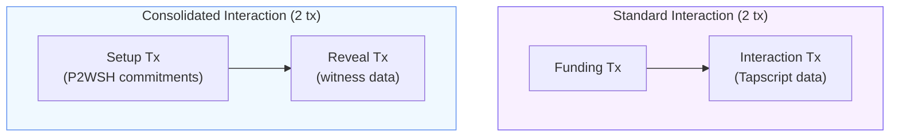
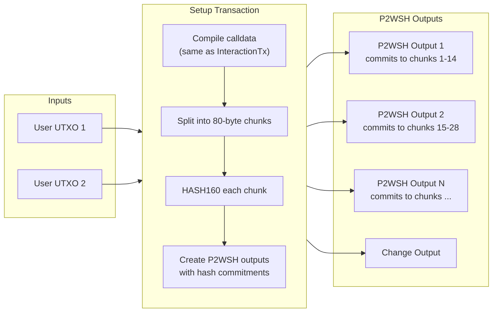
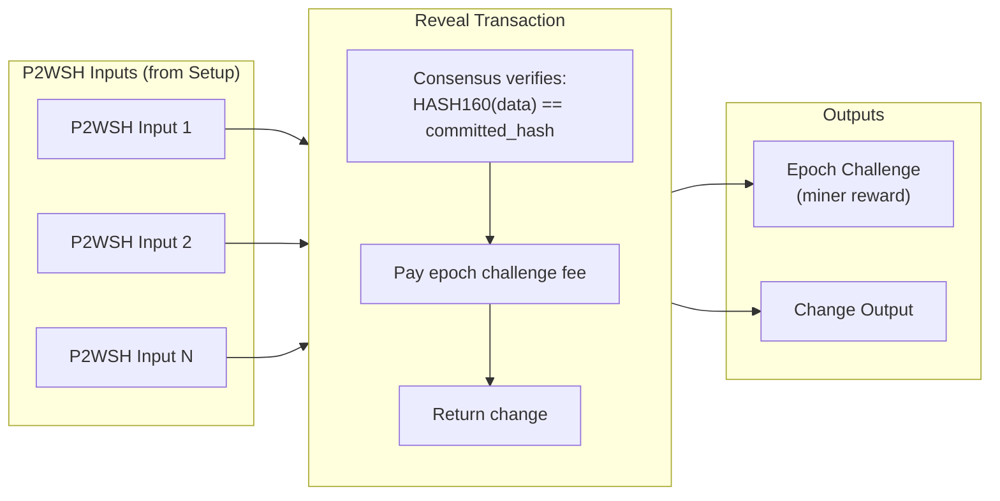
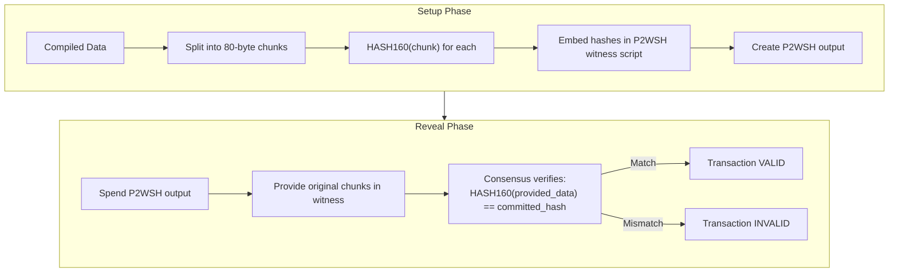

# Consolidated Transactions

Two-phase commitment-based interactions using `ConsolidatedInteractionTransaction`.

---

## Navigation

- [Back to Transaction Building](../README.md#transaction-building-1)
- [Interaction Transactions](./interaction-transactions.md)
- [TransactionFactory](./transaction-factory.md)
- [Response Types](../api-reference/response-types.md)

---

## Overview

`ConsolidatedInteractionTransaction` is a **drop-in replacement** for `InteractionTransaction` that bypasses BIP110/Bitcoin Knots censorship. It sends the same data on-chain and uses the same parameters, but embeds data in **hash-committed P2WSH witnesses** instead of Tapscript.

Standard OPNet interactions use Tapscript (`OP_IF`-based data embedding), which some node policies (notably Bitcoin Knots) censor by rejecting transactions with complex Tapscript structures. Consolidated transactions avoid this by using only standard P2WSH scripts, which have been part of Bitcoin consensus since SegWit activation.



---

## When to Use Consolidated vs Regular Interactions

| Criteria | Regular Interaction | Consolidated Interaction |
|----------|--------------------|-----------------------|
| Node compatibility | Requires OP_IF-permissive mempool | Works with all standard mempool policies |
| Bitcoin Knots | Rejected (BIP110 censorship) | Accepted |
| Transaction count | 2 (funding + interaction) | 2 (setup + reveal) |
| Data integrity | Script-level enforcement | Consensus-enforced via HASH160 |
| Maximum data size | ~400 KB (Tapscript limit) | ~242 KB (P2WSH policy limits) |
| Fee efficiency | Slightly lower fees | Slightly higher fees (P2WSH overhead) |
| Complexity | Simple Tapscript | Hash commitment + reveal |

**Use consolidated transactions when:**

- Your application must work with Bitcoin Knots nodes
- You need censorship resistance against policy-level filtering
- You want consensus-enforced data integrity guarantees

**Use regular interactions when:**

- You know the target mempool accepts Tapscript
- You need maximum data capacity (>242 KB)
- You want the simplest possible transaction structure

---

## How It Works

The CHCT (Consolidated Hash Commitment Transaction) system works in two phases:

### Phase 1: Setup Transaction

The setup transaction creates multiple P2WSH outputs, each committing to a set of data chunks via HASH160.



Each P2WSH output's witness script has the structure:

```
OP_HASH160 <hash_N> OP_EQUALVERIFY
OP_HASH160 <hash_N-1> OP_EQUALVERIFY
...
OP_HASH160 <hash_1> OP_EQUALVERIFY
<pubkey> OP_CHECKSIG
```

### Phase 2: Reveal Transaction

The reveal transaction spends all P2WSH outputs, providing the original data chunks in the witness. The consensus rules verify each chunk against its committed hash.



The witness stack for each input:

```
[signature, data_1, data_2, ..., data_N, witnessScript]
```

If any data chunk is stripped, modified, or missing, `HASH160(data) != committed_hash` and the transaction is **invalid at the consensus level**.

---

## Policy Limits

The consolidated transaction system respects all standard Bitcoin policy limits:

| Limit | Value | Description |
|-------|-------|-------------|
| `MAX_STANDARD_P2WSH_STACK_ITEM_SIZE` | 80 bytes | Maximum size per witness stack item |
| `g_script_size_policy_limit` | 1,650 bytes | Maximum total witness script size |
| `MAX_STANDARD_P2WSH_STACK_ITEMS` | 100 items | Maximum items per witness stack |

### Capacity

| Metric | Value |
|--------|-------|
| Bytes per chunk | up to 80 |
| Chunks per P2WSH output | up to 14 (with overhead) |
| Data per P2WSH output | ~1,120 bytes |
| Max outputs per reveal tx | ~220 |
| Max total data per transaction | ~242 KB |

---

## Parameters

`IConsolidatedInteractionParameters` extends `IInteractionParameters` with one additional optional field:

| Parameter | Type | Required | Default | Description |
|-----------|------|----------|---------|-------------|
| `to` | `string` | Yes | -- | Contract address (P2TR Taproot) |
| `calldata` | `Uint8Array` | Yes | -- | ABI-encoded function call data |
| `challenge` | `IChallengeSolution` | Yes | -- | Epoch challenge solution |
| `utxos` | `UTXO[]` | Yes | -- | Available UTXOs to spend |
| `signer` | `Signer \| UniversalSigner` | Yes | -- | Key pair for signing |
| `network` | `Network` | Yes | -- | Bitcoin network configuration |
| `feeRate` | `number` | Yes | -- | Fee rate in sat/vB |
| `priorityFee` | `bigint` | Yes | -- | OPNet priority fee in satoshis |
| `gasSatFee` | `bigint` | Yes | -- | OPNet gas fee in satoshis |
| `mldsaSigner` | `QuantumBIP32Interface \| null` | Yes | -- | ML-DSA signer (or `null`) |
| `from` | `string` | No | Derived from signer | Sender address (for change output) |
| `contract` | `string` | No | -- | Contract secret (32-byte hex) |
| `maxChunkSize` | `number` | No | `80` | Maximum bytes per P2WSH stack item |
| `disableAutoRefund` | `boolean` | No | `false` | Skip automatic change output |
| `loadedStorage` | `LoadedStorage` | No | -- | Pre-loaded contract storage (access list) |
| `randomBytes` | `Uint8Array` | No | Random | 32 random bytes for script uniqueness |
| `compiledTargetScript` | `Uint8Array \| string` | No | -- | Pre-compiled target script |
| `linkMLDSAPublicKeyToAddress` | `boolean` | No | `false` | Link ML-DSA key on-chain |
| `revealMLDSAPublicKey` | `boolean` | No | `false` | Reveal ML-DSA key in features |

---

## Response Type

`ConsolidatedInteractionResponse`:

| Property | Type | Description |
|----------|------|-------------|
| `setupTransaction` | `string` | Setup transaction hex (broadcast first) |
| `revealTransaction` | `string` | Reveal transaction hex (broadcast second) |
| `setupTxId` | `string` | Setup transaction ID |
| `revealTxId` | `string` | Reveal transaction ID |
| `totalFees` | `bigint` | Combined fees for both transactions |
| `chunkCount` | `number` | Total number of data chunks |
| `dataSize` | `number` | Total compiled data size in bytes |
| `challenge` | `RawChallenge` | Epoch challenge solution (JSON-serializable) |
| `inputUtxos` | `UTXO[]` | Original UTXOs consumed |
| `compiledTargetScript` | `string` | Compiled target script (hex) |

---

## Complete Example

### Using TransactionFactory (Recommended)

```typescript
import {
    TransactionFactory,
    BinaryWriter,
    ABICoder,
    networks,
} from '@btc-vision/transaction';
import type {
    IConsolidatedInteractionParameters,
    ConsolidatedInteractionResponse,
    UTXO,
} from '@btc-vision/transaction';

// 1. Prepare calldata (same as regular interaction)
const abiCoder = new ABICoder();
const selector = abiCoder.encodeSelector('transfer(address,uint256)');

const writer = new BinaryWriter();
writer.writeSelector(selector);
writer.writeAddress(recipientAddress);
writer.writeU256(amount);
const calldata = writer.getBuffer();

// 2. Build parameters (identical to signInteraction)
const params: IConsolidatedInteractionParameters = {
    from: 'bc1p...sender',
    to: 'bc1p...contract',
    contract: 'bc1p...contract',  // Required: contract address (same as `to`)
    calldata: calldata,
    utxos: myUtxos,
    signer: keypair,
    network: networks.bitcoin,
    feeRate: 10,
    priorityFee: 500n,
    gasSatFee: 330n,
    challenge: challengeSolution,
    mldsaSigner: null,
    // Optional: customize chunk size (default 80)
    // maxChunkSize: 80,
};

// 3. Sign the consolidated interaction
const factory = new TransactionFactory();
const result: ConsolidatedInteractionResponse =
    await factory.signConsolidatedInteraction(params);

// 4. Broadcast both transactions in order
console.log('Setup TX:', result.setupTxId);
console.log('Reveal TX:', result.revealTxId);
console.log('Total fees:', result.totalFees, 'sats');
console.log('Data chunks:', result.chunkCount);
console.log('Data size:', result.dataSize, 'bytes');

// Broadcast setup first
await broadcastTransaction(result.setupTransaction);
// Then broadcast reveal (can use CPFP if needed)
await broadcastTransaction(result.revealTransaction);
```

### Using ConsolidatedInteractionTransaction Directly

For advanced use cases where you need access to the builder internals:

```typescript
import {
    ConsolidatedInteractionTransaction,
} from '@btc-vision/transaction';
import type { IConsolidatedInteractionResult } from '@btc-vision/transaction';

const tx = new ConsolidatedInteractionTransaction({
    calldata: myCalldata,
    to: contractAddress,
    contract: contractSecret,
    challenge: myChallenge,
    utxos: myUtxos,
    signer: mySigner,
    network: networks.bitcoin,
    feeRate: 10,
    priorityFee: 0n,
    gasSatFee: 330n,
    mldsaSigner: null,
});

// Inspect before building
console.log('Output count:', tx.getOutputCount());
console.log('Total chunks:', tx.getTotalChunkCount());
console.log('Value per output:', tx.getValuePerOutput(), 'sats');

// Build both transactions
const result: IConsolidatedInteractionResult = await tx.build();

// Access setup details
console.log('Setup TX ID:', result.setup.txId);
console.log('Setup fees:', result.setup.feesPaid, 'sats');
console.log('Setup outputs:', result.setup.outputs.length);

// Access reveal details
console.log('Reveal TX ID:', result.reveal.txId);
console.log('Reveal fees:', result.reveal.feesPaid, 'sats');
console.log('Data revealed:', result.reveal.dataSize, 'bytes');

// Total
console.log('Total fees:', result.totalFees, 'sats');

// Get compiled target script (same as InteractionTransaction)
const compiledScript = tx.exportCompiledTargetScript();
```

---

## Data Integrity Guarantees

The CHCT system provides **consensus-level data integrity**. This is stronger than policy-level enforcement:



**Key guarantees:**

1. **Tamper-proof:** If any data chunk is modified between setup and reveal, the reveal transaction is invalid
2. **Complete:** If any data chunk is missing from the witness, the reveal transaction is invalid
3. **Ordered:** Chunks must be provided in the exact order committed in the witness script
4. **Signed:** A valid signature from the commitment creator is required (preventing unauthorized spending)

---

## Migration from Regular Interactions

Migrating from `signInteraction()` to `signConsolidatedInteraction()` requires minimal code changes:

```diff
- const result = await factory.signInteraction({
+ const result = await factory.signConsolidatedInteraction({
      from: senderAddress,
      to: contractAddress,
      calldata: calldata,
      utxos: myUtxos,
      signer: keypair,
      network: networks.bitcoin,
      feeRate: 10,
      priorityFee: 500n,
      gasSatFee: 330n,
      challenge: challengeSolution,
      mldsaSigner: null,
  });

- // Old: two-transaction broadcast
- await broadcast(result.fundingTransaction);
- await broadcast(result.interactionTransaction);
+ // New: two-transaction broadcast (different names)
+ await broadcast(result.setupTransaction);
+ await broadcast(result.revealTransaction);
```

The calldata, contract address, challenge solution, and all other parameters remain identical. The compiled target script is the same -- only the data embedding mechanism changes.

---

## Builder API Reference

### ConsolidatedInteractionTransaction

| Method | Returns | Description |
|--------|---------|-------------|
| `build()` | `Promise<IConsolidatedInteractionResult>` | Build both setup and reveal transactions |
| `exportCompiledTargetScript()` | `Uint8Array` | Get the compiled target script |
| `getContractSecret()` | `Uint8Array` | Get the contract secret (32 bytes) |
| `getRndBytes()` | `Uint8Array` | Get the random bytes |
| `getChallenge()` | `IChallengeSolution` | Get the challenge solution |
| `getCommitmentOutputs()` | `IHashCommittedP2WSH[]` | Get all commitment outputs |
| `getOutputCount()` | `number` | Get the number of P2WSH outputs |
| `getTotalChunkCount()` | `number` | Get the total number of data chunks |
| `getValuePerOutput()` | `bigint` | Get satoshi value per commitment output |
| `buildRevealTransaction(setupTxId)` | `IRevealTransactionResult` | Build reveal for a given setup txid |

### Properties

| Property | Type | Description |
|----------|------|-------------|
| `type` | `TransactionType.INTERACTION` | Transaction type discriminant |
| `randomBytes` | `Uint8Array` | Random bytes for interaction |
| `contractAddress` | `string` | The contract address |
| `contractSecret` | `Uint8Array` | The 32-byte contract secret |
| `calldata` | `Uint8Array` | Compressed calldata |
| `challenge` | `IChallengeSolution` | Epoch challenge solution |
| `compiledTargetScript` | `Uint8Array` | The compiled operation data |
| `commitmentOutputs` | `IHashCommittedP2WSH[]` | Hash-committed P2WSH outputs |

---

## See Also

- [Interaction Transactions](./interaction-transactions.md) -- Standard (Tapscript) interactions
- [TransactionFactory](./transaction-factory.md) -- Factory method documentation
- [Response Types](../api-reference/response-types.md) -- `ConsolidatedInteractionResponse` reference
- [Interfaces](../api-reference/interfaces.md) -- `IConsolidatedInteractionParameters` reference
