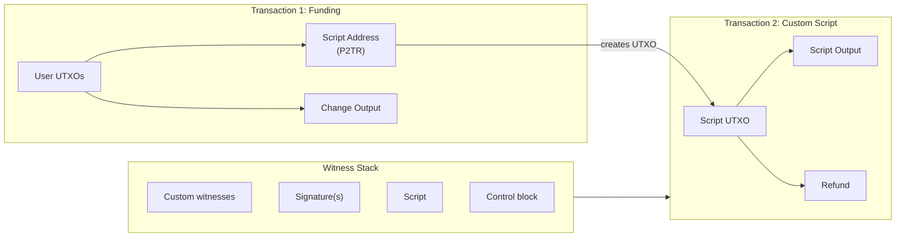
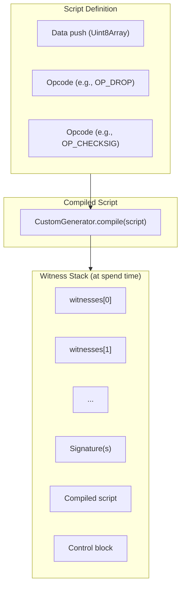
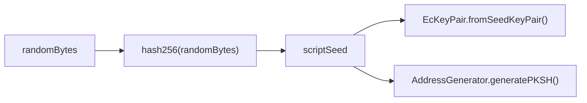
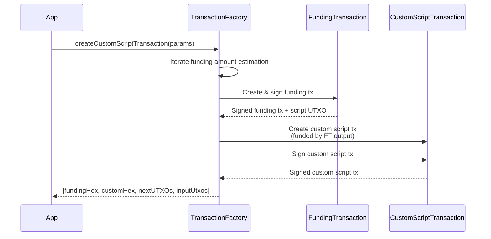
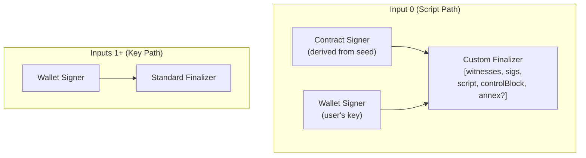

# Custom Script Transactions

Execute arbitrary Bitcoin scripts using `CustomScriptTransaction`.

## Overview

`CustomScriptTransaction` allows you to embed and execute arbitrary Bitcoin scripts within a Taproot transaction. It uses a two-transaction model similar to interactions: a funding transaction creates a UTXO at a derived script address, and the custom script transaction spends that UTXO by satisfying the embedded script.



## Factory Method

Custom script transactions are created through `TransactionFactory.createCustomScriptTransaction()`:

```typescript
import { TransactionFactory } from '@btc-vision/transaction';

const factory = new TransactionFactory();
const [fundingTx, customTx, nextUTXOs, inputUtxos] =
    await factory.createCustomScriptTransaction(parameters);
```

The return type is a tuple: `[string, string, UTXO[], UTXO[]]`.

| Index | Type | Description |
|-------|------|-------------|
| `[0]` | `string` | Funding transaction hex |
| `[1]` | `string` | Custom script transaction hex |
| `[2]` | `UTXO[]` | Change UTXOs for subsequent transactions |
| `[3]` | `UTXO[]` | Original input UTXOs that were consumed |

## Parameters

`ICustomTransactionParameters` extends `SharedInteractionParameters` (with `challenge` omitted):

| Parameter | Type | Required | Default | Description |
|-----------|------|----------|---------|-------------|
| `signer` | `Signer \| UniversalSigner` | Yes | - | Key pair used to sign inputs |
| `network` | `Network` | Yes | - | Bitcoin network |
| `utxos` | `UTXO[]` | Yes | - | Available UTXOs to fund the transaction |
| `from` | `string` | Yes | - | Sender address |
| `to` | `string` | Yes | - | Target address for the script output |
| `feeRate` | `number` | Yes | - | Fee rate in sat/vB |
| `priorityFee` | `bigint` | Yes | - | OPNet priority fee in satoshis |
| `gasSatFee` | `bigint` | Yes | - | OPNet gas fee in satoshis |
| `script` | `(Uint8Array \| Stack)[]` | Yes | - | Array of script elements (data pushes and opcodes) |
| `witnesses` | `Uint8Array[]` | Yes | - | Witness data to satisfy the script |
| `randomBytes` | `Uint8Array` | No | Auto-generated | 32-byte random salt |
| `annex` | `Uint8Array` | No | - | Optional Taproot annex data (without `0x50` prefix) |
| `mldsaSigner` | `QuantumBIP32Interface \| null` | No | - | ML-DSA signer |

## Script and Witness Structure

The `script` parameter is an array of Bitcoin script elements compiled into the Taproot leaf. The `witnesses` parameter provides the data that satisfies the script at spending time.



The witness stack is assembled in the custom finalizer:

1. All custom `witnesses` elements
2. Tap script signatures (from signing)
3. The compiled script (leaf script)
4. The Taproot control block
5. Optional annex data (if provided)

## Annex Data

The optional `annex` parameter allows embedding arbitrary data in the Taproot annex field. If the provided data does not start with the `0x50` prefix, it is automatically prepended:

```typescript
// Annex will be prefixed with 0x50 automatically
const parameters = {
    // ... other params
    annex: new Uint8Array([0x01, 0x02, 0x03]),
};

// Or provide the prefix yourself
const parameters2 = {
    // ... other params
    annex: new Uint8Array([0x50, 0x01, 0x02, 0x03]),
};
```

## Script Address Derivation

The script address is derived from a seed generated by hashing the random bytes:



The `CustomScriptTransaction` instance exposes:

- `scriptAddress` -- the derived PKSH address
- `p2trAddress` -- the P2TR address (either explicit `to` or computed)
- `getRndBytes()` -- the random bytes used

## Two-Transaction Flow



## Complete Example

```typescript
import {
    TransactionFactory,
    EcKeyPair,
    UTXO,
} from '@btc-vision/transaction';
import { networks, opcodes } from '@btc-vision/bitcoin';

async function executeCustomScript() {
    const network = networks.bitcoin;
    const factory = new TransactionFactory();

    // Create signer
    const signer = EcKeyPair.fromWIF(process.env.PRIVATE_KEY!, network);
    const address = EcKeyPair.getTaprootAddress(signer, network);

    // Fetch UTXOs
    const utxos: UTXO[] = await fetchUTXOs(address);

    // Define a custom script:
    // This script expects a preimage on the witness stack,
    // drops it, then requires a valid signature.
    const preimage = new TextEncoder().encode('secret-preimage');
    const customScript = [
        preimage,
        opcodes.OP_DROP,
        // The signer's pubkey is embedded by the generator
    ];

    // Witnesses must satisfy the script
    const witnesses = [
        preimage,    // Matches the data push + OP_DROP
    ];

    // Create and sign
    const [fundingTx, customTx, nextUTXOs, inputUtxos] =
        await factory.createCustomScriptTransaction({
            signer,
            mldsaSigner: null,
            network,
            utxos,
            from: address,
            to: address,
            feeRate: 10,
            priorityFee: 1000n,
            gasSatFee: 500n,
            script: customScript,
            witnesses,
        });

    // Broadcast both transactions in order
    await broadcastTransaction(fundingTx);
    await broadcastTransaction(customTx);

    console.log('Custom script executed!');
    console.log('Change UTXOs:', nextUTXOs);
}
```

## Signing Process

The custom script transaction uses a dual-signing process for input 0:



Parallel signing is used for inputs 1+ when `isUniversalSigner` is available, falling back to sequential signing otherwise.

## Error Handling

```typescript
try {
    const result = await factory.createCustomScriptTransaction(params);
} catch (error) {
    const message = (error as Error).message;

    if (message.includes('Bitcoin script is required')) {
        // The script parameter is missing
    } else if (message.includes('Witness(es) are required')) {
        // The witnesses parameter is missing
    } else if (message.includes('Field "to" not provided')) {
        // The to address is missing
    } else if (message.includes('Field "from" not provided')) {
        // The from address is missing
    } else if (message.includes('Could not sign funding transaction')) {
        // Funding step failed
    }
}
```

## Best Practices

1. **Match witnesses to script.** The witness stack must satisfy the script exactly. An incorrect witness will cause the transaction to be invalid.
2. **Test scripts on regtest first.** Custom scripts can lock funds permanently if they contain errors. Always test on regtest before mainnet.
3. **Keep scripts minimal.** Larger scripts increase transaction weight and fees. Only include the opcodes you need.
4. **Use annex sparingly.** The Taproot annex is non-standard and may cause issues with some nodes or services.
5. **Broadcast in order.** The funding transaction must be accepted before the custom script transaction can spend its output.
6. **Track change UTXOs.** The third element of the return tuple (`nextUTXOs`) contains your new spendable outputs.

---

[< MultiSig Transactions](./multisig-transactions.md) | [Cancel Transactions >](./cancel-transactions.md)
