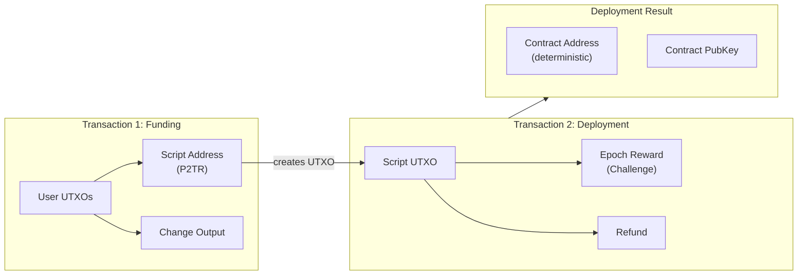
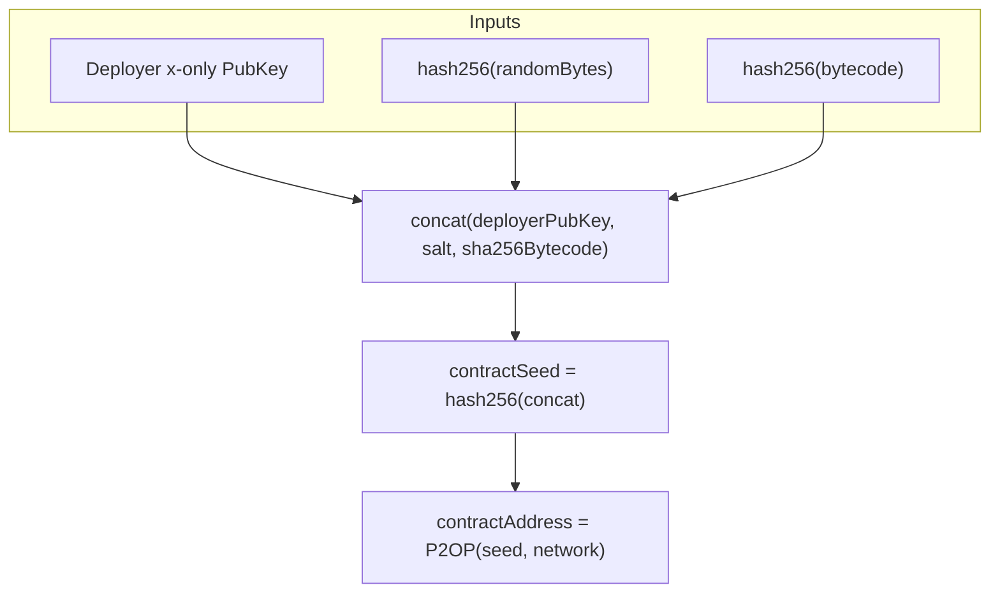
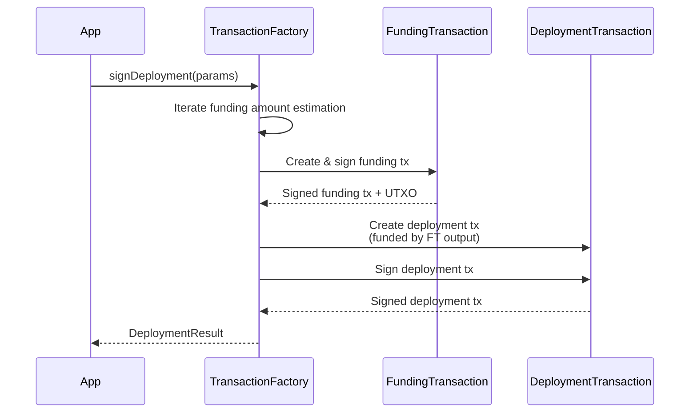

# Deployment Transactions

Deploy smart contracts to the OPNet network using `DeploymentTransaction`.

## Overview

A `DeploymentTransaction` deploys a compiled smart contract to the Bitcoin blockchain via OPNet. The process produces **two transactions** that must be broadcast in order: a funding transaction that sends BTC to a derived Taproot script address, and a deployment transaction that reveals the contract bytecode in the Taproot witness.



## Factory Method

Deployments are created through `TransactionFactory.signDeployment()`:

```typescript
import { TransactionFactory } from '@btc-vision/transaction';

const factory = new TransactionFactory();
const result = await factory.signDeployment(parameters);
```

## Parameters

`IDeploymentParameters` extends `ITransactionParameters` (with `to` omitted since the target address is derived automatically):

| Parameter | Type | Required | Default | Description |
|-----------|------|----------|---------|-------------|
| `signer` | `Signer \| UniversalSigner` | Yes | - | Key pair used to sign the transaction |
| `mldsaSigner` | `QuantumBIP32Interface \| null` | Yes | - | ML-DSA signer (required for deployment; provides the hashed public key) |
| `network` | `Network` | Yes | - | Bitcoin network |
| `utxos` | `UTXO[]` | Yes | - | Available UTXOs to fund the deployment |
| `from` | `string` | Yes | - | Deployer address |
| `feeRate` | `number` | Yes | - | Fee rate in sat/vB |
| `priorityFee` | `bigint` | Yes | - | OPNet priority fee in satoshis |
| `gasSatFee` | `bigint` | Yes | - | OPNet gas fee in satoshis |
| `bytecode` | `Uint8Array` | Yes | - | Compiled contract bytecode |
| `calldata` | `Uint8Array` | No | - | Constructor calldata (ABI-encoded constructor arguments) |
| `randomBytes` | `Uint8Array` | No | Auto-generated | 32-byte salt for contract address derivation |
| `challenge` | `IChallengeSolution` | Yes | - | Epoch challenge solution (proof of work) |

### Constraints

| Constraint | Value | Description |
|------------|-------|-------------|
| Maximum contract size | **128 KB** (`128 * 1024` bytes) | After compression. Enforced by `DeploymentTransaction.MAXIMUM_CONTRACT_SIZE`. |
| Maximum calldata size | **1 MB** (`1024 * 1024` bytes) | Constructor calldata limit. Enforced by `SharedInteractionTransaction.MAXIMUM_CALLDATA_SIZE`. |
| ML-DSA signer | Required | The `mldsaSigner` (hashed public key) must be defined to deploy a contract. |

## Response Type

`DeploymentResult`:

| Field | Type | Description |
|-------|------|-------------|
| `transaction` | `[string, string]` | Tuple of `[fundingTxHex, deploymentTxHex]` -- broadcast in this order |
| `contractAddress` | `string` | The deterministic P2OP contract address |
| `contractPubKey` | `string` | The contract's public key (hex, `0x`-prefixed) |
| `challenge` | `RawChallenge` | The raw epoch challenge used |
| `utxos` | `UTXO[]` | Refund UTXOs (change from the funding transaction) |
| `inputUtxos` | `UTXO[]` | Original UTXOs consumed as inputs |

## Contract Address Derivation

Contract addresses are deterministic. The address is derived from the deployer's public key, a random salt, and the bytecode hash:



This means the same deployer deploying the same bytecode with the same salt will always produce the same contract address. To deploy a distinct instance, use different `randomBytes`.

## Bytecode Compression

Contract bytecode is automatically compressed before embedding in the transaction. The `Compressor` module handles this transparently:

```typescript
// Internally in DeploymentTransaction constructor:
this.bytecode = Compressor.compress(
    new Uint8Array([...versionBuffer, ...parameters.bytecode]),
);
```

A version prefix is prepended before compression. The compressed bytecode must remain under the 128 KB limit.

## Two-Transaction Model

The factory's `signDeployment()` method handles the full two-transaction flow internally:



1. The factory estimates the required funding amount through iterative simulation.
2. A `FundingTransaction` sends the estimated amount to the derived Taproot script address.
3. A `DeploymentTransaction` spends that UTXO, embedding the bytecode in the witness.
4. Both hex-encoded transactions are returned for sequential broadcast.

## Complete Example

```typescript
import {
    TransactionFactory,
    EcKeyPair,
    ChallengeSolution,
    UTXO,
} from '@btc-vision/transaction';
import { networks, crypto as bitCrypto } from '@btc-vision/bitcoin';

async function deployContract() {
    const network = networks.bitcoin;
    const factory = new TransactionFactory();

    // Create signers
    const signer = EcKeyPair.fromWIF(process.env.PRIVATE_KEY!, network);
    const address = EcKeyPair.getTaprootAddress(signer, network);

    // ML-DSA signer is required for deployment
    const mldsaSigner = /* your ML-DSA signer instance */;

    // Fetch UTXOs
    const utxos: UTXO[] = await fetchUTXOs(address);

    // Prepare contract bytecode (compiled .wasm or equivalent)
    const bytecode: Uint8Array = await readContractBytecode('./my_contract.wasm');

    // Optional: constructor calldata (ABI-encoded)
    const calldata: Uint8Array = encodeConstructorArgs(/* ... */);

    // Obtain the epoch challenge solution
    const challenge: ChallengeSolution = await solveEpochChallenge(/* ... */);

    // Deploy
    const result = await factory.signDeployment({
        signer,
        mldsaSigner,
        network,
        utxos,
        from: address,
        feeRate: 10,
        priorityFee: 10000n,
        gasSatFee: 5000n,
        bytecode,
        calldata,
        challenge,
    });

    // Broadcast both transactions in order
    await broadcastTransaction(result.transaction[0]);  // Funding
    await broadcastTransaction(result.transaction[1]);  // Deployment

    console.log('Contract deployed!');
    console.log('Contract address:', result.contractAddress);
    console.log('Contract pubkey:', result.contractPubKey);
    console.log('Refund UTXOs:', result.utxos);
}
```

## Error Handling

```typescript
try {
    const result = await factory.signDeployment(params);
} catch (error) {
    const message = (error as Error).message;

    if (message.includes('MLDSA signer must be defined')) {
        // mldsaSigner is null or missing -- required for deployment
    } else if (message.includes('Contract size overflow')) {
        // Compressed bytecode exceeds 128 KB
    } else if (message.includes('Calldata size overflow')) {
        // Constructor calldata exceeds 1 MB
    } else if (message.includes('Bytecode is required')) {
        // bytecode parameter is missing or empty
    } else if (message.includes('Challenge solution is required')) {
        // challenge parameter is missing
    } else if (message.includes('Could not sign funding transaction')) {
        // Funding step failed (likely insufficient UTXOs)
    }
}
```

## Best Practices

1. **Pre-check bytecode size.** Compress and measure your bytecode before attempting deployment to avoid wasted fees.
2. **Save the contract address.** The `contractAddress` and `contractPubKey` are needed for all future interactions with the contract.
3. **Use consistent random bytes for reproducibility.** If you need a predictable contract address (e.g., for CREATE2-style deployment), pass explicit `randomBytes`.
4. **Broadcast in order.** The funding transaction must confirm (or at least enter the mempool) before the deployment transaction can be accepted.
5. **Track refund UTXOs.** Use `result.utxos` as inputs for your next transaction.
6. **Verify contract size.** The 128 KB limit applies to the compressed bytecode including the version prefix.

---

[< Funding Transactions](./funding-transactions.md) | [Interaction Transactions >](./interaction-transactions.md)
