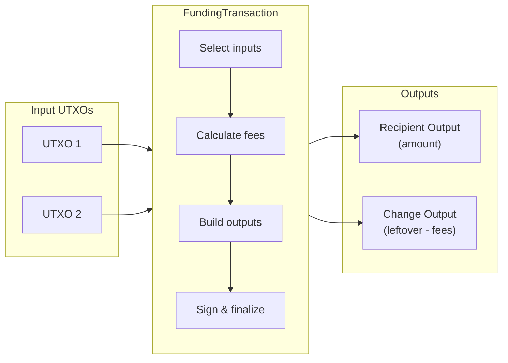
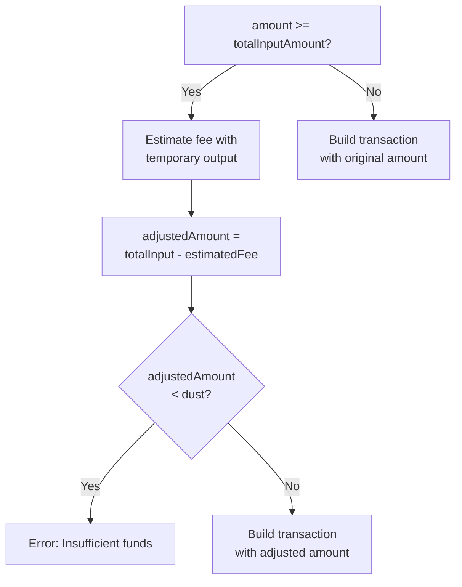
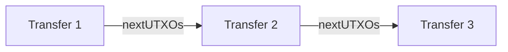

# Funding Transactions (BTC Transfers)

Simple Bitcoin transfers using `FundingTransaction`.

## Overview

A `FundingTransaction` creates a standard Bitcoin transfer from one address to another. It handles UTXO selection, fee calculation, change outputs, and optional output splitting.



## Factory Methods

Funding transactions are created through `TransactionFactory`:

| Method | Description |
|--------|-------------|
| `TransactionFactory.createBTCTransfer()` | Create and sign a BTC transfer, returning the hex-encoded transaction |

```typescript
import { TransactionFactory } from '@btc-vision/transaction';

const factory = new TransactionFactory();
const result = await factory.createBTCTransfer(parameters);
```

## Parameters

`IFundingTransactionParameters` extends the base `ITransactionParameters`:

| Parameter | Type | Required | Default | Description |
|-----------|------|----------|---------|-------------|
| `signer` | `Signer` | Yes | - | Key pair used to sign inputs |
| `network` | `Network` | Yes | - | Bitcoin network (`networks.bitcoin`, `networks.testnet`, `networks.regtest`) |
| `utxos` | `UTXO[]` | Yes | - | Available UTXOs to spend |
| `from` | `string` | Yes | - | Sender address (for change output) |
| `to` | `string` | Yes | - | Recipient address |
| `feeRate` | `number` | Yes | - | Fee rate in sat/vB |
| `priorityFee` | `bigint` | Yes | - | OPNet priority fee (use `0n` for plain BTC transfers) |
| `gasSatFee` | `bigint` | Yes | - | OPNet gas fee (use `0n` for plain BTC transfers) |
| `amount` | `bigint` | Yes | - | Amount to send in satoshis |
| `splitInputsInto` | `number` | No | `1` | Split the output into N equal UTXOs |
| `autoAdjustAmount` | `boolean` | No | `false` | Deduct fees from output (send-max mode) |
| `feeUtxos` | `UTXO[]` | No | `undefined` | Separate UTXOs used exclusively to cover fees |
| `mldsaSigner` | `MLDSASigner \| null` | No | - | ML-DSA (quantum-resistant) signer |
| `optionalOutputs` | `PsbtOutputExtended[]` | No | - | Additional outputs (e.g., OP_RETURN notes) |
| `note` | `string \| Uint8Array` | No | - | Embed an OP_RETURN note in the transaction |

## Response Type

`BitcoinTransferResponse`:

| Field | Type | Description |
|-------|------|-------------|
| `tx` | `string` | Signed transaction in hex format, ready to broadcast |
| `estimatedFees` | `bigint` | Total fees paid in satoshis |
| `nextUTXOs` | `UTXO[]` | Change UTXOs belonging to the sender, for use in subsequent transactions |
| `inputUtxos` | `UTXO[]` | The UTXOs that were consumed as inputs |
| `original` | `FundingTransaction` | The underlying `FundingTransaction` instance |

## Send-Max Mode

Setting `autoAdjustAmount: true` sends the entire balance minus fees. When the requested `amount` equals or exceeds the total UTXO value, the builder estimates fees first, then reduces the output amount accordingly.



```typescript
// Send entire balance
const result = await factory.createBTCTransfer({
    signer,
    mldsaSigner: null,
    network,
    utxos,
    from: myAddress,
    to: recipientAddress,
    feeRate: 10,
    priorityFee: 0n,
    gasSatFee: 0n,
    amount: totalBalance,       // Set to total UTXO value
    autoAdjustAmount: true,     // Fees deducted from output
});

// result.tx contains the full balance minus fees
```

## Output Splitting

Use `splitInputsInto` to divide the output amount across multiple equal UTXOs at the same address. This is useful for preparing UTXOs for future parallel transactions.

```typescript
const result = await factory.createBTCTransfer({
    signer,
    mldsaSigner: null,
    network,
    utxos,
    from: myAddress,
    to: recipientAddress,
    feeRate: 10,
    priorityFee: 0n,
    gasSatFee: 0n,
    amount: 100000n,
    splitInputsInto: 4,    // Creates 4 outputs of 25,000 sat each
});
```

## Fee UTXOs

Use `feeUtxos` to pay transaction fees from a separate set of UTXOs. The output amount stays exact and fees are drawn from the fee UTXOs. Any leftover becomes the change output.

```typescript
const result = await factory.createBTCTransfer({
    signer,
    mldsaSigner: null,
    network,
    utxos: [paymentUtxo],        // Used for the payment output
    feeUtxos: [feeOnlyUtxo],     // Used exclusively to cover fees
    from: myAddress,
    to: recipientAddress,
    feeRate: 10,
    priorityFee: 0n,
    gasSatFee: 0n,
    amount: 50000n,
});
```

Internally, `feeUtxos` are merged into the input set:

```typescript
// From FundingTransaction constructor:
const mergedParams = parameters.feeUtxos?.length
    ? { ...parameters, utxos: [...parameters.utxos, ...parameters.feeUtxos] }
    : parameters;
```

## Complete Example

```typescript
import { TransactionFactory, EcKeyPair, UTXO } from '@btc-vision/transaction';
import { networks } from '@btc-vision/bitcoin';

async function transferBTC() {
    const network = networks.bitcoin;
    const factory = new TransactionFactory();

    // Create signer
    const signer = EcKeyPair.fromWIF(process.env.PRIVATE_KEY!, network);
    const address = EcKeyPair.getTaprootAddress(signer, network);

    // Fetch your UTXOs (from a provider or local state)
    const utxos: UTXO[] = [
        {
            transactionId: 'abcd1234...'.padEnd(64, '0'),
            outputIndex: 0,
            value: 100000n,
            scriptPubKey: {
                hex: '5120...',
                address: address,
            },
        },
    ];

    // Send 50,000 sats
    const result = await factory.createBTCTransfer({
        signer,
        mldsaSigner: null,
        network,
        utxos,
        from: address,
        to: 'bc1p...recipient',
        feeRate: 10,
        priorityFee: 0n,
        gasSatFee: 0n,
        amount: 50000n,
    });

    console.log('Transaction hex:', result.tx);
    console.log('Fees paid:', result.estimatedFees, 'sats');
    console.log('Change UTXOs:', result.nextUTXOs);

    // Broadcast the transaction
    await broadcastTransaction(result.tx);

    // Track the change UTXOs for your next transaction
    const availableUtxos = result.nextUTXOs;
}
```

## UTXO Tracking

Always track the `nextUTXOs` returned from each transaction. These are your new spendable outputs and must be used as inputs for subsequent transactions.



```typescript
let currentUtxos = initialUtxos;

// First transfer
const result1 = await factory.createBTCTransfer({
    ...params,
    utxos: currentUtxos,
    amount: 30000n,
});
currentUtxos = result1.nextUTXOs;

// Second transfer (uses change from first)
const result2 = await factory.createBTCTransfer({
    ...params,
    utxos: currentUtxos,
    amount: 20000n,
});
currentUtxos = result2.nextUTXOs;
```

## Error Handling

```typescript
try {
    const result = await factory.createBTCTransfer(params);
} catch (error) {
    const message = (error as Error).message;

    if (message.includes('Recipient address is required')) {
        // The 'to' field is missing
    } else if (message.includes('Insufficient funds')) {
        // UTXOs do not cover amount + fees (thrown during autoAdjust)
    } else if (message.includes('below minimum dust')) {
        // After fee deduction, remaining amount is below 330 sats
    } else if (message.includes('Field "from" not provided')) {
        // The 'from' field is missing (thrown by TransactionFactory)
    }
}
```

## Best Practices

1. **Set realistic fee rates.** Query mempool fee estimates before building a transaction.
2. **Track change UTXOs.** Always use `nextUTXOs` as inputs for follow-up transactions to avoid double-spending.
3. **Use `autoAdjustAmount` for sweeps.** When sending the entire balance, let the builder subtract fees automatically.
4. **Use `feeUtxos` for exact amounts.** When the recipient must receive an exact amount, pay fees from separate UTXOs.
5. **Consolidate dust.** Periodically combine many small UTXOs into fewer larger ones to reduce future transaction sizes and fees.
6. **Set OPNet fees to `0n` for plain transfers.** The `priorityFee` and `gasSatFee` fields are only relevant for OPNet contract operations.

---

[< Back to Transaction Building](../transaction-building.md) | [Deployment Transactions >](./deployment-transactions.md)
