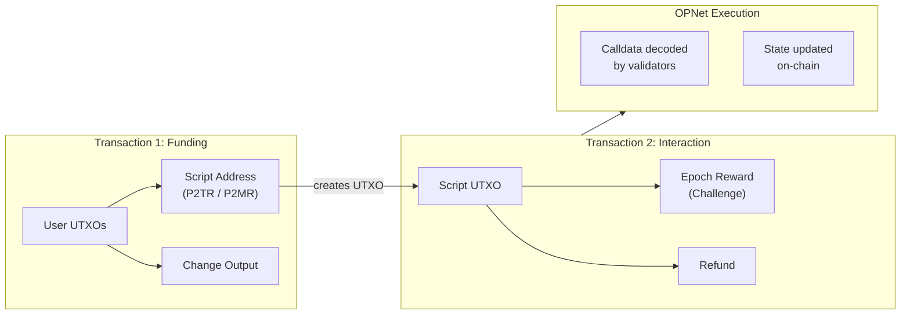
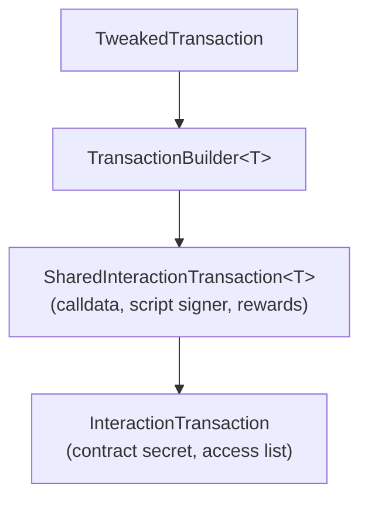
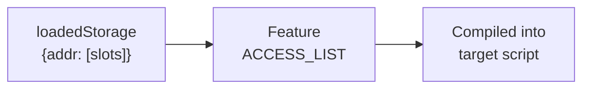
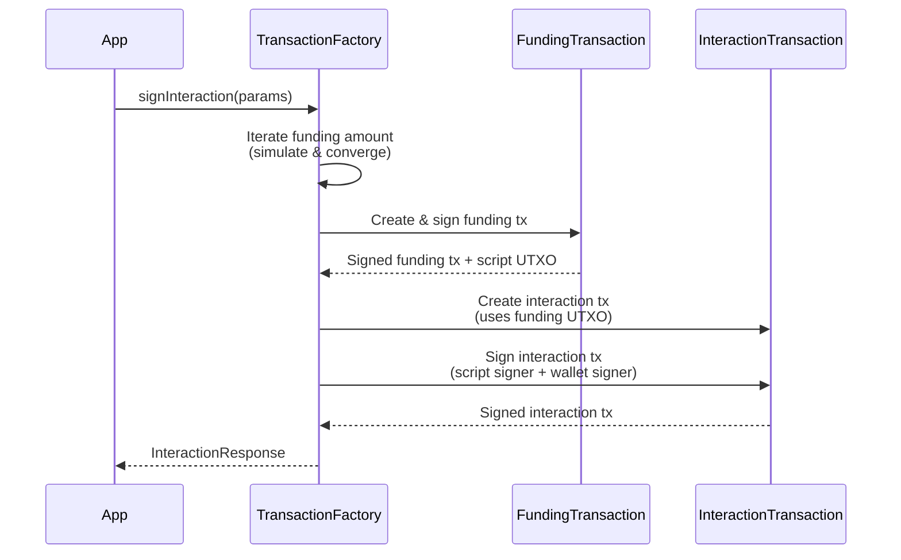
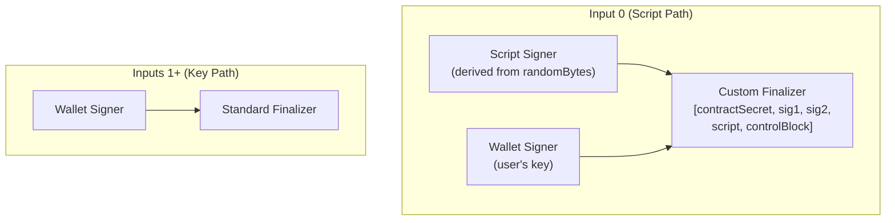

# Interaction Transactions

Call smart contract functions using `InteractionTransaction`.

## Overview

An `InteractionTransaction` calls a function on a deployed OPNet smart contract. Like deployments, interactions use a **two-transaction model**: a funding transaction sends BTC to a derived script address (P2TR or P2MR), and the interaction transaction spends that UTXO while embedding the calldata in the witness.



## Factory Method

Interactions are created through `TransactionFactory.signInteraction()`:

```typescript
import { TransactionFactory } from '@btc-vision/transaction';

const factory = new TransactionFactory();
const result = await factory.signInteraction(parameters);
```

## Architecture

`InteractionTransaction` extends `SharedInteractionTransaction`, which provides the common logic for calldata compression, script-path signing, and reward outputs. The class hierarchy is:



`SharedInteractionTransaction` handles:
- Calldata compression via `Compressor`
- Script signer generation from random bytes
- Taproot script tree construction (target script + lock leaf)
- Epoch reward output creation
- Dual-signature signing (script signer + wallet signer)

`InteractionTransaction` adds:
- Contract secret (derived from the contract's public key)
- Access list support for gas optimization
- Feature generation (epoch submission, ML-DSA linking)

## Parameters

`IInteractionParameters` extends `SharedInteractionParameters`:

| Parameter | Type | Required | Default | Description |
|-----------|------|----------|---------|-------------|
| `signer` | `Signer \| UniversalSigner` | Yes | - | Key pair used to sign inputs |
| `mldsaSigner` | `QuantumBIP32Interface \| null` | No | - | ML-DSA (quantum-resistant) signer |
| `network` | `Network` | Yes | - | Bitcoin network |
| `utxos` | `UTXO[]` | Yes | - | Available UTXOs to fund the interaction |
| `from` | `string` | Yes | - | Sender address |
| `to` | `string` | Yes | - | Contract's P2TR address |
| `feeRate` | `number` | Yes | - | Fee rate in sat/vB |
| `priorityFee` | `bigint` | Yes | - | OPNet priority fee in satoshis |
| `gasSatFee` | `bigint` | Yes | - | OPNet gas fee in satoshis |
| `calldata` | `Uint8Array` | Yes | - | ABI-encoded function call |
| `contract` | `string` | Yes | - | Contract public key (hex, `0x`-prefixed, 32 bytes) |
| `challenge` | `IChallengeSolution` | Yes | - | Epoch challenge solution |
| `randomBytes` | `Uint8Array` | No | Auto-generated | 32-byte random salt |
| `loadedStorage` | `LoadedStorage` | No | - | Access list for gas optimization |
| `disableAutoRefund` | `boolean` | No | `false` | Skip the automatic refund output |
| `useP2MR` | `boolean` | No | `false` | Use P2MR (BIP 360) instead of P2TR. Eliminates the quantum-vulnerable key-path spend. |

### Constraints

| Constraint | Value | Description |
|------------|-------|-------------|
| Maximum calldata size | **1 MB** (`1024 * 1024` bytes) | Before compression. Enforced by `SharedInteractionTransaction.MAXIMUM_CALLDATA_SIZE`. |
| Contract secret length | **32 bytes** | The `contract` parameter must decode to exactly 32 bytes. |

## Response Type

`InteractionResponse`:

| Field | Type | Description |
|-------|------|-------------|
| `fundingTransaction` | `string \| null` | Funding transaction hex (`null` for P2WDA interactions) |
| `interactionTransaction` | `string` | Interaction transaction hex |
| `estimatedFees` | `bigint` | Total fees in satoshis |
| `nextUTXOs` | `UTXO[]` | Change UTXOs for subsequent transactions |
| `fundingUTXOs` | `UTXO[]` | The UTXO(s) created by the funding transaction |
| `fundingInputUtxos` | `UTXO[]` | Original UTXOs consumed as inputs |
| `challenge` | `RawChallenge` | The raw epoch challenge used |
| `interactionAddress` | `string \| null` | The Taproot script address used for the interaction |
| `compiledTargetScript` | `string \| null` | The compiled target script (hex) for cancellation recovery |

## Access List Support

The access list (`loadedStorage`) pre-declares which contract storage slots the interaction will read. This allows validators to optimize gas costs by pre-loading the required state.

```typescript
const loadedStorage: LoadedStorage = {
    // contract address -> array of storage slot keys
    'bc1p...contractAddress': [
        '0x0000...storageSlot1',
        '0x0000...storageSlot2',
    ],
};

const result = await factory.signInteraction({
    // ... other params
    loadedStorage,
});
```

The access list is encoded as a transaction feature with `Features.ACCESS_LIST` priority:



## Two-Transaction Flow

The factory handles the complete two-transaction flow:



1. The factory iteratively estimates the required funding amount.
2. A `FundingTransaction` sends BTC to the derived Taproot script address.
3. An `InteractionTransaction` spends that UTXO, revealing the calldata in the witness.
4. Both transactions are returned for sequential broadcast.

## Signing Process

Interaction transactions use a dual-signature scheme. Input 0 (the script-path input) requires two signatures:



The witness stack for the script-path input contains:
1. The contract secret (32 bytes)
2. Script signer's Schnorr signature
3. Wallet signer's Schnorr signature
4. The compiled target script
5. The Taproot control block

## Complete Example

```typescript
import {
    TransactionFactory,
    EcKeyPair,
    ABICoder,
    ChallengeSolution,
    UTXO,
} from '@btc-vision/transaction';
import { networks } from '@btc-vision/bitcoin';

async function callContract() {
    const network = networks.bitcoin;
    const factory = new TransactionFactory();

    // Create signer
    const signer = EcKeyPair.fromWIF(process.env.PRIVATE_KEY!, network);
    const address = EcKeyPair.getTaprootAddress(signer, network);

    // Fetch UTXOs
    const utxos: UTXO[] = await fetchUTXOs(address);

    // Encode the function call
    const coder = new ABICoder();
    const calldata = coder.encodeSelector('transfer')
        .addAddress('bc1p...recipientAddress')
        .addUint256(1000000n)
        .compile();

    // Obtain epoch challenge
    const challenge: ChallengeSolution = await solveEpochChallenge(/* ... */);

    // Contract details
    const contractAddress = 'bc1p...contractP2TR';
    const contractPubKey = '0x...contractPubKey';  // 32 bytes hex

    // Execute interaction
    const result = await factory.signInteraction({
        signer,
        mldsaSigner: null,
        network,
        utxos,
        from: address,
        to: contractAddress,
        feeRate: 10,
        priorityFee: 10000n,
        gasSatFee: 5000n,
        calldata,
        contract: contractPubKey,
        challenge,
        // useP2MR: true,  // Uncomment for quantum-safe P2MR output (bc1z...)
    });

    // Broadcast both transactions in order
    await broadcastTransaction(result.fundingTransaction!);
    await broadcastTransaction(result.interactionTransaction);

    console.log('Interaction sent!');
    console.log('Fees:', result.estimatedFees, 'sats');
    console.log('Change UTXOs:', result.nextUTXOs);

    // Save compiledTargetScript for potential cancellation
    const compiledScript = result.compiledTargetScript;
}
```

## Error Handling

```typescript
try {
    const result = await factory.signInteraction(params);
} catch (error) {
    const message = (error as Error).message;

    if (message.includes('parameters.contract is required')) {
        // The 'contract' parameter is missing
    } else if (message.includes('Invalid contract secret length')) {
        // Contract public key does not decode to 32 bytes
    } else if (message.includes('Calldata is required')) {
        // The calldata parameter is missing
    } else if (message.includes('Challenge solution is required')) {
        // The challenge parameter is missing
    } else if (message.includes('Field "to" not provided')) {
        // Contract address (to) is missing
    } else if (message.includes('Could not sign funding transaction')) {
        // Insufficient UTXOs or funding step failed
    }
}
```

## Best Practices

1. **Save the `compiledTargetScript`.** If the interaction gets stuck, you need this script to create a `CancelTransaction` for recovery.
2. **Use access lists when possible.** Pre-declaring storage slots via `loadedStorage` reduces gas costs for the validator.
3. **Broadcast sequentially.** The funding transaction must reach the mempool before the interaction transaction.
4. **Track change UTXOs.** Use `result.nextUTXOs` for subsequent transactions.
5. **Set appropriate fees.** Both `priorityFee` and `gasSatFee` affect how validators prioritize your interaction.
6. **Handle P2WDA automatically.** If your UTXOs are P2WDA type, the factory automatically uses the single-transaction P2WDA path (no funding transaction needed).
7. **Consider P2MR for quantum safety.** Set `useP2MR: true` to use P2MR outputs (BIP 360) instead of P2TR. P2MR commits directly to a Merkle root without a key-path spend, eliminating quantum-vulnerable internal pubkey exposure.

---

[< Deployment Transactions](./deployment-transactions.md) | [MultiSig Transactions >](./multisig-transactions.md)
