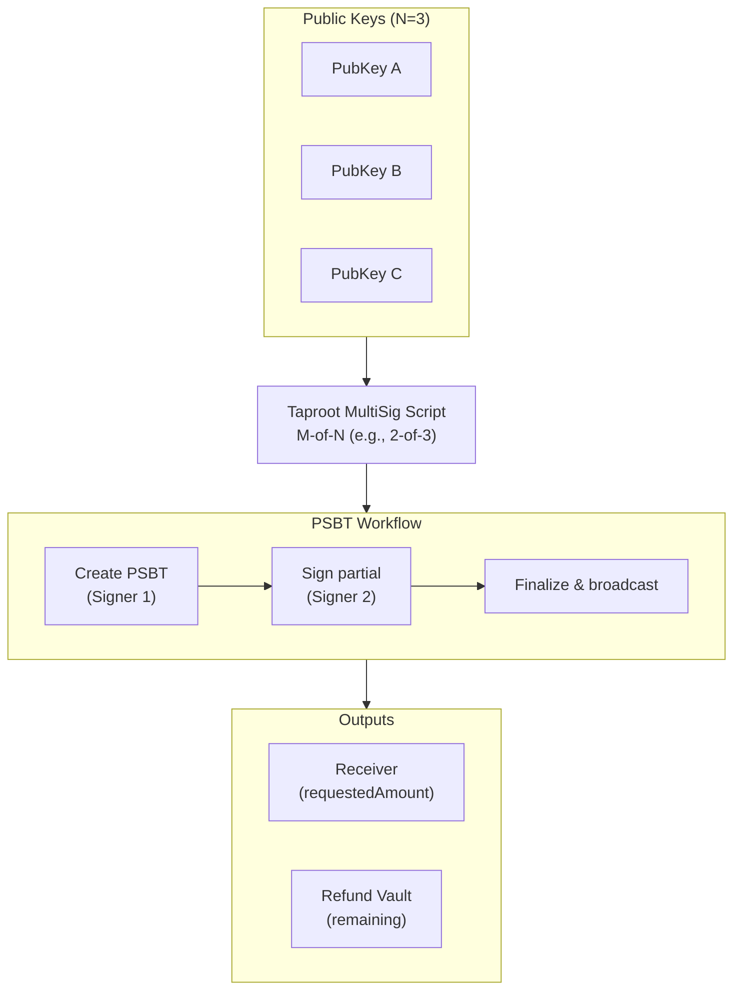
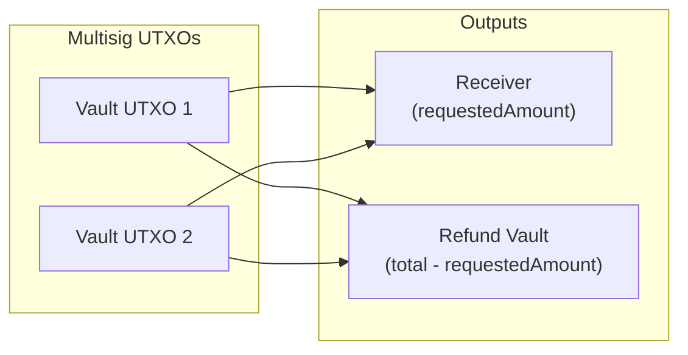
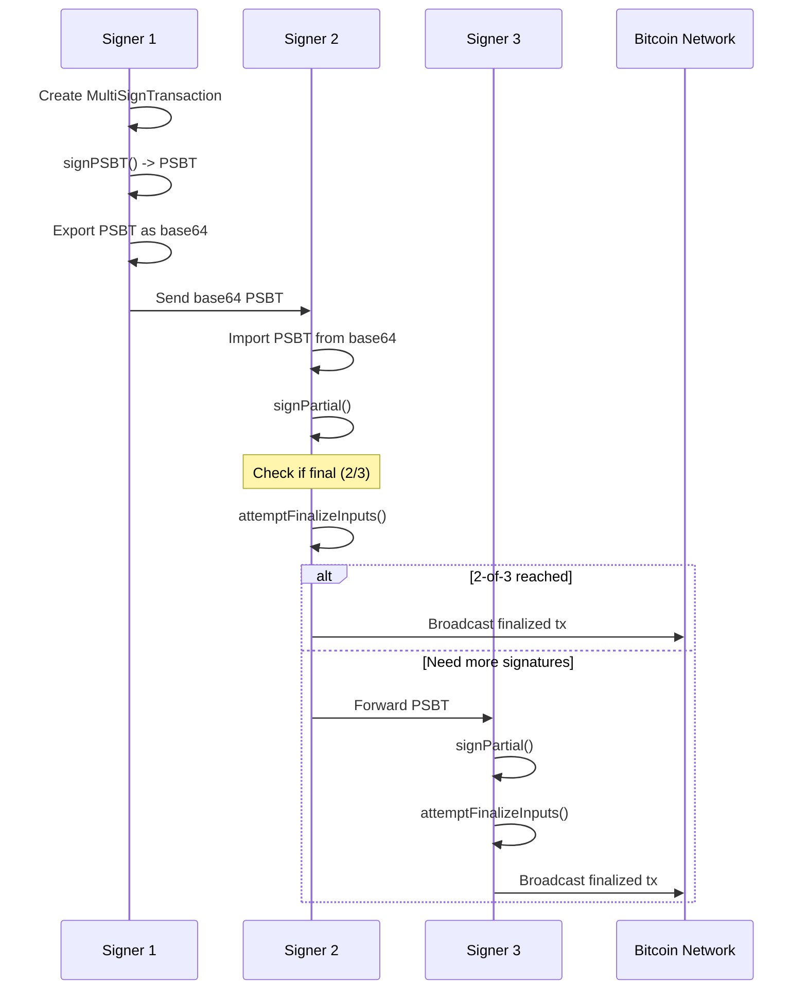
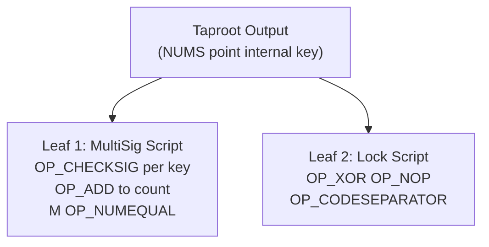

# Multi-Signature Transactions

Create M-of-N multi-signature transactions using `MultiSignTransaction`.

## Overview

`MultiSignTransaction` creates Taproot-based multi-signature transactions where M out of N key holders must sign before the transaction is valid. It uses a PSBT (Partially Signed Bitcoin Transaction) workflow to collect signatures from multiple parties.



## Direct Construction

Unlike other transaction types, `MultiSignTransaction` is used directly rather than through `TransactionFactory`:

```typescript
import { MultiSignTransaction } from '@btc-vision/transaction';

const multiSigTx = new MultiSignTransaction(parameters);
const psbt = await multiSigTx.signPSBT();
```

## Parameters

`MultiSignParameters`:

| Parameter | Type | Required | Default | Description |
|-----------|------|----------|---------|-------------|
| `network` | `Network` | Yes | - | Bitcoin network |
| `utxos` | `UTXO[]` | Yes | - | UTXOs locked in the multisig address |
| `feeRate` | `number` | Yes | - | Fee rate in sat/vB |
| `pubkeys` | `Uint8Array[]` | Yes | - | Array of N public keys for the multisig |
| `minimumSignatures` | `number` | Yes | - | Minimum signatures required (M) |
| `receiver` | `string` | Yes | - | Address to receive the requested amount |
| `requestedAmount` | `bigint` | Yes | - | Amount to send to the receiver in satoshis |
| `refundVault` | `string` | Yes | - | Address to receive remaining funds |
| `from` | `string` | No | - | Source address |
| `to` | `string` | No | - | Target address |
| `psbt` | `Psbt` | No | - | Existing PSBT to add signatures to |

Note: The `signer`, `priorityFee`, and `gasSatFee` fields from `ITransactionParameters` are omitted. A dummy signer is used internally since actual signing happens via the PSBT workflow.

## Output Structure

The multisig transaction creates two outputs:



The refund amount is calculated as:

```
refundAmount = totalInputValue - requestedAmount
```

## PSBT Workflow

Multi-signature transactions use a PSBT-based workflow for collecting signatures from multiple parties:



## Key Static Methods

### `MultiSignTransaction.fromBase64()`

Reconstruct a `MultiSignTransaction` from a base64-encoded PSBT:

```typescript
const multiSigTx = MultiSignTransaction.fromBase64({
    psbt: base64String,
    network,
    utxos: vaultUtxos,
    feeRate: 10,
    pubkeys: [pubkeyA, pubkeyB, pubkeyC],
    minimumSignatures: 2,
    receiver: recipientAddress,
    requestedAmount: 100000n,
    refundVault: vaultAddress,
});
```

### `MultiSignTransaction.signPartial()`

Add a signature from an additional signer:

```typescript
const result = MultiSignTransaction.signPartial(
    psbt,                   // The PSBT to sign
    signer,                 // The signer's key pair
    originalInputCount,     // Number of inputs before multisig inputs
    minimums,               // Array of required signatures per input
);

// result.signed  - true if this signer added a signature
// result.final   - true if enough signatures have been collected
```

### `MultiSignTransaction.verifyIfSigned()`

Check whether a specific public key has already signed:

```typescript
const alreadySigned = MultiSignTransaction.verifyIfSigned(psbt, signerPubKey);
```

### `MultiSignTransaction.attemptFinalizeInputs()`

Attempt to finalize all multisig inputs after collecting signatures:

```typescript
const success = MultiSignTransaction.attemptFinalizeInputs(
    psbt,
    startIndex,        // Index of first multisig input
    orderedPubKeys,    // Array of ordered public key arrays per input
    isFinal,           // Whether all required signatures are present
);
```

### `MultiSignTransaction.dedupeSignatures()`

Merge and deduplicate signature arrays (used when combining PSBTs from different signers):

```typescript
const merged = MultiSignTransaction.dedupeSignatures(
    originalSignatures,
    newPartialSignatures,
);
```

## Taproot Script Structure

The multisig uses a Taproot script tree with two leaves:



The internal public key is the NUMS (Nothing Up My Sleeve) point, which ensures that only the script path can be used -- there is no key-path spend.

```typescript
// NUMS point used as internal key (no key-path spend possible)
public static readonly numsPoint: PublicKey = fromHex(
    '50929b74c1a04954b78b4b6035e97a5e078a5a0f28ec96d547bfee9ace803ac0',
);
```

## Complete 2-of-3 Example

```typescript
import {
    MultiSignTransaction,
    EcKeyPair,
    UTXO,
} from '@btc-vision/transaction';
import { networks, Psbt } from '@btc-vision/bitcoin';

const network = networks.bitcoin;

// Three participants
const signerA = EcKeyPair.fromWIF(process.env.KEY_A!, network);
const signerB = EcKeyPair.fromWIF(process.env.KEY_B!, network);
const signerC = EcKeyPair.fromWIF(process.env.KEY_C!, network);

const pubkeys = [signerA.publicKey, signerB.publicKey, signerC.publicKey];

// UTXOs locked in the multisig address
const vaultUtxos: UTXO[] = [
    {
        transactionId: 'abcd...'.padEnd(64, '0'),
        outputIndex: 0,
        value: 200000n,
        scriptPubKey: {
            hex: '5120...',
            address: 'bc1p...multisigAddress',
        },
    },
];

// --- Step 1: First signer creates the PSBT ---

const multiSigTx = new MultiSignTransaction({
    network,
    utxos: vaultUtxos,
    feeRate: 10,
    pubkeys,
    minimumSignatures: 2,
    receiver: 'bc1p...recipientAddress',
    requestedAmount: 100000n,
    refundVault: 'bc1p...vaultAddress',
});

const psbt = await multiSigTx.signPSBT();
const psbtBase64 = psbt.toBase64();

// --- Step 2: Send psbtBase64 to the second signer ---

// Second signer reconstructs and signs
const psbt2 = Psbt.fromBase64(psbtBase64, { network });

// Check if this signer already signed
const alreadySigned = MultiSignTransaction.verifyIfSigned(
    psbt2,
    signerB.publicKey,
);

if (!alreadySigned) {
    const result = MultiSignTransaction.signPartial(
        psbt2,
        signerB,
        0,                          // originalInputCount
        [2],                        // minimums per input (need 2 sigs)
    );

    if (result.final) {
        // 2-of-3 threshold reached - finalize
        const finalized = MultiSignTransaction.attemptFinalizeInputs(
            psbt2,
            0,                      // startIndex
            [pubkeys],              // orderedPubKeys per input
            true,                   // isFinal
        );

        if (finalized) {
            const tx = psbt2.extractTransaction();
            const txHex = tx.toHex();
            await broadcastTransaction(txHex);
            console.log('Multi-sig transaction broadcast!');
        }
    } else {
        // Need more signatures - forward to next signer
        const updatedPsbt = psbt2.toBase64();
        // Send updatedPsbt to signer C...
    }
}
```

## Error Handling

```typescript
try {
    const multiSigTx = new MultiSignTransaction(params);
    const psbt = await multiSigTx.signPSBT();
} catch (error) {
    const message = (error as Error).message;

    if (message.includes('Refund vault is required')) {
        // refundVault parameter is missing
    } else if (message.includes('Requested amount is required')) {
        // requestedAmount is missing or zero
    } else if (message.includes('Receiver is required')) {
        // receiver address is missing
    } else if (message.includes('Pubkeys are required')) {
        // pubkeys array is missing
    } else if (message.includes('Output value left is negative')) {
        // requestedAmount exceeds total UTXO value
    } else if (message.includes('Could not sign transaction')) {
        // PSBT signing failed
    }
}
```

## Best Practices

1. **Verify signatures before forwarding.** Use `verifyIfSigned()` to prevent duplicate signing.
2. **Use base64 for PSBT transport.** The `toBase64()` / `fromBase64()` methods provide a compact, safe encoding for transmitting PSBTs between signers.
3. **Order public keys consistently.** The same `pubkeys` array order must be used by all signers when constructing or reconstructing the `MultiSignTransaction`.
4. **Validate the refund amount.** Ensure `requestedAmount` does not exceed the total UTXO value to avoid a negative refund.
5. **Check `result.final` after each signature.** If the threshold is met, finalize and broadcast immediately rather than collecting unnecessary extra signatures.
6. **Keep the NUMS point.** The internal key is a standard NUMS point that ensures only script-path spending. Do not change this.

---

[< Interaction Transactions](./interaction-transactions.md) | [Custom Script Transactions >](./custom-script-transactions.md)
