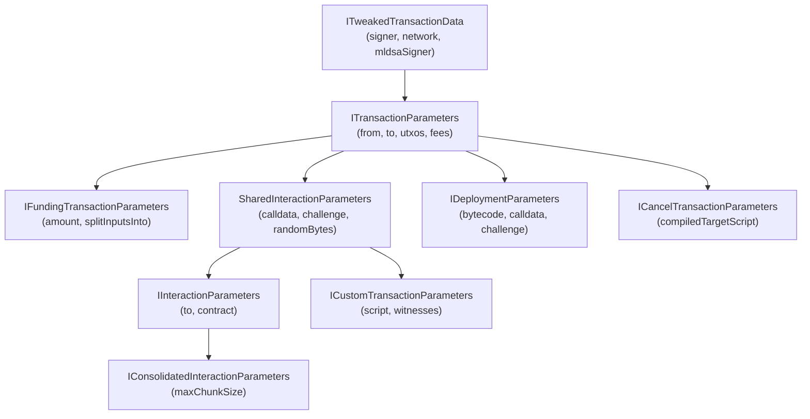

# Transaction Factory Interfaces

Complete reference for all parameter and response interfaces used by the `TransactionFactory` and its transaction builders.

**Source directory:** `src/transaction/interfaces/`

## Interface Hierarchy



## ITweakedTransactionData

The base interface that provides signing and network configuration. Every transaction type inherits these fields.

**Source:** `src/transaction/interfaces/ITweakedTransactionData.ts`

| Field | Type | Required | Description |
|-------|------|----------|-------------|
| `signer` | `Signer \| UniversalSigner` | Yes | The key used to sign transaction inputs. In browser environments using the `WithoutSigner` type variants, this field is omitted entirely and the OP_WALLET extension handles signing. |
| `mldsaSigner` | `QuantumBIP32Interface \| null` | Yes | The ML-DSA (post-quantum) signer for quantum-resistant signatures. Pass `null` to skip quantum signing. In browser environments using `WithoutSigner` types, this field is omitted. |
| `network` | `Network` | Yes | The Bitcoin network object (`networks.bitcoin`, `networks.testnet`, `networks.regtest`). Determines address encoding and validation rules. |
| `chainId` | `ChainId` | No | The chain identifier. `ChainId.Bitcoin` (0) or `ChainId.Fractal` (1). Used in protocol-level chain discrimination. |
| `nonWitnessUtxo` | `Uint8Array` | No | Full previous transaction bytes for legacy (non-SegWit) inputs. Required when spending P2PKH or P2SH UTXOs. Typically set internally by the factory. |
| `noSignatures` | `boolean` | No | When `true`, skip all signing. Useful for fee estimation or creating unsigned transaction templates. |
| `unlockScript` | `Uint8Array[]` | No | Custom unlock script stack items. Used for spending custom script-path Taproot inputs. |
| `txVersion` | `SupportedTransactionVersion` | No | Bitcoin transaction version. Supported values: `1`, `2`, or `3`. Version 2 enables BIP68 relative timelocks; version 3 enables BIP431 features. |
| `addressRotation` | `AddressRotationConfigBase` | No | Per-UTXO signing configuration. When enabled, different UTXOs can be signed by different signers based on their addresses. See [Address Rotation](#address-rotation-configuration). |
| `parallelSigning` | `SigningPoolLike \| WorkerPoolConfig` | No | Parallel signing configuration using worker threads. When provided, key-path Taproot inputs are signed in parallel for performance. Falls back to sequential for address rotation, browser, or non-Taproot inputs. |
| `useP2MR` | `boolean` | No | When `true`, use P2MR (Pay-to-Merkle-Root, BIP 360) instead of P2TR for script-path outputs. P2MR commits directly to a Merkle root without a key-path spend, eliminating quantum-vulnerable internal pubkey exposure. Addresses start with `bc1z` instead of `bc1p`. Default: `false` (P2TR). |

### SupportedTransactionVersion

```typescript
type SupportedTransactionVersion = 1 | 2 | 3;
```

### Example

```typescript
import { EcKeyPair } from '@btc-vision/transaction';
import { networks } from '@btc-vision/bitcoin';

// Backend: provide signer and mldsaSigner
const tweakedData: ITweakedTransactionData = {
    signer: EcKeyPair.fromWIF(privateKey, networks.bitcoin),
    mldsaSigner: null,       // No quantum signing
    network: networks.bitcoin,
};

// Browser: omit signer and mldsaSigner (use WithoutSigner types)
// The wallet extension handles signing automatically
```

## ITransactionParameters

Extends `ITweakedTransactionData` with transaction-specific fields. This is the base for all transaction parameter interfaces.

**Source:** `src/transaction/interfaces/ITransactionParameters.ts`

| Field | Type | Required | Description |
|-------|------|----------|-------------|
| `from` | `string` | No | Sender address. Used as the change output destination. Required by most factory methods even though typed as optional. |
| `to` | `string` | No | Recipient or target address. For interactions, this is the contract address. Required by most factory methods. |
| `utxos` | `UTXO[]` | Yes | Array of unspent transaction outputs to fund this transaction. At least one UTXO is required. |
| `feeRate` | `number` | Yes | Mining fee rate in satoshis per virtual byte (sat/vB). Determines how quickly the transaction confirms. |
| `priorityFee` | `bigint` | Yes | OPNet priority fee in satoshis. Added as an additional output to incentivize faster OPNet processing. |
| `gasSatFee` | `bigint` | Yes | OPNet gas fee in satoshis. Covers the computational cost of contract execution on the OPNet network. |
| `nonWitnessUtxo` | `Uint8Array` | No | Full previous transaction for legacy inputs. Inherited from `ITweakedTransactionData` but can be overridden per-transaction. |
| `estimatedFees` | `bigint` | No | Pre-calculated fee estimate. When provided, skips internal fee estimation. Typically set internally by the factory during the iteration process. |
| `optionalInputs` | `UTXO[]` | No | Additional UTXOs to include as inputs beyond the primary `utxos`. Useful for combining funds from multiple sources. |
| `optionalOutputs` | `PsbtOutputExtended[]` | No | Additional outputs to include in the transaction. Each output specifies either an `address` + `value` or a `script` + `value`. |
| `chainId` | `ChainId` | No | Chain identifier override. Inherited from `ITweakedTransactionData`. |
| `noSignatures` | `boolean` | No | Skip signing. Inherited from `ITweakedTransactionData`. |
| `note` | `string \| Uint8Array` | No | Memo/note embedded in the transaction via `OP_RETURN`. Accepts a UTF-8 string or raw bytes. Maximum 80 bytes. |
| `anchor` | `boolean` | No | When `true`, adds an anchor output (ephemeral dust) to the transaction. Anchor outputs enable CPFP (Child-Pays-For-Parent) fee bumping by third parties. Uses the standard `OP_1 OP_PUSHBYTES_2 4e73` script. |
| `compiledTargetScript` | `Uint8Array \| string` | No | Pre-compiled target script. Typically set internally by the factory. When provided, skips script compilation. |
| `debugFees` | `boolean` | No | Enable verbose fee calculation logging. |
| `revealMLDSAPublicKey` | `boolean` | No | When `true`, reveals the user's ML-DSA public key in the transaction features. |
| `linkMLDSAPublicKeyToAddress` | `boolean` | No | When `true`, links the user's ML-DSA public key to their legacy Bitcoin public key in the transaction features. |
| `addressRotation` | `AddressRotationConfigBase` | No | Per-UTXO signing configuration. See [Address Rotation](#address-rotation-configuration). |

### Example

```typescript
const baseParams: ITransactionParameters = {
    signer,
    mldsaSigner: null,
    network: networks.bitcoin,
    from: 'bc1p...sender',
    to: 'bc1p...recipient',
    utxos: myUtxos,
    feeRate: 10,
    priorityFee: 1000n,
    gasSatFee: 500n,
    note: 'Payment for services',   // Embedded via OP_RETURN
    anchor: false,
};
```

## IFundingTransactionParameters

Extends `ITransactionParameters` with fields specific to BTC transfers and the internal funding step.

**Source:** `src/transaction/interfaces/ITransactionParameters.ts`

| Field | Type | Required | Description |
|-------|------|----------|-------------|
| `amount` | `bigint` | Yes | The amount to send in satoshis. This is the value of the primary output. |
| `splitInputsInto` | `number` | No | Split the payment across N equal outputs to the same address (default: `1`). Useful for creating multiple UTXOs for parallel spending. |
| `autoAdjustAmount` | `boolean` | No | When `true`, fees are deducted from the output amount instead of from change. Useful for send-max / consolidation use cases where the `amount` equals the total UTXO value. |
| `feeUtxos` | `UTXO[]` | No | Extra UTXOs used exclusively to cover transaction fees. When provided, the output `amount` stays exact (not reduced by fees) and all fees are paid from these separate UTXOs. Leftover from fee UTXOs becomes the change output. |

**Inherits all fields from:** [`ITransactionParameters`](#itransactionparameters)

### Example: Standard Transfer

```typescript
const params: IFundingTransactionParameters = {
    signer,
    mldsaSigner: null,
    network: networks.bitcoin,
    utxos: myUtxos,
    from: 'bc1p...sender',
    to: 'bc1p...recipient',
    feeRate: 10,
    priorityFee: 0n,
    gasSatFee: 0n,
    amount: 50_000n,
};
```

### Example: Send-Max

```typescript
const totalBalance = myUtxos.reduce((sum, u) => sum + u.value, 0n);

const params: IFundingTransactionParameters = {
    // ...base params
    amount: totalBalance,
    autoAdjustAmount: true,   // Fees deducted from amount
};
```

### Example: Separate Fee Funding

```typescript
const params: IFundingTransactionParameters = {
    // ...base params
    utxos: [paymentUtxo],          // UTXO that covers the amount
    feeUtxos: [smallFeeUtxo],      // Separate UTXO just for fees
    amount: 100_000n,               // Exact amount, not reduced by fees
};
```

## SharedInteractionParameters

Extends `ITransactionParameters` with fields shared between interaction and custom script transactions.

**Source:** `src/transaction/interfaces/ITransactionParameters.ts`

| Field | Type | Required | Description |
|-------|------|----------|-------------|
| `calldata` | `Uint8Array` | No | ABI-encoded function call data. Optional in the shared interface but required by `IInteractionParameters`. |
| `challenge` | `IChallengeSolution` | Yes | The epoch challenge solution that proves the transaction is valid for the current epoch. Obtained from the OPNet network. |
| `randomBytes` | `Uint8Array` | No | 32 random bytes used to make the Taproot script address unique. Auto-generated if not provided. |
| `disableAutoRefund` | `boolean` | No | When `true`, disables the automatic refund output that returns excess funds to the sender. |
| `loadedStorage` | `LoadedStorage` | No | Pre-loaded contract storage slots. A mapping of storage keys to arrays of hex-encoded values. Used for optimization to avoid on-chain lookups. |
| `isCancellation` | `boolean` | No | Internal flag indicating this is a cancellation operation. |

**Inherits all fields from:** [`ITransactionParameters`](#itransactionparameters)

### LoadedStorage Type

```typescript
interface LoadedStorage {
    [key: string]: string[];
}
```

## IInteractionParameters

Extends `SharedInteractionParameters` for contract function calls. This is the primary interface for `signInteraction`.

**Source:** `src/transaction/interfaces/ITransactionParameters.ts`

| Field | Type | Required | Description |
|-------|------|----------|-------------|
| `calldata` | `Uint8Array` | Yes | ABI-encoded function call data. Use the `ABICoder` to encode function selectors and parameters. |
| `to` | `string` | Yes | The contract address to call. Must be a valid Bitcoin address (typically P2TR). |
| `contract` | `string` | No | Alternative contract identifier. Can be used instead of or alongside `to` for contract resolution. |

**Inherits all fields from:** [`SharedInteractionParameters`](#sharedinteractionparameters)

### Example

```typescript
const params: IInteractionParameters = {
    signer,
    mldsaSigner: null,
    network: networks.bitcoin,
    utxos: myUtxos,
    from: 'bc1p...caller',
    to: 'bc1p...contract',
    feeRate: 10,
    priorityFee: 1000n,
    gasSatFee: 500n,
    calldata: abiCoder.encodeFunction('transfer', [recipientAddress, amount]),
    challenge: epochChallenge,
};
```

## IDeploymentParameters

Extends `ITransactionParameters` (with `to` omitted) for contract deployment. The `to` field is omitted because the contract address is derived from the deployment itself.

**Source:** `src/transaction/interfaces/ITransactionParameters.ts`

| Field | Type | Required | Description |
|-------|------|----------|-------------|
| `bytecode` | `Uint8Array` | Yes | The compiled smart contract bytecode to deploy. |
| `calldata` | `Uint8Array` | No | ABI-encoded constructor parameters. Omit if the contract has no constructor arguments. |
| `challenge` | `IChallengeSolution` | Yes | The epoch challenge solution for this deployment. |
| `randomBytes` | `Uint8Array` | No | 32 random bytes for script uniqueness. Auto-generated if not provided. |

**Inherits all fields from:** `Omit<ITransactionParameters, 'to'>`

### Example

```typescript
const params: IDeploymentParameters = {
    signer,
    mldsaSigner: null,
    network: networks.bitcoin,
    utxos: myUtxos,
    from: 'bc1p...deployer',
    feeRate: 15,
    priorityFee: 1000n,
    gasSatFee: 500n,
    bytecode: compiledContractBytes,
    calldata: constructorCalldata,
    challenge: epochChallenge,
};
```

## ICustomTransactionParameters

Extends `SharedInteractionParameters` (with `challenge` omitted) for arbitrary Bitcoin script execution.

**Source:** `src/transaction/interfaces/ICustomTransactionParameters.ts`

| Field | Type | Required | Description |
|-------|------|----------|-------------|
| `script` | `(Uint8Array \| Stack)[]` | Yes | The custom Bitcoin script to embed in the Taproot script-path. Each element is either raw bytes or a compiled script stack. |
| `witnesses` | `Uint8Array[]` | Yes | Witness data items that satisfy the custom script. Placed on the witness stack when spending. |
| `annex` | `Uint8Array` | No | Optional Taproot annex payload. **Do not** include the `0x50` prefix byte; it is added automatically. |
| `to` | `string` | Yes | The recipient address for the script output. |

**Inherits all fields from:** `Omit<SharedInteractionParameters, 'challenge'>`

### Example

```typescript
import { opcodes } from '@btc-vision/bitcoin';

const params: ICustomTransactionParameters = {
    signer,
    mldsaSigner: null,
    network: networks.bitcoin,
    utxos: myUtxos,
    from: 'bc1p...sender',
    to: 'bc1p...recipient',
    feeRate: 10,
    priorityFee: 1000n,
    gasSatFee: 500n,
    script: [
        new TextEncoder().encode('hello opnet'),
        opcodes.OP_DROP,
        opcodes.OP_TRUE,
    ],
    witnesses: [new TextEncoder().encode('witness data')],
};
```

## ICancelTransactionParameters

Extends `ITransactionParameters` (with `priorityFee` and `gasSatFee` omitted) for cancelling stuck transactions. Cancel transactions do not pay OPNet fees since they are not contract operations.

**Source:** `src/transaction/interfaces/ICancelTransactionParameters.ts`

| Field | Type | Required | Description |
|-------|------|----------|-------------|
| `compiledTargetScript` | `string \| Uint8Array` | Yes | The compiled target script from the original transaction's response. Required to spend the locked UTXO via the cancel script path. Obtain this from `InteractionResponse.compiledTargetScript` or `DeploymentResult` outputs. |

**Inherits all fields from:** `Omit<ITransactionParameters, 'priorityFee' | 'gasSatFee'>`

### Example

```typescript
const params: ICancelTransactionParameters = {
    signer,
    mldsaSigner: null,
    network: networks.bitcoin,
    utxos: stuckUtxos,
    from: 'bc1p...original-sender',
    to: 'bc1p...recovery-address',
    feeRate: 25,   // Use higher fee to ensure quick confirmation
    compiledTargetScript: savedCompiledScript,
};
```

## IConsolidatedInteractionParameters

Extends `IInteractionParameters` with CHCT-specific configuration.

**Source:** `src/transaction/interfaces/IConsolidatedTransactionParameters.ts`

| Field | Type | Required | Description |
|-------|------|----------|-------------|
| `maxChunkSize` | `number` | No | Maximum bytes per P2WSH stack item. Default: `80` (the standard P2WSH policy limit `MAX_STANDARD_P2WSH_STACK_ITEM_SIZE`). Reducing this value creates more chunks but may improve compatibility with non-standard relay policies. |

**Inherits all fields from:** [`IInteractionParameters`](#iinteractionparameters)

### Example

```typescript
const params: IConsolidatedInteractionParameters = {
    signer,
    mldsaSigner: null,
    network: networks.bitcoin,
    utxos: myUtxos,
    from: 'bc1p...caller',
    to: 'bc1p...contract',
    feeRate: 10,
    priorityFee: 1000n,
    gasSatFee: 500n,
    calldata: encodedCall,
    challenge: epochChallenge,
    maxChunkSize: 80,   // Default, can be reduced
};
```

## MultiSignParameters

Parameters for creating M-of-N multi-signature Taproot transactions. Extends `ITransactionParameters` with `gasSatFee`, `priorityFee`, `signer`, `from`, and `to` omitted (multi-sig does not use OPNet fees or a single signer).

**Source:** `src/transaction/builders/MultiSignTransaction.ts`

| Field | Type | Required | Description |
|-------|------|----------|-------------|
| `pubkeys` | `Uint8Array[]` | Yes | Array of all N public keys participating in the M-of-N scheme. Each key is a 33-byte compressed public key. |
| `minimumSignatures` | `number` | Yes | The minimum number of signatures required (M in M-of-N). Must be `<= pubkeys.length`. |
| `receiver` | `string` | Yes | The address that receives the requested amount. |
| `requestedAmount` | `bigint` | Yes | The amount in satoshis to send to the `receiver`. The remaining UTXO balance (minus fees) goes to `refundVault`. |
| `refundVault` | `string` | Yes | The address that receives leftover funds after the `requestedAmount` is sent. Typically the multi-sig vault's own address. |
| `psbt` | `Psbt` | No | An existing PSBT to continue signing. Used when collecting signatures from multiple parties. |
| `from` | `string` | No | Optional sender address. Not required for multi-sig since the script address is derived from the public keys. |
| `to` | `string` | No | Optional target address. Not required; use `receiver` instead. |

**Inherits all fields from:** `Omit<ITransactionParameters, 'gasSatFee' | 'priorityFee' | 'signer' | 'from' | 'to'>`

### MultiSignFromBase64Params

Variant that accepts a base64-encoded PSBT string instead of a `Psbt` object.

```typescript
interface MultiSignFromBase64Params extends Omit<MultiSignParameters, 'psbt'> {
    readonly psbt: string;  // Base64-encoded PSBT
}
```

### Example: Multi-Signature Workflow

```typescript
import { MultiSignTransaction } from '@btc-vision/transaction';
import { networks } from '@btc-vision/bitcoin';

// Step 1: First signer creates the PSBT
const multiSigTx = new MultiSignTransaction({
    network: networks.bitcoin,
    mldsaSigner: null,
    utxos: vaultUtxos,
    feeRate: 10,
    pubkeys: [pubkeyA, pubkeyB, pubkeyC],
    minimumSignatures: 2,
    receiver: 'bc1p...recipient',
    requestedAmount: 100_000n,
    refundVault: 'bc1p...vault',
});

const psbt = await multiSigTx.signPSBT();
const psbtBase64 = psbt.toBase64();

// Step 2: Send psbtBase64 to second signer
const result = MultiSignTransaction.signPartial(
    Psbt.fromBase64(psbtBase64),
    secondSigner,
    0,         // originalInputCount
    [2, 2],    // minimum signatures per input
);

if (result.final) {
    // All required signatures collected - extract and broadcast
}
```

## WithoutSigner Type Variants

For browser environments where wallet extensions handle signing, the library provides type aliases that omit signing-related fields.

**Source:** `src/transaction/interfaces/IWeb3ProviderTypes.ts`

| Type | Base Interface | Omitted Fields |
|------|---------------|----------------|
| `InteractionParametersWithoutSigner` | `IInteractionParameters` | `signer`, `challenge`, `mldsaSigner` |
| `IDeploymentParametersWithoutSigner` | `IDeploymentParameters` | `signer`, `network`, `challenge`, `mldsaSigner` |
| `ICustomTransactionWithoutSigner` | `ICustomTransactionParameters` | `signer`, `challenge`, `mldsaSigner` |
| `ICancelTransactionParametersWithoutSigner` | `ICancelTransactionParameters` | `signer`, `challenge`, `network`, `mldsaSigner` |

### Example: Browser Usage

```typescript
// In a browser with OP_WALLET extension
const params: InteractionParametersWithoutSigner = {
    // No signer, mldsaSigner, or challenge needed
    utxos: myUtxos,
    from: walletAddress,
    to: contractAddress,
    feeRate: 10,
    priorityFee: 1000n,
    gasSatFee: 500n,
    calldata: encodedCall,
    network: networks.bitcoin,
};

const result = await factory.signInteraction(params);
```

## Supporting Types

### UTXO

The fundamental building block representing an unspent transaction output.

**Source:** `src/utxo/interfaces/IUTXO.ts`

| Field | Type | Required | Description |
|-------|------|----------|-------------|
| `transactionId` | `string` | Yes | The transaction hash that created this output (64 hex characters). |
| `outputIndex` | `number` | Yes | The index of this output in the creating transaction (0-based). |
| `value` | `bigint` | Yes | The amount locked in this output, in satoshis. |
| `scriptPubKey` | `ScriptPubKey` | Yes | The locking script. Contains `hex` (the raw script) and `address` (the derived address). |
| `redeemScript` | `string \| Uint8Array` | No | P2SH redeem script. Required when spending P2SH outputs. |
| `witnessScript` | `string \| Uint8Array` | No | P2WSH witness script. Required when spending P2WSH outputs. |
| `nonWitnessUtxo` | `string \| Uint8Array` | No | Full previous transaction bytes. Required for legacy (non-SegWit) inputs. |
| `signer` | `RotationSignerBase` | No | Per-UTXO signer override. Used with address rotation mode. |

### IChallengeSolution

Epoch challenge proof required for contract deployments and interactions.

**Source:** `src/epoch/interfaces/IChallengeSolution.ts`

| Field | Type | Description |
|-------|------|-------------|
| `epochNumber` | `bigint` | The epoch number this challenge belongs to |
| `publicKey` | `Address` | The public key used for the challenge |
| `solution` | `Uint8Array` | The proof-of-work solution bytes |
| `salt` | `Uint8Array` | Random salt used in the solution |
| `graffiti` | `Uint8Array` | Optional graffiti data embedded in the solution |
| `difficulty` | `number` | The difficulty level of the challenge |
| `verification` | `IChallengeVerification` | Epoch verification data (hashes, roots, proofs) |

### RawChallenge

Serialized form of `IChallengeSolution` returned in transaction responses. All binary fields are hex-encoded strings.

```typescript
interface RawChallenge {
    readonly epochNumber: string;
    readonly mldsaPublicKey: string;
    readonly legacyPublicKey: string;
    readonly solution: string;
    readonly salt: string;
    readonly graffiti: string;
    readonly difficulty: number;
    readonly verification: RawChallengeVerification;
    readonly submission?: RawChallengeSubmission;
}
```

### ChainId

```typescript
enum ChainId {
    Bitcoin = 0,
    Fractal = 1,
}
```

## Common Parameter Patterns

### Fee Configuration

Every transaction requires three fee-related fields that work together:

| Field | Purpose | Typical Value |
|-------|---------|---------------|
| `feeRate` | Mining fee in sat/vB. Determines confirmation speed on the Bitcoin network. | `5` - `100` depending on mempool |
| `priorityFee` | OPNet priority fee in satoshis. Incentivizes faster OPNet indexer processing. | `330n` - `10000n` |
| `gasSatFee` | OPNet gas fee in satoshis. Covers contract execution costs. | `330n` - `10000n` |

The combined `priorityFee + gasSatFee` must meet the minimum dust threshold of 330 satoshis. If the sum is below this, the factory automatically raises it to the minimum.

```typescript
// Minimal fees for simple transfer (no OPNet processing needed)
{
    feeRate: 10,
    priorityFee: 0n,
    gasSatFee: 0n,
}

// Standard fees for contract interaction
{
    feeRate: 10,
    priorityFee: 1000n,
    gasSatFee: 500n,
}
```

### Note / Memo via OP_RETURN

The `note` field embeds data in the transaction via an `OP_RETURN` output. This data is permanently stored on the blockchain but does not lock any funds.

```typescript
// String note (auto-encoded to UTF-8)
{
    note: 'Payment for invoice #1234',
}

// Raw bytes
{
    note: new Uint8Array([0x01, 0x02, 0x03]),
}
```

The maximum `OP_RETURN` payload is 80 bytes. Notes exceeding this limit will cause the transaction to be rejected.

### Anchor Outputs

Anchor outputs are minimal-value outputs using a standardized script that anyone can spend. They enable CPFP (Child-Pays-For-Parent) fee bumping by any third party.

```typescript
{
    anchor: true,   // Adds OP_1 OP_PUSHBYTES_2 4e73 output
}
```

### Extra Inputs and Outputs

Add additional inputs or outputs beyond the primary transaction flow:

```typescript
{
    // Extra UTXOs to include as inputs (e.g., combining funds)
    optionalInputs: [
        {
            transactionId: 'abc...',
            outputIndex: 0,
            value: 5000n,
            scriptPubKey: { hex: '...', address: '...' },
        },
    ],

    // Extra outputs (e.g., paying multiple recipients)
    optionalOutputs: [
        {
            address: 'bc1p...second-recipient',
            value: 10000,   // Note: number (satoshis), not bigint
        },
    ],
}
```

### Address Rotation Configuration

Address rotation allows different UTXOs to be signed by different keys, supporting Bitcoin privacy best practices where each address has its own keypair.

**Source:** `src/signer/IRotationSigner.ts`

| Field | Type | Description |
|-------|------|-------------|
| `enabled` | `boolean` | Whether address rotation mode is active |
| `signerMap` | `SignerMapBase` | `Map<string, RotationSignerBase>` mapping addresses to their signers |

```typescript
import { createSignerMap, createAddressRotation } from '@btc-vision/transaction';

// Create a map of address -> signer
const signerMap = createSignerMap([
    ['bc1p...address1', signer1],
    ['bc1p...address2', signer2],
    ['bc1p...address3', signer3],
]);

const params = {
    signer: defaultSigner,  // Fallback for unmapped addresses
    addressRotation: createAddressRotation(signerMap),
    utxos: [
        { /* from address1 - signed by signer1 */ },
        { /* from address2 - signed by signer2 */ },
        { /* from address3 - signed by signer3 */ },
    ],
    // ...other params
};
```

Alternatively, individual UTXOs can carry their own signer via the `signer` field on the `UTXO` interface:

```typescript
const utxo: UTXO = {
    transactionId: '...',
    outputIndex: 0,
    value: 50000n,
    scriptPubKey: { hex: '...', address: 'bc1p...addr1' },
    signer: specificSignerForThisUtxo,
};
```

### autoAdjustAmount for Send-Max

When sending the entire wallet balance, set `amount` to the total UTXO value and enable `autoAdjustAmount`. The transaction builder will automatically deduct fees from the output amount so there is no change output.

```typescript
const total = utxos.reduce((sum, u) => sum + u.value, 0n);

const params: IFundingTransactionParameters = {
    amount: total,
    autoAdjustAmount: true,
    // ... other params
};

// Result: single output of (total - fees) to recipient
// No change output is created
```

### feeUtxos for Separate Fee Funding

When you need the output amount to be exact (e.g., for exchange withdrawals), provide separate UTXOs to cover fees:

```typescript
const params: IFundingTransactionParameters = {
    utxos: [mainUtxo],            // Covers the amount
    feeUtxos: [smallUtxo],        // Covers only fees
    amount: 100_000n,              // Exact, not reduced by fees
    // ... other params
};

// Result: output of exactly 100,000 sats to recipient
// Fees paid from feeUtxos, change from feeUtxos returned
```

The `FundingTransaction` constructor internally merges `feeUtxos` into the main UTXO array, but the fee calculation ensures the primary `amount` remains intact.

## CHCT-Specific Interfaces

These interfaces are used internally by `ConsolidatedInteractionTransaction` and returned in its results.

### IHashCommittedP2WSH

Represents a P2WSH output with HASH160 commitments to data chunks.

| Field | Type | Description |
|-------|------|-------------|
| `dataHashes` | `Uint8Array[]` | The HASH160 values of all data chunks this output commits to |
| `dataChunks` | `Uint8Array[]` | The actual data chunks (stored for the reveal transaction) |
| `chunkStartIndex` | `number` | Starting index of this output's chunks in the overall data sequence |
| `scriptPubKey` | `Uint8Array` | The P2WSH scriptPubKey (`OP_0 <32-byte-hash>`) |

### ISetupTransactionResult

| Field | Type | Description |
|-------|------|-------------|
| `txHex` | `string` | The signed setup transaction hex |
| `txId` | `string` | Setup transaction ID |
| `outputs` | `IHashCommittedP2WSH[]` | All P2WSH outputs created with metadata |
| `feesPaid` | `bigint` | Fees paid in satoshis |
| `chunkCount` | `number` | Number of data chunks |
| `totalDataSize` | `number` | Total compiled data size in bytes |

### IRevealTransactionResult

| Field | Type | Description |
|-------|------|-------------|
| `txHex` | `string` | The signed reveal transaction hex |
| `txId` | `string` | Reveal transaction ID |
| `dataSize` | `number` | Total data revealed in bytes |
| `feesPaid` | `bigint` | Fees paid in satoshis |
| `inputCount` | `number` | Number of P2WSH inputs spent |

### IConsolidatedInteractionResult

| Field | Type | Description |
|-------|------|-------------|
| `setup` | `ISetupTransactionResult` | Setup transaction result |
| `reveal` | `IRevealTransactionResult` | Reveal transaction result |
| `totalFees` | `bigint` | Total fees across both transactions |

## Navigation

- **Previous:** [Transaction Factory](./transaction-factory.md)
- **Up:** [Transaction Building Guide](../transaction-building.md)
- **Related:** [Offline Transaction Signing](../offline-transaction-signing.md)
