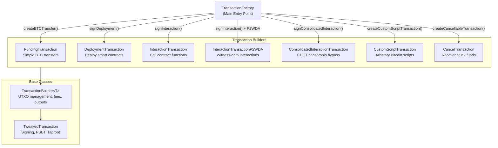
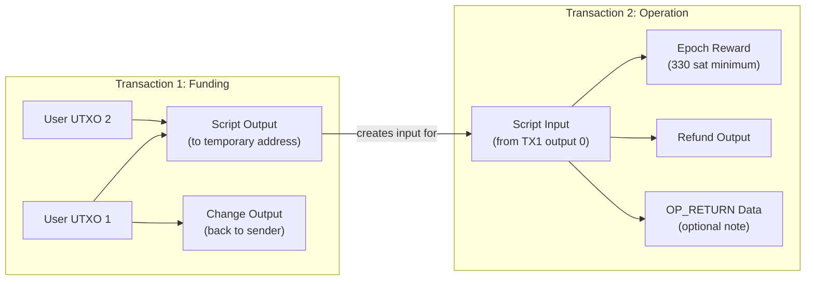
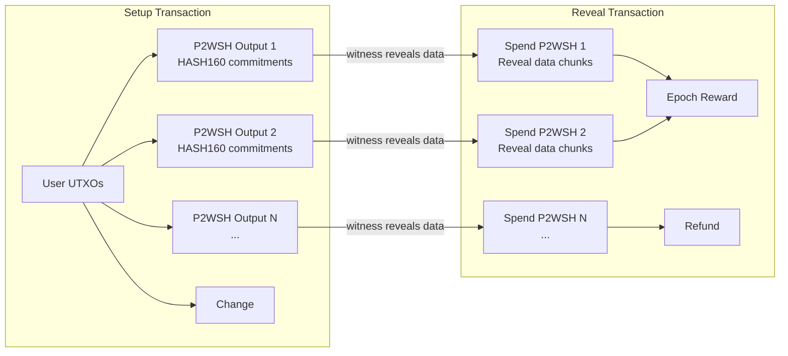
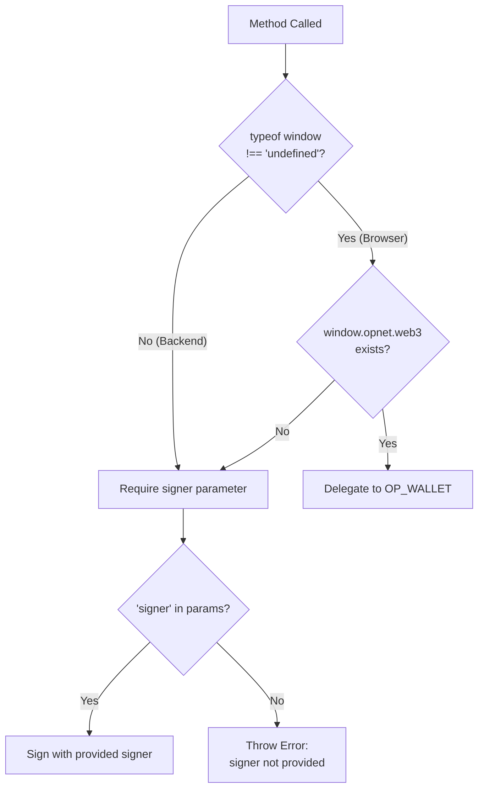

# TransactionFactory

The `TransactionFactory` class is the **main entry point** for creating all OPNet transaction types. It manages the complete transaction lifecycle including fee estimation, the two-transaction model for contract operations, and automatic detection of browser wallet extensions.

**Source:** `src/transaction/TransactionFactory.ts`

## Architecture



## Quick Start

```typescript
import { TransactionFactory, EcKeyPair } from '@btc-vision/transaction';
import { networks } from '@btc-vision/bitcoin';

const network = networks.bitcoin;
const factory = new TransactionFactory();

// Backend: provide a signer
const signer = EcKeyPair.fromWIF('your-private-key-wif', network);

// Browser: signer is null (wallet extension handles signing)
// const signer = null;
```

## Methods

### createBTCTransfer

Creates and signs a simple BTC transfer (funding) transaction.

```typescript
public async createBTCTransfer(
    parameters: IFundingTransactionParameters,
): Promise<BitcoinTransferResponse>
```

| Parameter | Type | Required | Description |
|-----------|------|----------|-------------|
| `signer` | `Signer \| UniversalSigner` | Yes | The signing key for the transaction |
| `mldsaSigner` | `QuantumBIP32Interface \| null` | Yes | ML-DSA quantum signer, or `null` |
| `network` | `Network` | Yes | Bitcoin network (`networks.bitcoin`, `networks.testnet`, etc.) |
| `utxos` | `UTXO[]` | Yes | Unspent outputs to fund the transaction |
| `from` | `string` | Yes | Sender address |
| `to` | `string` | Yes | Recipient address |
| `feeRate` | `number` | Yes | Fee rate in sat/vB |
| `priorityFee` | `bigint` | Yes | OPNet priority fee in satoshis |
| `gasSatFee` | `bigint` | Yes | OPNet gas fee in satoshis |
| `amount` | `bigint` | Yes | Amount to send in satoshis |
| `splitInputsInto` | `number` | No | Split the payment into N equal outputs (default: 1) |
| `autoAdjustAmount` | `boolean` | No | Deduct fees from amount (send-max mode) |
| `feeUtxos` | `UTXO[]` | No | Separate UTXOs used exclusively for fees |

**Returns:** [`BitcoinTransferResponse`](#bitcointransferresponse)

---

### signDeployment

Deploys a smart contract using the two-transaction model. Produces a funding transaction and a deployment transaction.

```typescript
public async signDeployment(
    deploymentParameters: IDeploymentParameters,
): Promise<DeploymentResult>
```

| Parameter | Type | Required | Description |
|-----------|------|----------|-------------|
| `signer` | `Signer \| UniversalSigner` | Browser: omit | The signing key (omit in browser for OP_WALLET) |
| `mldsaSigner` | `QuantumBIP32Interface \| null` | Browser: omit | ML-DSA quantum signer |
| `network` | `Network` | Yes | Bitcoin network |
| `utxos` | `UTXO[]` | Yes | Unspent outputs to fund the deployment |
| `from` | `string` | Yes | Deployer address |
| `feeRate` | `number` | Yes | Fee rate in sat/vB |
| `priorityFee` | `bigint` | Yes | OPNet priority fee in satoshis |
| `gasSatFee` | `bigint` | Yes | OPNet gas fee in satoshis |
| `bytecode` | `Uint8Array` | Yes | Compiled contract bytecode |
| `calldata` | `Uint8Array` | No | Constructor parameters (ABI-encoded) |
| `challenge` | `IChallengeSolution` | Yes | Epoch challenge solution |
| `randomBytes` | `Uint8Array` | No | 32 random bytes for script uniqueness (auto-generated if omitted) |

**Returns:** [`DeploymentResult`](#deploymentresult)

---

### signInteraction

Calls a smart contract function using the two-transaction model. Produces a funding transaction and an interaction transaction. Automatically uses P2WDA mode when P2WDA UTXOs are detected.

```typescript
public async signInteraction(
    interactionParameters: IInteractionParameters | InteractionParametersWithoutSigner,
): Promise<InteractionResponse>
```

| Parameter | Type | Required | Description |
|-----------|------|----------|-------------|
| `signer` | `Signer \| UniversalSigner` | Browser: omit | The signing key (omit in browser for OP_WALLET) |
| `mldsaSigner` | `QuantumBIP32Interface \| null` | Browser: omit | ML-DSA quantum signer |
| `network` | `Network` | Yes | Bitcoin network |
| `utxos` | `UTXO[]` | Yes | Unspent outputs to fund the interaction |
| `from` | `string` | Yes | Caller address |
| `to` | `string` | Yes | Contract address to call |
| `feeRate` | `number` | Yes | Fee rate in sat/vB |
| `priorityFee` | `bigint` | Yes | OPNet priority fee in satoshis |
| `gasSatFee` | `bigint` | Yes | OPNet gas fee in satoshis |
| `calldata` | `Uint8Array` | Yes | ABI-encoded function call data |
| `challenge` | `IChallengeSolution` | Yes | Epoch challenge solution |
| `contract` | `string` | No | Alternative contract identifier |
| `randomBytes` | `Uint8Array` | No | 32 random bytes (auto-generated if omitted) |
| `disableAutoRefund` | `boolean` | No | Disable automatic refund output |
| `loadedStorage` | `LoadedStorage` | No | Pre-loaded contract storage for optimization |

**Returns:** [`InteractionResponse`](#interactionresponse)

---

### signConsolidatedInteraction

Drop-in replacement for `signInteraction` that bypasses BIP110/Bitcoin Knots censorship. Uses P2WSH with HASH160 commitments (the CHCT system) instead of Tapscript. Produces a setup transaction and a reveal transaction.

```typescript
public async signConsolidatedInteraction(
    interactionParameters: IConsolidatedInteractionParameters,
): Promise<ConsolidatedInteractionResponse>
```

| Parameter | Type | Required | Description |
|-----------|------|----------|-------------|
| `signer` | `Signer \| UniversalSigner` | Yes | The signing key (no browser wallet support) |
| `mldsaSigner` | `QuantumBIP32Interface \| null` | Yes | ML-DSA quantum signer |
| `network` | `Network` | Yes | Bitcoin network |
| `utxos` | `UTXO[]` | Yes | Unspent outputs |
| `from` | `string` | Yes | Caller address |
| `to` | `string` | Yes | Contract address to call |
| `feeRate` | `number` | Yes | Fee rate in sat/vB |
| `priorityFee` | `bigint` | Yes | OPNet priority fee in satoshis |
| `gasSatFee` | `bigint` | Yes | OPNet gas fee in satoshis |
| `calldata` | `Uint8Array` | Yes | ABI-encoded function call data |
| `challenge` | `IChallengeSolution` | Yes | Epoch challenge solution |
| `maxChunkSize` | `number` | No | Max bytes per stack item (default: 80, P2WSH policy limit) |

**Returns:** [`ConsolidatedInteractionResponse`](#consolidatedinteractionresponse)

> **Note:** Unlike `signInteraction`, consolidated interactions do **not** support browser wallet extensions (OP_WALLET). A signer must always be provided.

---

### createCustomScriptTransaction

Generates a transaction with an arbitrary Bitcoin script. Follows the two-transaction model (funding + custom script).

```typescript
public async createCustomScriptTransaction(
    interactionParameters: ICustomTransactionParameters | ICustomTransactionWithoutSigner,
): Promise<[string, string, UTXO[], UTXO[]]>
```

| Parameter | Type | Required | Description |
|-----------|------|----------|-------------|
| `signer` | `Signer \| UniversalSigner` | Yes | The signing key |
| `mldsaSigner` | `QuantumBIP32Interface \| null` | Yes | ML-DSA quantum signer |
| `network` | `Network` | Yes | Bitcoin network |
| `utxos` | `UTXO[]` | Yes | Unspent outputs |
| `from` | `string` | Yes | Sender address |
| `to` | `string` | Yes | Recipient address |
| `feeRate` | `number` | Yes | Fee rate in sat/vB |
| `priorityFee` | `bigint` | Yes | OPNet priority fee in satoshis |
| `gasSatFee` | `bigint` | Yes | OPNet gas fee in satoshis |
| `script` | `(Uint8Array \| Stack)[]` | Yes | The custom Bitcoin script to execute |
| `witnesses` | `Uint8Array[]` | Yes | Witness data for the script |
| `annex` | `Uint8Array` | No | Optional Taproot annex payload (without the `0x50` prefix) |

**Returns:** `[string, string, UTXO[], UTXO[]]` - Tuple of `[fundingTxHex, customTxHex, nextUTXOs, inputUtxos]`

---

### createCancellableTransaction

Cancels or recovers funds from a stuck transaction. Uses the compiled target script to spend the locked UTXO back to the sender.

```typescript
public async createCancellableTransaction(
    params: ICancelTransactionParameters | ICancelTransactionParametersWithoutSigner,
): Promise<CancelledTransaction>
```

| Parameter | Type | Required | Description |
|-----------|------|----------|-------------|
| `signer` | `Signer \| UniversalSigner` | Browser: omit | The signing key (omit in browser for OP_WALLET) |
| `mldsaSigner` | `QuantumBIP32Interface \| null` | Browser: omit | ML-DSA quantum signer |
| `network` | `Network` | Yes | Bitcoin network |
| `utxos` | `UTXO[]` | Yes | The stuck UTXOs to recover |
| `from` | `string` | Yes | Original sender address (receives refund) |
| `to` | `string` | Yes | Recovery destination address |
| `feeRate` | `number` | Yes | Fee rate in sat/vB |
| `compiledTargetScript` | `string \| Uint8Array` | Yes | The compiled script from the original transaction |

**Returns:** [`CancelledTransaction`](#cancelledtransaction)

> **Note:** Cancel transactions do **not** use `priorityFee` or `gasSatFee`. These fields are omitted from the parameter interface.

---

### MultiSignTransaction (Direct Constructor)

Multi-signature transactions are created directly through the `MultiSignTransaction` class rather than the factory.

```typescript
import { MultiSignTransaction } from '@btc-vision/transaction';

const multiSigTx = new MultiSignTransaction({
    network,
    utxos: vaultUtxos,
    feeRate: 10,
    mldsaSigner: null,
    pubkeys: [pubkeyA, pubkeyB, pubkeyC],
    minimumSignatures: 2,
    receiver: recipientAddress,
    requestedAmount: 100000n,
    refundVault: vaultAddress,
});

const psbt = await multiSigTx.signPSBT();
```

| Parameter | Type | Required | Description |
|-----------|------|----------|-------------|
| `network` | `Network` | Yes | Bitcoin network |
| `utxos` | `UTXO[]` | Yes | Vault UTXOs to spend |
| `feeRate` | `number` | Yes | Fee rate in sat/vB |
| `mldsaSigner` | `QuantumBIP32Interface \| null` | Yes | ML-DSA quantum signer |
| `pubkeys` | `Uint8Array[]` | Yes | All N public keys for the M-of-N scheme |
| `minimumSignatures` | `number` | Yes | Minimum required signatures (M) |
| `receiver` | `string` | Yes | Address to receive the requested amount |
| `requestedAmount` | `bigint` | Yes | Amount to send to the receiver in satoshis |
| `refundVault` | `string` | Yes | Address to receive leftover funds |
| `psbt` | `Psbt` | No | Existing PSBT to continue signing |

---

### Unsigned Transaction Builders

These methods on `TransactionFactory` create transactions without signing, useful for estimation or offline workflows. They are **private** methods used internally by the factory but document the internal two-step process.

| Internal Method | Creates | Used By |
|----------------|---------|---------|
| `createFundTransaction(params)` | `FundingTransactionResponse` | `createBTCTransfer`, `signInteraction`, `signDeployment`, `createCustomScriptTransaction` |
| `iterateFundingAmount(params, TxClass, calcFn, prefix)` | Iteratively estimates and converges on the correct funding amount | `signInteraction`, `signDeployment`, `createCustomScriptTransaction` |

## Response Types

### BitcoinTransferResponse

Returned by `createBTCTransfer`.

```typescript
interface BitcoinTransferResponse {
    readonly tx: string;                    // Signed transaction hex
    readonly estimatedFees: bigint;         // Total fees paid in satoshis
    readonly nextUTXOs: UTXO[];             // Change UTXOs (yours to spend next)
    readonly inputUtxos: UTXO[];            // UTXOs consumed by this transaction
    readonly original: FundingTransaction;  // The underlying transaction builder
}
```

### DeploymentResult

Returned by `signDeployment`.

```typescript
interface DeploymentResult {
    readonly transaction: [string, string]; // [fundingTxHex, deploymentTxHex]
    readonly contractAddress: string;       // The deployed contract's address
    readonly contractPubKey: string;        // The contract's public key
    readonly challenge: RawChallenge;       // Serialized epoch challenge
    readonly utxos: UTXO[];                 // Refund UTXOs (change from funding)
    readonly inputUtxos: UTXO[];            // UTXOs consumed
}
```

### InteractionResponse

Returned by `signInteraction`.

```typescript
interface InteractionResponse {
    readonly fundingTransaction: string | null;    // Funding tx hex (null for P2WDA)
    readonly interactionTransaction: string;       // Interaction tx hex
    readonly estimatedFees: bigint;                // Fees for the interaction tx
    readonly nextUTXOs: UTXO[];                    // Refund UTXOs (change)
    readonly fundingUTXOs: UTXO[];                 // UTXOs created by funding tx
    readonly fundingInputUtxos: UTXO[];            // Original UTXOs consumed
    readonly challenge: RawChallenge;              // Serialized epoch challenge
    readonly interactionAddress: string | null;    // Script address (null for P2WDA)
    readonly compiledTargetScript: string | null;  // Compiled script hex (null for P2WDA)
}
```

### ConsolidatedInteractionResponse

Returned by `signConsolidatedInteraction`.

```typescript
interface ConsolidatedInteractionResponse {
    readonly setupTransaction: string;         // Setup tx hex (creates P2WSH commitments)
    readonly revealTransaction: string;        // Reveal tx hex (spends commitments)
    readonly setupTxId: string;                // Setup transaction ID
    readonly revealTxId: string;               // Reveal transaction ID
    readonly totalFees: bigint;                // Total fees across both transactions
    readonly chunkCount: number;               // Number of data chunks
    readonly dataSize: number;                 // Total compiled data size in bytes
    readonly challenge: RawChallenge;          // Serialized epoch challenge
    readonly inputUtxos: UTXO[];               // UTXOs consumed
    readonly compiledTargetScript: string;     // Compiled script hex
}
```

### CancelledTransaction

Returned by `createCancellableTransaction`.

```typescript
interface CancelledTransaction {
    readonly transaction: string;   // Signed cancel tx hex
    readonly nextUTXOs: UTXO[];     // Recovered UTXOs
    readonly inputUtxos: UTXO[];    // UTXOs consumed
}
```

## The Two-Transaction Model

Standard contract operations (deployment, interaction) use a **two-transaction model**. The first transaction funds a temporary script address; the second spends from that address to execute the contract operation.



### Why Two Transactions?

1. **Script isolation** - The contract operation script is committed to a specific Taproot address. Funding that address in a separate transaction ensures the script hash is locked before spending.
2. **Fee accuracy** - The factory iteratively estimates the funding amount needed for the second transaction, accounting for fees, priority fees, and optional outputs.
3. **Cancellation support** - If the second transaction fails to confirm, the first transaction's output can be recovered using `createCancellableTransaction` with the `compiledTargetScript`.

### P2WDA Exception

When the factory detects P2WDA (Pay-to-Witness-Data-Authentication) UTXOs in the inputs, it switches to a **single-transaction model**. P2WDA embeds operation data directly in the witness field, avoiding the need for a separate funding transaction and achieving approximately 75% cost reduction.

In P2WDA mode, the `InteractionResponse` will have:
- `fundingTransaction: null`
- `interactionAddress: null`
- `compiledTargetScript: null`

### CHCT System (Consolidated Interactions)

The `signConsolidatedInteraction` method uses a different two-transaction model called CHCT (Commitment-Hash-Commitment-Transaction):



This bypasses BIP110/Bitcoin Knots censorship by avoiding Tapscript `OP_IF` opcodes entirely. Data integrity is consensus-enforced: if any data is modified, `HASH160(data) != committed_hash` and the transaction is invalid.

## Browser vs. Backend Environments

The `TransactionFactory` supports both browser and backend environments. The key difference is how signing is handled.

### Backend Environment

In a backend (Node.js) environment, you provide a signer object directly:

```typescript
import { EcKeyPair } from '@btc-vision/transaction';
import { networks } from '@btc-vision/bitcoin';

const signer = EcKeyPair.fromWIF(privateKeyWIF, networks.bitcoin);

const result = await factory.signInteraction({
    signer: signer,           // Provided signer
    mldsaSigner: mldsaKey,     // Or null if no quantum signing
    network: networks.bitcoin,
    // ... other parameters
});
```

### Browser Environment (Wallet Extensions)

In a browser environment, set `signer` and `mldsaSigner` to `null`. The factory automatically detects the OP_WALLET browser extension (`window.opnet.web3`) and delegates signing to it:

```typescript
// Browser - wallet extension handles signing
const result = await factory.signInteraction({
    // signer is OMITTED (or set to null via the WithoutSigner type)
    // mldsaSigner is OMITTED
    network: networks.bitcoin,
    utxos,
    from: walletAddress,
    to: contractAddress,
    feeRate: 10,
    // priorityFee and gasSatFee are still required
    priorityFee: 1000n,
    gasSatFee: 500n,
    calldata: encodedCall,
    // challenge is OMITTED for browser
});
```

The `WithoutSigner` type variants (`InteractionParametersWithoutSigner`, `IDeploymentParametersWithoutSigner`, etc.) automatically omit `signer`, `mldsaSigner`, and `challenge` from the parameter types.

### Detection Flow



## Complete Examples

### Example 1: Simple BTC Transfer

```typescript
import { TransactionFactory, EcKeyPair, type UTXO } from '@btc-vision/transaction';
import { networks } from '@btc-vision/bitcoin';

async function sendBitcoin() {
    const network = networks.bitcoin;
    const factory = new TransactionFactory();

    const signer = EcKeyPair.fromWIF(process.env.PRIVATE_KEY!, network);
    const address = EcKeyPair.getTaprootAddress(signer, network);

    const utxos: UTXO[] = [
        {
            transactionId: 'abcd1234...'.padEnd(64, '0'),
            outputIndex: 0,
            value: 100_000n,
            scriptPubKey: {
                hex: '5120...',
                address: address,
            },
        },
    ];

    const result = await factory.createBTCTransfer({
        signer,
        mldsaSigner: null,
        network,
        utxos,
        from: address,
        to: 'bc1p...recipient',
        feeRate: 10,
        priorityFee: 0n,
        gasSatFee: 0n,
        amount: 50_000n,
    });

    console.log('Transaction hex:', result.tx);
    console.log('Fees paid:', result.estimatedFees, 'satoshis');
    console.log('Change UTXOs:', result.nextUTXOs);

    // Broadcast result.tx to the Bitcoin network
    // Save result.nextUTXOs for the next transaction
}
```

### Example 2: Contract Deployment

```typescript
import { TransactionFactory, EcKeyPair } from '@btc-vision/transaction';
import { networks } from '@btc-vision/bitcoin';

async function deployContract(
    bytecode: Uint8Array,
    constructorCalldata: Uint8Array,
    challenge: IChallengeSolution,
) {
    const network = networks.bitcoin;
    const factory = new TransactionFactory();

    const signer = EcKeyPair.fromWIF(process.env.PRIVATE_KEY!, network);
    const address = EcKeyPair.getTaprootAddress(signer, network);

    const utxos = await fetchUTXOs(address);

    const result = await factory.signDeployment({
        signer,
        mldsaSigner: null,
        network,
        utxos,
        from: address,
        feeRate: 15,
        priorityFee: 1000n,
        gasSatFee: 500n,
        bytecode: bytecode,
        calldata: constructorCalldata,
        challenge: challenge,
    });

    // Broadcast BOTH transactions in order
    await broadcastTransaction(result.transaction[0]); // Funding tx first
    await broadcastTransaction(result.transaction[1]); // Then deployment tx

    console.log('Contract deployed at:', result.contractAddress);
    console.log('Contract public key:', result.contractPubKey);
    console.log('Refund UTXOs:', result.utxos);
}
```

### Example 3: Contract Interaction

```typescript
import { TransactionFactory, EcKeyPair } from '@btc-vision/transaction';
import { networks } from '@btc-vision/bitcoin';

async function callContract(
    contractAddress: string,
    calldata: Uint8Array,
    challenge: IChallengeSolution,
) {
    const network = networks.bitcoin;
    const factory = new TransactionFactory();

    const signer = EcKeyPair.fromWIF(process.env.PRIVATE_KEY!, network);
    const address = EcKeyPair.getTaprootAddress(signer, network);

    const utxos = await fetchUTXOs(address);

    const result = await factory.signInteraction({
        signer,
        mldsaSigner: null,
        network,
        utxos,
        from: address,
        to: contractAddress,
        feeRate: 10,
        priorityFee: 1000n,
        gasSatFee: 500n,
        calldata: calldata,
        challenge: challenge,
    });

    // For standard interactions: broadcast both transactions
    if (result.fundingTransaction) {
        await broadcastTransaction(result.fundingTransaction);
    }
    await broadcastTransaction(result.interactionTransaction);

    console.log('Interaction address:', result.interactionAddress);
    console.log('Estimated fees:', result.estimatedFees, 'satoshis');
    console.log('Change UTXOs:', result.nextUTXOs);

    // Save compiledTargetScript in case cancellation is needed
    if (result.compiledTargetScript) {
        saveCancelScript(result.compiledTargetScript);
    }
}
```

### Example 4: Cancel a Stuck Transaction

```typescript
async function cancelStuckTransaction(
    stuckUtxos: UTXO[],
    compiledTargetScript: string,
) {
    const factory = new TransactionFactory();

    const result = await factory.createCancellableTransaction({
        signer,
        mldsaSigner: null,
        network: networks.bitcoin,
        utxos: stuckUtxos,
        from: myAddress,
        to: myAddress,
        feeRate: 20, // Higher fee to ensure confirmation
        compiledTargetScript: compiledTargetScript,
    });

    await broadcastTransaction(result.transaction);
    console.log('Funds recovered! UTXOs:', result.nextUTXOs);
}
```

### Example 5: Send-Max with autoAdjustAmount

```typescript
// Send the entire UTXO balance minus fees
const result = await factory.createBTCTransfer({
    signer,
    mldsaSigner: null,
    network,
    utxos: allMyUtxos,
    from: address,
    to: 'bc1p...recipient',
    feeRate: 10,
    priorityFee: 0n,
    gasSatFee: 0n,
    amount: totalUtxoValue,      // Set amount to total value
    autoAdjustAmount: true,      // Fees deducted from amount automatically
});
```

## Best Practices

### UTXO Management

Always track and reuse the `nextUTXOs` returned by each transaction method. These are your change outputs and represent your available balance for subsequent transactions.

```typescript
let availableUtxos = await fetchUTXOs(address);

const result1 = await factory.createBTCTransfer({ utxos: availableUtxos, ... });
availableUtxos = result1.nextUTXOs; // Update for next transaction

const result2 = await factory.signInteraction({ utxos: availableUtxos, ... });
availableUtxos = result2.nextUTXOs; // Update again
```

### Fee Rate Selection

Use realistic fee rates from mempool data. The factory uses the fee rate for vSize-based fee calculation. Setting the fee too low risks the transaction not confirming; setting it too high wastes satoshis.

### Save compiledTargetScript

For deployment and interaction transactions, always save the `compiledTargetScript` from the response. If the second transaction fails to confirm (e.g., due to network congestion), you will need this script to cancel and recover funds.

### Error Handling

```typescript
try {
    const result = await factory.signInteraction(params);
} catch (error) {
    if (error.message.includes('not provided')) {
        // Missing required parameter
    } else if (error.message.includes('Missing at least one UTXO')) {
        // Empty UTXO array
    } else if (error.message.includes('Insufficient funds')) {
        // Not enough satoshis to cover amount + fees
    } else if (error.message.includes('Failed to converge')) {
        // Fee estimation did not stabilize (rare edge case)
    }
}
```

### Debug Mode

Enable debug logging to trace the iterative fee estimation process:

```typescript
const factory = new TransactionFactory();
factory.debug = true;

// Console will show iteration logs:
// "Interaction Iteration 1: Previous=2000, New=3456"
// "Interaction Iteration 2: Previous=3456, New=3456"
```

## Navigation

- **Previous:** [Transaction Building Guide](../transaction-building.md)
- **Next:** [Transaction Factory Interfaces](./transaction-factory-interfaces.md)
- **Related:** [Offline Transaction Signing](../offline-transaction-signing.md)
